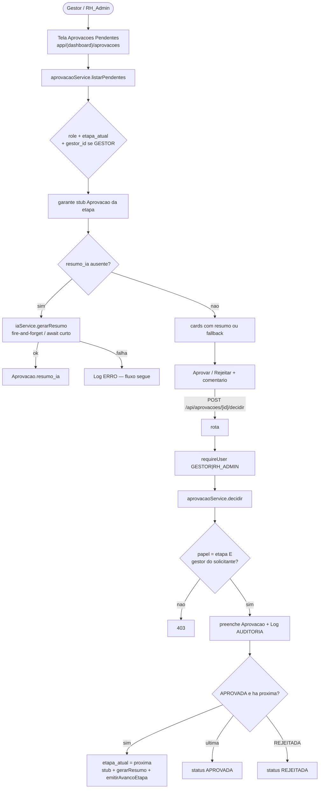

# Aprovações — Design

**Spec**: `.specs/features/aprovacoes/spec.md`
**Context**: `.specs/features/aprovacoes/context.md`
**UI reference**: `docs/fluxorh-mockup.html` (`#screen-aprovacoes`)
**Status**: Draft

---

## Architecture Overview

Camadas conforme `CLAUDE.md`: Route (Zod + auth) → Service → Prisma. Chamadas OpenAI **somente** em `iaService` (server-side).



---

## Code Reuse Analysis

| Component | Location | How to Use |
| --- | --- | --- |
| `authService.requireUser` | `lib/services/authService.ts` | Gate GESTOR/RH_ADMIN; `gestor_id` para APR-07 |
| `logService.registrar` | `lib/services/logService.ts` | AUDITORIA em decisão/transição; ERRO em falha IA |
| `tipoFluxoService.buscarPorId` | `lib/services/tipoFluxoService.ts` | Ler `etapas` / nome — nunca `prisma.tipoFluxo` direto |
| Padrão rota Zod + auth | `app/api/tipos-fluxo/**` | Mesmo mapeamento 401/403/400 |
| Padrão página Server Component | `configuracao-fluxos/page.tsx` | `requireUser` + service direto na listagem |
| Extensão `Solicitacao` | `solicitacoes/design.md` | Esta feature aplica o schema (pré-requisito); não implementa `solicitacaoService` |
| Tokens / cards mockup | `docs/fluxorh-mockup.html` | CSS variables + `.approval-card` / `.callout-ia` / stamp-badge |

### Integration Points

| System | Method |
| --- | --- |
| `solicitacoes` | Lê `Solicitacao`; link detalhe `/solicitacoes/[id]` |
| `notificacoes` | `emitirAvancoEtapa` stub (no-op) |
| `auditoria-logs` | Só escreve `Log` via `logService` |
| `sla-cobranca` | Só exibe `prazo_sla` no card |

---

## Components

### Prisma — estender `Solicitacao` + criar `Aprovacao`

```prisma
enum DecisaoAprovacao {
  APROVADA
  REJEITADA
}

model Solicitacao {
  id             String            @id @default(cuid())
  tipo_fluxo_id  String
  tipoFluxo      TipoFluxo         @relation(fields: [tipo_fluxo_id], references: [id])
  solicitante_id String            @db.Uuid
  solicitante    User              @relation(fields: [solicitante_id], references: [id])
  dados          Json
  status         StatusSolicitacao @default(PENDENTE)
  etapa_atual    Role
  prazo_sla      DateTime
  criado_em      DateTime          @default(now())
  aprovacoes     Aprovacao[]

  @@index([tipo_fluxo_id])
  @@index([status])
  @@index([solicitante_id])
  @@index([etapa_atual])
  @@map("solicitacoes")
}

model Aprovacao {
  id             String            @id @default(cuid())
  solicitacao_id String
  solicitacao    Solicitacao       @relation(fields: [solicitacao_id], references: [id])
  etapa          Int
  aprovador_role Role
  aprovador_id   String?           @db.Uuid
  aprovador      User?             @relation(fields: [aprovador_id], references: [id])
  decisao        DecisaoAprovacao?
  comentario     String?
  resumo_ia      String?
  decidido_em    DateTime?

  @@unique([solicitacao_id, etapa])
  @@index([solicitacao_id])
  @@map("aprovacoes")
}
```

`User` ganha `solicitacoes Solicitacao[]` e `aprovacoes Aprovacao[]`.

### `lib/services/iaService.ts`

- **Purpose**: montar prompt + chamar OpenAI `gpt-4o-mini`; nunca lança para travar o fluxo — retorna `string | null` e grava `Log ERRO` em falha/vazio.
- **Interfaces**:
  - `gerarResumoSolicitacao(input: { solicitacaoId: string; tipoFluxoNome: string; dados: Record<string, unknown>; etapa: Role }): Promise<string | null>`
- **Deps**: `openai` SDK, `OPENAI_API_KEY`, `logService.registrar`
- **Constraint**: só importado por services (nunca client)

### `lib/services/aprovacaoService.ts`

- **Errors**: `ErroNaoEncontrado`, `ErroNaoAutorizadoAprovacao`, `ErroDecisaoInvalida` (já decidida / status final / etapa errada)
- **Interfaces**:
  - `listarPendentes(usuario: AuthenticatedUser): Promise<AprovacaoPendenteCard[]>` — filtra `status=PENDENTE` + `etapa_atual` coerente com papel; GESTOR restringe `solicitante.gestor_id = usuario.id`; RH_ADMIN vê todas com `etapa_atual=RH_ADMIN`. Garante stub da etapa; tenta preencher `resumo_ia` se ausente (await da geração — falha → card sem resumo).
  - `decidir(solicitacaoId, usuario, input: { decisao: 'APROVADA'|'REJEITADA'; comentario?: string }): Promise<Solicitacao>` — autorização APR-06/07/08; grava `Aprovacao`; Log AUDITORIA; avança ou encerra; se avançou: stub próxima + `gerarResumo` (não bloqueia retorno se falhar) + `emitirAvancoEtapa`.
  - `listarHistorico(solicitacaoId, usuario): Promise<Aprovacao[]>` — P2; aplica regra de visibilidade CLAUDE.md (próprias / equipe / RH_ADMIN tudo).
- **Helpers internos**: `assertPodeDecidir`, `indiceEtapaAtual`, `proximaEtapa`

### `lib/validations/aprovacao.ts`

```ts
decisaoInputSchema = z.object({
  decisao: z.enum(['APROVADA', 'REJEITADA']),
  comentario: z.string().max(2000).optional(),
})
```

### `lib/events/solicitacaoEvents.ts`

- `emitirAvancoEtapa(payload: { solicitacao_id: string; etapa_atual: Role }): Promise<void>` — no-op documentado.

### API

- `GET /api/aprovacoes/pendentes` → `requireUser([GESTOR, RH_ADMIN])` → `listarPendentes`
- `POST /api/aprovacoes/[solicitacaoId]/decidir` → auth + Zod → `decidir`
- `GET /api/aprovacoes/[solicitacaoId]/historico` → auth + `listarHistorico` (P2)

### UI — `app/(dashboard)/aprovacoes/`

Espelha mockup `#screen-aprovacoes`:

- **`page.tsx`** (Server): gate GESTOR/RH_ADMIN; `listarPendentes`; empty state APR-17; lista de cards.
- **`_components/AprovacaoCard.tsx`** (Client para ações): chip tipo, nome solicitante, id proto, stamp SLA, callout IA (ou fallback), link detalhe, botões Rejeitar/Aprovar + campo comentário opcional.
- **`aprovacoes.module.css`**: tokens do mockup (`--paper`, `--azul-*`, `--amarelo-*`, Fraunces/Inter/IBM Plex Mono via `next/font` no layout da página ou root).

**Design tokens (mockup)**: paper `#F3F6FC`, ink `#16233D`, azul-900 `#142A52`, amarelo-600 `#DDA02A`, verde `#2F8F62`, vermelho `#C24B3B`, laranja `#CC5B23`.

**Signature UI**: callout amarelo “✦ Resumo por IA” como herói do card (hero feature).

---

## Data Models (TS)

```typescript
interface AprovacaoPendenteCard {
  solicitacao_id: string
  tipo_fluxo_nome: string
  solicitante_nome: string
  solicitante_email: string
  etapa_atual: 'GESTOR' | 'RH_ADMIN'
  prazo_sla: Date
  resumo_ia: string | null
  criado_em: Date
}
```

---

## Error Handling

| Error | HTTP | When |
| --- | --- | --- |
| `ErroNaoAutenticado` | 401 | sem sessão |
| `ErroNaoAutorizado` (auth) | 403 | papel ≠ GESTOR/RH_ADMIN na rota |
| `ErroNaoAutorizadoAprovacao` | 403 | papel ≠ etapa, gestor errado, sem gestor_id |
| `ErroNaoEncontrado` | 404 | solicitação inexistente |
| `ErroDecisaoInvalida` | 409 | já decidida / status final / race |
| Zod fail | 400 | comentário > 2000 / decisao inválida |

IA: nunca propaga — `null` + `Log ERRO` (`acao: FALHA_IA`).

---

## Tech Decisions

| Decision | Rationale |
| --- | --- |
| Stub `Aprovacao` na entrada da etapa | `resumo_ia` vive em `Aprovacao` (design doc); decisão preenche a mesma linha |
| Geração sob demanda + pós-avanço | Desacopla de `solicitacoes.criar`; resiliente |
| `openai` npm package | SDK oficial; só server |
| Sem tab-toggle do mockup | APR-05 já define filtro por papel |
| CSS module local + fonts no root layout | Fidelidade ao mockup sem redesenhar sidebar global nesta feature |

---

## Requirement Mapping

| ID | Component |
| --- | --- |
| APR-01,05,14,17 | `listarPendentes` + UI page/cards |
| APR-02 | link `/solicitacoes/[id]` |
| APR-03,04,09–12 | `decidir` + route |
| APR-06,07,08 | `assertPodeDecidir` |
| APR-13,15 | `iaService` |
| APR-16 | `listarHistorico` + route |
