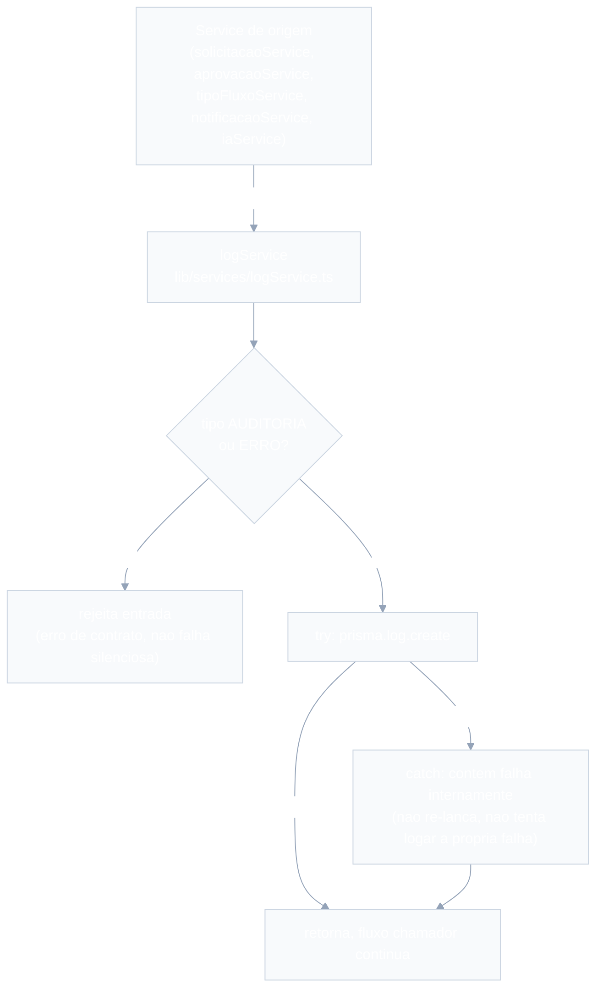

# Auditoria e Logs — Design

**Spec**: `.specs/features/auditoria-logs/spec.md`
**Context**: nenhum `context.md` — sem `/discuss` dedicado. As 5 "Questões em Aberto" do spec foram resolvidas neste Design (ver seção Tech Decisions), com base no próprio spec e no `CLAUDE.md`. Sinalizadas para revisão do usuário antes da fase de Tasks.
**Status**: Draft

---

## 0. Nota de reconciliação (nomes já usados por designs vizinhos)

`auditoria-logs` ainda não tinha `design.md`, mas duas features já desenharam contra o contrato do `logService` antes desta (repo greenfield, ordem de design não seguiu ordem de dependência):

| Peça | Nome usado em design vizinho | Nome canônico definido aqui |
| --- | --- | --- |
| Gravação de log | `configuracao-fluxos/design.md`: `logService.registrarLog(evento)` | `logService.registrar(evento)` |
| Checagem de papel/autenticação | `configuracao-fluxos/design.md`: `getUsuarioAutenticado` + `requireRole` (fundação mínima) | `authService.getSessionUser()` / `authService.requireUser(roles?)`, conforme `autenticacao-usuarios/design.md` (dona da feature) |

**Decisão**: esta feature é a dona conceitual do `logService`, então fixa `registrar` como nome final (bate com o que `autenticacao-usuarios/design.md` já assumiu ao consumir o contrato no AUTH-07). `autenticacao-usuarios` é a dona de auth, então `authService.getSessionUser`/`requireUser` são os nomes finais para checagem de sessão/papel. **Ação pendente fora desta feature**: quando `configuracao-fluxos` for implementada (ou seu design revisado), renomear `registrarLog` → `registrar` e `getUsuarioAutenticado`/`requireRole` → `authService.getSessionUser`/`requireUser` para eliminar a duplicidade de fundação. Não alterei o `design.md` de `configuracao-fluxos` aqui para não invadir escopo de outra feature sem confirmação.

---

## Architecture Overview

Duas superfícies independentes: (1) escrita — qualquer service de negócio grava um log sem nunca travar seu próprio fluxo; (2) leitura — RH_Admin consulta via Tela 8.



```mermaid
%%{init: {'theme': 'base', 'themeVariables': {'primaryColor': '#4f46e5', 'primaryTextColor': '#ffffff', 'primaryBorderColor': '#3730a3', 'lineColor': '#94a3b8', 'secondaryColor': '#10b981', 'tertiaryColor': '#f59e0b', 'background': '#ffffff', 'mainBkg': '#f8fafc', 'nodeBorder': '#cbd5e1', 'clusterBkg': '#f1f5f9', 'clusterBorder': '#e2e8f0', 'titleColor': '#1e293b', 'edgeLabelBackground': '#ffffff', 'textColor': '#334155'}}}%%
sequenceDiagram
    actor Admin as RH_Admin
    participant UI as Tela Auditoria/Logs<br/>app/(dashboard)/auditoria-logs
    participant Route as GET /api/logs
    participant Auth as authService.requireUser
    participant Service as logService.listar
    participant DB as Prisma/PostgreSQL

    Admin->>UI: aplica filtros (tipo, entidade, usuario, periodo, pagina)
    UI->>Route: GET /api/logs?tipo=...&entidade=...&usuario_id=...&data_inicio=...&data_fim=...&page=...
    Route->>Auth: requireUser(['RH_ADMIN'])
    alt nao autenticado ou papel diferente
        Auth-->>Route: lanca ErroNaoAutorizado
        Route-->>UI: 401/403
    else RH_ADMIN valido
        Route->>Route: valida query com Zod (inclui data_inicio <= data_fim)
        Route->>Service: listar(filtros)
        Service->>DB: Log.findMany(where AND, include usuario, orderBy criado_em desc, skip/take)
        DB-->>Service: registros + total
        Service-->>Route: { logs, total }
        Route-->>UI: 200 JSON
        UI-->>Admin: tabela + paginacao; expandir linha mostra detalhes (JSON) sem nova chamada
    end
```

---

## Code Reuse Analysis

### Existing Components to Leverage

Repositório ainda greenfield (sem código-fonte), mas dois designs vizinhos já definem contratos que esta feature consome:

| Component | Location | How to Use |
| --- | --- | --- |
| `authService.getSessionUser()` / `authService.requireUser(roles?)` | `lib/services/authService.ts` (desenhado em `autenticacao-usuarios/design.md`) | Bloqueia a API/tela de logs a `RH_ADMIN` no backend (AUD-05). |
| Model `User` + enum `Role` | `prisma/schema.prisma` (desenhado em `autenticacao-usuarios/design.md`) | `Log.usuario_id` relaciona-se a `User` para permitir o join que exibe nome/e-mail na tela (Questão em Aberto #3, resolvida). |
| `lib/prisma.ts` (singleton) | Criado por `autenticacao-usuarios` | Único ponto de acesso ao banco, reusado por `logService`. |

### Integration Points

| System | Integration Method |
| --- | --- |
| `solicitacoes`, `aprovacoes`, `configuracao-fluxos`, `notificacoes`, `painel-insights` | Cada um chama `logService.registrar(...)` no próprio código; esta feature não decide *quando* logar (fora de escopo, ver spec), só o contrato de gravação e a consulta. |
| `autenticacao-usuarios` | Fornece `authService` e o model `User`; também é consumidora do `logService` (grava `ERRO` no AUTH-07). |

---

## Components

### `prisma/schema.prisma` (extensão — model `Log`)

- **Purpose**: persistência do registro de auditoria/erro (AUD-01, AUD-02).
- **Location**: `prisma/schema.prisma`
- **Reuses**: `User` (relação opcional para `usuario_id`).

```prisma
enum LogTipo {
  AUDITORIA
  ERRO
}

model Log {
  id          String   @id @default(cuid())
  tipo        LogTipo
  entidade    String            // nome da entidade de origem, ex: "Solicitacao", "TipoFluxo" — string livre, sem FK (polimorfico)
  entidade_id String            // id do registro de origem — string livre, sem FK (entidades distintas têm PKs distintas)
  acao        String            // ex: "CRIACAO", "APROVACAO", "REJEICAO", "FALHA_IA"
  usuario_id  String?  @db.Uuid
  usuario     User?    @relation(fields: [usuario_id], references: [id], onDelete: SetNull)
  detalhes    Json?
  criado_em   DateTime @default(now())

  @@index([tipo])
  @@index([entidade])
  @@index([usuario_id])
  @@index([criado_em])
  @@map("logs")
}
```

### `lib/services/logService.ts`

- **Purpose**: ponto único de gravação (AUD-01 a AUD-04) e de consulta filtrável (AUD-05 a AUD-09) de `Log`.
- **Location**: `lib/services/logService.ts`
- **Interfaces**:
  - `registrar(evento: { tipo: 'AUDITORIA' | 'ERRO'; entidade: string; entidade_id: string; acao: string; usuario_id?: string | null; detalhes?: unknown }): Promise<void>` — rejeita (lança) se `tipo` fora do union (erro de contrato do chamador, detectável em teste); qualquer falha de persistência (DB indisponível etc.) é capturada internamente e **nunca propagada** ao chamador; não tenta gravar um novo log `ERRO` para essa falha (evita recursão).
  - `listar(filtros: LogFiltro): Promise<{ logs: LogComUsuario[]; total: number }>` — combina filtros com AND lógico; ordena por `criado_em` desc; pagina.
- **Dependencies**: `lib/prisma.ts`.
- **Reuses**: nada além do Prisma singleton — é a própria fundação que os demais services consomem.

### API Routes

- **`app/api/logs/route.ts`**
  - `GET` → `authService.requireUser(['RH_ADMIN'])` (AUD-05) → valida query params via Zod (`tipoLogSchema` opcional, `entidade` opcional, `usuario_id` opcional, `data_inicio`/`data_fim` opcionais com `refine` garantindo `data_inicio <= data_fim`, `page`/`pageSize` opcionais) → `logService.listar(filtros)` (AUD-06 a AUD-09, AUD-11).
- **Reuses**: `authService.requireUser`.

> Não há `GET /api/logs/[id]` dedicado: `listar` já retorna o campo `detalhes` completo em cada registro; a Tela 8 expande a linha localmente para exibir o JSON (AUD-10), sem round-trip adicional.

### UI — `app/(dashboard)/auditoria-logs/`

- **`page.tsx`** — Server Component: `authService.requireUser(['RH_ADMIN'])`; demais papéis recebem 403/redirect (AUD-05).
- **`_components/LogFiltros.tsx`** — Client Component: campos de filtro (tipo, entidade, usuário, período); dispara nova busca ao mudar; bloqueia submit se `data_inicio > data_fim` mostrando mensagem, sem chamar a API.
- **`_components/LogTabela.tsx`** — tabela ordenada por `criado_em` desc, colunas `criado_em`, `tipo`, `entidade`, `entidade_id`, `acao`, usuário (nome do `usuario` via join, ou "Sistema" se `usuario_id` nulo); linha expansível mostra `detalhes` formatado (JSON legível, com truncamento/scroll para payloads grandes); estado vazio explícito quando não há resultados.
- **`_components/LogPaginacao.tsx`** — paginação simples (AUD-11).
- **Reuses**: `GET /api/logs`.

---

## Data Models

### `Log` (ver Prisma acima)

```typescript
interface LogComUsuario {
  id: string
  tipo: 'AUDITORIA' | 'ERRO'
  entidade: string
  entidade_id: string
  acao: string
  usuario_id: string | null
  usuario: { nome: string; email: string } | null
  detalhes: unknown | null
  criado_em: Date
}
```

### `LogFiltro` (query de `listar`)

```typescript
interface LogFiltro {
  tipo?: 'AUDITORIA' | 'ERRO'
  entidade?: string
  usuario_id?: string
  data_inicio?: Date
  data_fim?: Date
  page?: number      // default 1
  pageSize?: number  // default fixo (ex.: 20)
}
```

**Relationships**: `Log.usuario_id` → `User.id` (opcional, `onDelete: SetNull` — log sobrevive mesmo que o usuário referenciado seja removido). `Log.entidade`/`Log.entidade_id` são referência polimórfica livre (sem FK), pois apontam para modelos distintos (`Solicitacao`, `TipoFluxo`, `Aprovacao`, `User`) sem uma coluna única de destino possível no Prisma.

---

## Error Handling Strategy

| Error Scenario | Handling | User Impact |
| --- | --- | --- |
| Usuário não autenticado ou não `RH_ADMIN` acessa tela/API de logs | `authService.requireUser(['RH_ADMIN'])` bloqueia antes do service (AUD-05) | 401/403; tela nem renderiza a tabela |
| `tipo` inválido passado a `registrar` (erro de contrato do chamador) | `logService.registrar` rejeita (lança) — é bug do chamador, não falha de infra | Nenhum log gravado; erro deve ser pego em teste/dev, não em produção silenciosamente |
| Falha ao persistir `Log` (DB indisponível, timeout) | `registrar` captura internamente, não relança, não tenta logar a própria falha (evita recursão) | Fluxo de negócio chamador conclui normalmente, sem indício de erro para o usuário final |
| `data_inicio` posterior a `data_fim` no filtro | Zod `refine` rejeita na rota antes de chamar `listar` → 400 | Mensagem de validação; nenhuma consulta executada |
| Filtros sem resultado | `listar` retorna lista vazia + `total: 0` | Tabela exibe estado vazio ("nenhum log encontrado"), não erro |
| `usuario_id` referenciando usuário removido | Relação `onDelete: SetNull` — nunca é o caso na prática (sem delete de `User` no MVP), mas se ocorrer o log permanece com `usuario_id` nulo | Tela mostra "Sistema" (mesmo tratamento de log sem usuário) |
| `detalhes` grande/profundamente aninhado | UI trunca/expande com scroll, sem quebrar layout | Detalhe ainda legível, sem crash de render |

---

## Tech Decisions (only non-obvious ones)

| Decision | Choice | Rationale |
| --- | --- | --- |
| Nome canônico do contrato de gravação | `logService.registrar(evento)` (não `registrarLog`) | Reconciliação com `autenticacao-usuarios/design.md`, que já consome esse nome; ver seção 0 |
| Checagem de papel na Tela 8/API | `authService.requireUser(['RH_ADMIN'])` (não `getUsuarioAutenticado`/`requireRole`) | Reconciliação com a feature dona de auth; ver seção 0 |
| `entidade`/`entidade_id` sem FK | Strings livres, relação polimórfica não modelada no schema | Prisma não expressa nativamente FK para múltiplos models de destino; forçar isso seria inventar sintaxe não suportada |
| `usuario_id` com relação real a `User` (não string crua) | `onDelete: SetNull`, campo opcional | Permite `include` para exibir nome/e-mail (Questão em Aberto #3, resolvida: sim ao join) e sobrevive a eventual remoção futura do usuário (edge case do spec) |
| Retenção/expurgo de logs (Questão em Aberto #1) | Não implementado — persistência simples, sem TTL/rotação | Já explícito no `Out of Scope` do próprio spec; paginação (AUD-11, P3) já mitiga volume na UI |
| Shape de `detalhes` (Questão em Aberto #2) | JSON livre (`Json?`), sem schema comum imposto a todas as origens | AUD-01 só exige "JSON"; cada service de origem tem payloads muito diferentes (erro de IA vs. decisão de aprovação) — impor um shape único seria over-engineering não pedido |
| Exibir usuário por nome/e-mail via join (Questão em Aberto #3) | Sim — `listar` sempre inclui `usuario: { nome, email }` | Já assumido nos critérios de aceitação do spec ("mostrando... usuário responsável"); id cru não é rastreável para humano |
| Filtro por `entidade_id` específico (Questão em Aberto #4) | Não implementado no MVP | Spec lista exatamente 4 filtros (tipo, entidade, usuário, período); ficar estrito evita scope creep — registrado como ideia adiada |
| Filtro por `acao` (Questão em Aberto #5) | Não implementado no MVP | Mesma razão da linha acima — ideia adiada |
| Sem `GET /api/logs/[id]` dedicado | Detalhe expande inline a partir do registro já listado | `listar` já retorna `detalhes` completo; endpoint extra seria round-trip sem ganho |
| Rejeição de `tipo` inválido é lançada, falha de persistência não é | Dois caminhos de erro distintos dentro do mesmo `registrar` | AUD-04 (contrato fechado) é erro de programação do chamador, capturável em teste; AUD-03/AUD-05 (resiliência) é falha de infraestrutura em runtime — tratamentos propositalmente diferentes |

---

## Requirement Traceability (mapeamento para Design)

| Requirement ID | Coberto por |
| --- | --- |
| AUD-01 | Model `Log` (enum `LogTipo`) + `logService.registrar` |
| AUD-02 | `criado_em @default(now())` |
| AUD-03 | `registrar` — catch interno, nunca relança em falha de persistência |
| AUD-04 | `registrar` — rejeita `tipo` fora do union `AUDITORIA`/`ERRO` |
| AUD-05 | `authService.requireUser(['RH_ADMIN'])` na rota e na página |
| AUD-06 | `LogFiltro.tipo` + `where` no `listar` |
| AUD-07 | `LogFiltro.entidade` / `LogFiltro.usuario_id` + `where` |
| AUD-08 | `LogFiltro.data_inicio`/`data_fim` + `where` (`criado_em` entre datas) |
| AUD-09 | `listar` — `orderBy criado_em desc`, colunas exibidas em `LogTabela` |
| AUD-10 | `detalhes` já incluído em `listar`; expansão inline em `LogTabela` |
| AUD-11 | `LogFiltro.page`/`pageSize` + `LogPaginacao` |

---

## Riscos / Pontos a verificar na fase de Tasks

- Reconciliar nomes (`registrarLog`→`registrar`, `getUsuarioAutenticado`/`requireRole`→`authService.*`) no `design.md` de `configuracao-fluxos` quando essa feature for revisitada — não feito aqui por não invadir escopo de outra feature sem confirmação (ver seção 0).
- Confirmar com o usuário as 5 decisões da tabela Tech Decisions marcadas como resolução de "Questão em Aberto" — nenhuma teve `/discuss` dedicado; todas foram resolvidas com base no próprio spec/CLAUDE.md antes da fase de Tasks.
