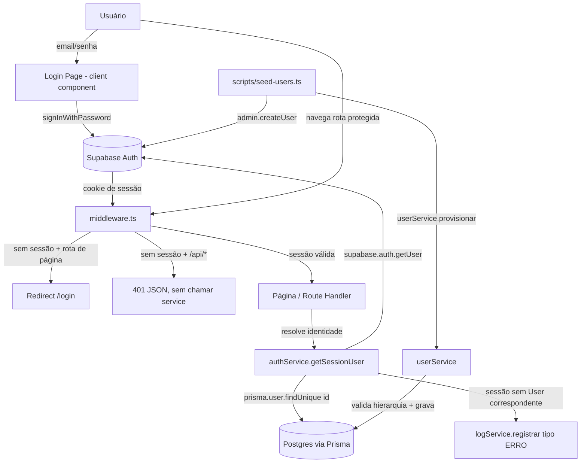

# Autenticação e Usuários Design

**Spec**: `.specs/features/autenticacao-usuarios/spec.md`
**Context**: `.specs/features/autenticacao-usuarios/context.md`
**Status**: Draft

---

## Contexto

Projeto greenfield — nenhum código-fonte ainda existe (só `.specs/` e `docs/`). Este design assume o scaffold inicial do Next.js (App Router) + Prisma + Supabase descrito em `CLAUDE.md`, e é a primeira feature a introduzir esse scaffold (`lib/prisma.ts`, `lib/services/`, `prisma/schema.prisma`). Não há "Code Reuse Analysis" de componentes existentes porque não há nada para reusar ainda — a seção abaixo documenta o que esta feature cria como base para as demais.

**Decisões travadas em `context.md`** (não reabrir sem novo /discuss):

- Password recovery: fora de escopo do MVP.
- `gestor_id` nulo: só válido para `role = RH_ADMIN`.
- Pós-login: landing única em `/`, sem roteamento por papel.
- `id` do `User` (Prisma) = `id` do usuário no Supabase Auth (mesma chave, sem tabela de correlação).

---

## Architecture Overview

Sessão vive nos cookies do Supabase Auth. Duas camadas de proteção, porque páginas e API routes exigem respostas diferentes (redirect vs. 401 JSON):



---

## Code Reuse Analysis

### O que esta feature entrega e que as outras consomem

| Componente | Localização | Como as outras features usam |
| --- | --- | --- |
| `authService.getSessionUser()` | `lib/services/authService.ts` | Toda API route de `solicitacoes`, `aprovacoes`, `configuracao-fluxos`, `painel-insights`, `auditoria-logs` chama isso para resolver `{ id, nome, email, role, gestor_id }` e checar autorização. |
| `authService.requireUser(roles?)` | `lib/services/authService.ts` | Wrapper que já responde 401/403 — routes que precisam restringir por papel (ex. `auditoria-logs` só `RH_ADMIN`) usam direto. |
| Modelo `User` + enum `Role` | `prisma/schema.prisma` | Toda relação (`Aprovacao.aprovador_id`, `Log.usuario_id`, `Solicitacao.solicitante_id`) referencia este modelo. |
| `logService.registrar(...)` | `lib/services/logService.ts` (feature `auditoria-logs`) | Esta feature **consome** o contrato já especificado em `auditoria-logs/spec.md` (AUD-01) para gravar o `Log` tipo `ERRO` do AUTH-07. Não redefine o serviço. |

### Integration Points

| Sistema | Método de integração |
| --- | --- |
| Supabase Auth | `@supabase/ssr` — cliente de browser (login) e cliente de servidor (middleware, route handlers, server components) compartilhando cookies. |
| Postgres (via Prisma) | `lib/prisma.ts` (singleton, a ser criado nesta feature — é o primeiro consumidor do Prisma no projeto). |
| `auditoria-logs` | Chamada direta a `logService.registrar` no caminho de erro AUTH-07. Dependência de feature, não de infraestrutura. |

---

## Components

### Supabase clients

- **Purpose**: Centralizar criação dos clients Supabase (browser e servidor) sobre cookies do Next.js, único ponto de configuração de URL/anon key.
- **Location**: `lib/supabase/client.ts` (browser), `lib/supabase/server.ts` (server components / route handlers), `lib/supabase/middleware.ts` (helper de refresh de sessão para o middleware).
- **Interfaces**:
  - `createBrowserClient(): SupabaseClient` — usado pelo formulário de login (client component).
  - `createServerClient(): SupabaseClient` — lê/escreve cookies via `next/headers`, usado por `authService` e route handlers.
- **Dependencies**: `@supabase/ssr`, variáveis de ambiente `NEXT_PUBLIC_SUPABASE_URL` / `NEXT_PUBLIC_SUPABASE_ANON_KEY`.
- **Reuses**: Nenhum (primeira introdução do Supabase no projeto).

> Nota de incerteza: `@supabase/ssr` é o pacote atualmente recomendado pela Supabase para Next.js App Router (substitui o descontinuado `@supabase/auth-helpers-nextjs`). Não encontrei o schema/versão exata no codebase (projeto ainda não tem `package.json`) nem em `docs/`. Confirmar a API exata (`createServerClient`, contrato de cookies) na documentação oficial da Supabase no momento da implementação, antes de codar a Task correspondente.

### `middleware.ts`

- **Purpose**: Ponto único de proteção de rota — decide redirect (páginas) vs. 401 JSON (API), sem tocar em lógica de negócio.
- **Location**: `middleware.ts` (raiz do projeto).
- **Interfaces**:
  - `middleware(request: NextRequest): NextResponse` — matcher exclui `/login`, assets estáticos e `_next/*`.
- **Dependencies**: `lib/supabase/middleware.ts` (refresh de sessão), `supabase.auth.getUser()` (valida token, não só presença de cookie — cobre AUTH-11).
- **Reuses**: Supabase clients acima.
- **Regra de decisão**:
  - Sem sessão válida + rota começa com `/api/` → responde `401` JSON, não invoca handler (AUTH-12).
  - Sem sessão válida + rota de página → `redirect('/login')` (AUTH-09).
  - Sessão válida → deixa passar; resolução de `User`/`role` fica a cargo de `authService` dentro da page/route (o middleware não consulta Prisma, só valida a sessão Supabase).

### `authService`

- **Purpose**: Resolver a identidade de negócio (`User` do Prisma) a partir da sessão Supabase, e recusar acesso quando a sessão não tem `User` correspondente.
- **Location**: `lib/services/authService.ts`.
- **Interfaces**:
  - `getSessionUser(): Promise<AuthenticatedUser | null>` — `null` cobre tanto "sem sessão" quanto "sessão sem `User`" (AUTH-06, AUTH-07). Ao cair no segundo caso, chama `logService.registrar({ tipo: 'ERRO', entidade: 'User', entidade_id: session.user.id, acao: 'SESSAO_SEM_USER', usuario_id: null, detalhes: { supabase_user_id, email } })` antes de retornar `null`.
  - `requireUser(roles?: Role[]): Promise<AuthenticatedUser>` — usado por route handlers; lança erro tipado que a route converte em `401` (sem `User`/sessão) ou `403` (role não permitido), sem executar a lógica de negócio da route.
- **Dependencies**: `lib/supabase/server.ts`, `lib/prisma.ts`, `logService` (de `auditoria-logs`).
- **Reuses**: N/A (novo).

### Login page

- **Purpose**: Formulário de e-mail/senha, validação client-side antes de chamar Supabase, mensagens genéricas de erro.
- **Location**: `app/login/page.tsx` (server component de layout) + `app/login/LoginForm.tsx` (client component com o formulário).
- **Interfaces**: Componente de UI, sem API pública além de props padrão de página.
- **Dependencies**: `lib/supabase/client.ts`.
- **Reuses**: N/A (primeira tela do projeto).
- **Comportamento**:
  - Campos obrigatórios em branco → bloqueia submit no client, sem chamar Supabase (AUTH-03).
  - `signInWithPassword` retorna erro de credenciais → mensagem genérica fixa ("E-mail ou senha inválidos"), nunca diferencia "e-mail não existe" de "senha errada" (AUTH-02).
  - Erro de rede/indisponibilidade (exception ao chamar Supabase, não erro de credenciais) → mensagem "Não foi possível conectar. Tente novamente." com o formulário reabilitado para nova tentativa (AUTH-04).
  - Sucesso → `router.push('/')` e `router.refresh()` (landing única, decisão travada).

### Logout

- **Purpose**: Encerrar sessão Supabase e devolver o usuário ao Login.
- **Location**: `components/auth/LogoutButton.tsx` (client component, ex.: no header).
- **Interfaces**: Botão que chama `supabase.auth.signOut()` (browser client) e então `router.push('/login')` + `router.refresh()`.
- **Dependencies**: `lib/supabase/client.ts`.
- **Reuses**: N/A.
- **Nota**: não precisa de route handler dedicado — `signOut()` do `@supabase/ssr` já limpa os cookies de sessão pelo próprio client de browser; o middleware trata a próxima navegação como não autenticada (AUTH-13/14).

### `UserBadge` (exibição de identidade — P3)

- **Purpose**: Mostrar nome e papel do usuário logado numa área persistente (ex.: header).
- **Location**: `components/layout/UserBadge.tsx` (server component).
- **Interfaces**: Sem props — chama `authService.getSessionUser()` internamente e renderiza `nome` + rótulo legível do `role` (ex.: mapa `{ SOLICITANTE: 'Solicitante', GESTOR: 'Gestor', RH_ADMIN: 'RH Admin' }`).
- **Dependencies**: `authService`.
- **Reuses**: `authService.getSessionUser()`.

### `userService` (provisionamento e integridade de hierarquia)

- **Purpose**: Validar e persistir `User` respeitando as regras de hierarquia — único ponto de escrita de `User`, usado pelo seed (não há CRUD via UI no MVP).
- **Location**: `lib/services/userService.ts`.
- **Interfaces**:
  - `provisionar(input: { id: string; nome: string; email: string; role: Role; gestor_id?: string | null }): Promise<User>`.
- **Dependencies**: `lib/prisma.ts`.
- **Reuses**: N/A.
- **Validações aplicadas antes de qualquer escrita** (AUTH-05, AUTH-15, AUTH-16, AUTH-17):
  1. `role` ∈ `{ SOLICITANTE, GESTOR, RH_ADMIN }` (garantido também pelo enum do Prisma, mas validado cedo para mensagem de erro clara).
  2. `gestor_id` nulo só é aceito se `role === 'RH_ADMIN'`; caso contrário rejeita com erro de validação.
  3. Se `gestor_id` informado: rejeita se `gestor_id === id` (auto-referência) e rejeita se não existir `User` com esse `id` (`prisma.user.findUnique`).
  4. `email` duplicado: deixado para a constraint `@unique` do Prisma — captura `P2002` e traduz para erro de validação (AUTH-08).

### Seed / provisionamento inicial

- **Purpose**: Criar usuários de teste/demonstração já vinculados entre Supabase Auth e `User` (Prisma), usando o e-mail corporativo como identificador de setup (decisão travada em `context.md`).
- **Location**: `scripts/seed-users.ts` (executado via `tsx` ou script `npm run seed`, fora do runtime da aplicação).
- **Interfaces**: Script standalone, lista de usuários hardcoded/config (`{ nome, email, senha_temporaria, role, gestor_email? }`).
- **Dependencies**: `@supabase/supabase-js` com **service role key** (server-only, nunca exposta ao client) para `supabase.auth.admin.createUser({ email, password, email_confirm: true })`; depois `userService.provisionar({ id: authUser.id, ... })` usando o mesmo `id` retornado pelo Supabase.
- **Reuses**: `userService.provisionar`.
- **Ordem de execução**: usuários sem `gestor_email` (RH_ADMIN, topo) primeiro, depois os demais em ordem que garanta que o `gestor_id` referenciado já foi criado — o script resolve `gestor_email → gestor_id` via lookup antes de cada `provisionar`.

---

## Data Models

### `User`

```prisma
enum Role {
  SOLICITANTE
  GESTOR
  RH_ADMIN
}

model User {
  id        String  @id @db.Uuid  // mesmo id do usuário no Supabase Auth (auth.users.id)
  nome      String
  email     String  @unique
  role      Role
  gestor_id String? @db.Uuid

  gestor    User?   @relation("Hierarquia", fields: [gestor_id], references: [id])
  equipe    User[]  @relation("Hierarquia")
}
```

**Relationships**: auto-relação `gestor`/`equipe` (1 gestor → N subordinados). `gestor_id` nulo permitido apenas quando `role = RH_ADMIN` — regra de negócio validada em `userService`, não expressável de forma nativa no schema do Prisma (ver Tech Decisions).

**Campos e nomenclatura**: nomes de campo (`nome`, `email`, `role`, `gestor_id`) seguem literalmente o design doc e `CLAUDE.md` — sem tradução/camelCase, para rastreabilidade 1:1.

---

## Error Handling Strategy

| Cenário | Tratamento | Impacto no usuário |
| --- | --- | --- |
| Credenciais inválidas (AUTH-02) | `signInWithPassword` retorna erro → client exibe mensagem fixa e genérica | Permanece no Login, sem indicar se e-mail existe |
| Campos obrigatórios em branco (AUTH-03) | Validação client-side bloqueia submit antes de chamar Supabase | Campos sinalizados, nenhuma chamada de rede |
| Supabase indisponível/erro de rede no login (AUTH-04) | `catch` na chamada distingue erro de rede de erro de credenciais → mensagem de retry | Formulário reabilitado, pode tentar de novo |
| Sessão Supabase válida sem `User` correspondente (AUTH-07) | `authService.getSessionUser()` retorna `null` após gravar `Log` tipo `ERRO` via `logService` | Tratado como não autenticado — redirect (página) ou 401 (API) |
| Rota protegida sem sessão (AUTH-09, AUTH-12) | Middleware intercepta antes de qualquer handler/service rodar | Redirect para Login (página) ou 401 JSON (API), sem execução de lógica de negócio |
| Sessão expirada em uso (AUTH-11) | `supabase.auth.getUser()` no middleware revalida o token a cada requisição — não confia só no cookie presente | Próxima navegação protegida cai no fluxo de "sem sessão" |
| Provisionamento com `role` inválido ou `gestor_id` violando hierarquia (AUTH-05, AUTH-15, AUTH-16, AUTH-17) | `userService.provisionar` valida antes do `prisma.user.create`, lança erro descritivo | Script de seed falha com mensagem clara, nenhum `User` inconsistente é persistido |
| `email` duplicado (AUTH-08) | Constraint `@unique` do Prisma → `P2002` capturado e traduzido | Script de seed reporta "e-mail já cadastrado" |

---

## Tech Decisions (only non-obvious ones)

| Decisão | Escolha | Racional |
| --- | --- | --- |
| Proteção de rota em duas camadas | Middleware decide por tipo de rota (`/api/*` → 401 JSON; página → redirect) | AUTH-09 e AUTH-12 exigem respostas diferentes; um único mecanismo não cobre os dois formatos de resposta |
| `id` do `User` = `id` do Supabase Auth | Sem tabela de correlação separada | Decisão travada em `context.md`; simplifica `authService` para um único `findUnique` por `id` |
| Integridade de `gestor_id`/`role` validada em `userService`, não em constraint de banco | Validação em código antes do `create`/`update` | Prisma não expressa nativamente uma regra condicional ("nulo só se role = X") no schema declarativo; uma constraint `CHECK` customizada via SQL de migração é possível como reforço futuro, mas não fabricar essa sintaxe agora sem confirmar na documentação do Prisma — a validação em `userService` já é suficiente e testável para o MVP |
| Sem endpoint de logout dedicado | `signOut()` client-side chamado direto do `LogoutButton` | `@supabase/ssr` já limpa os cookies via client de browser; um route handler adicionaria uma camada sem ganho para o AUTH-13/14 |
| Nenhuma UI de CRUD de usuário | Provisionamento só via `scripts/seed-users.ts` | Confirmado no `spec.md` (Out of Scope) — não construir tela de gestão de usuários |

---

## Riscos / Pontos a verificar na fase de Tasks

- Confirmar a API exata do `@supabase/ssr` (nomes de função, contrato de cookies para middleware) na documentação oficial antes de implementar — não há projeto Next.js/Prisma existente no repo para inspecionar convenções já em uso.
- Confirmar se o projeto já tem (ou vai ganhar nesta feature) `lib/prisma.ts` — como é a primeira feature a tocar Prisma, a Task 1 deve incluir o setup do client singleton e a inicialização do `schema.prisma`, não só o modelo `User`.
