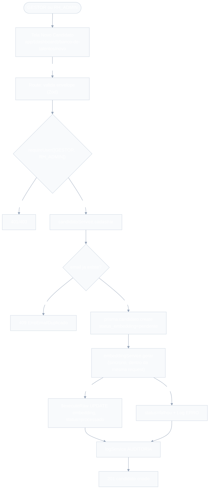
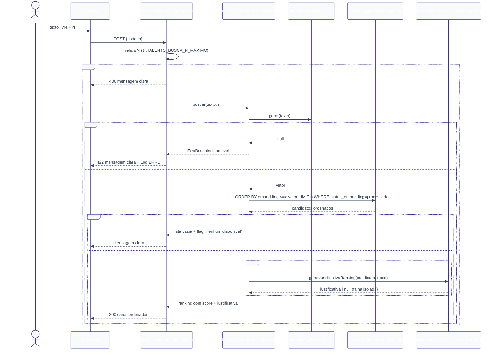
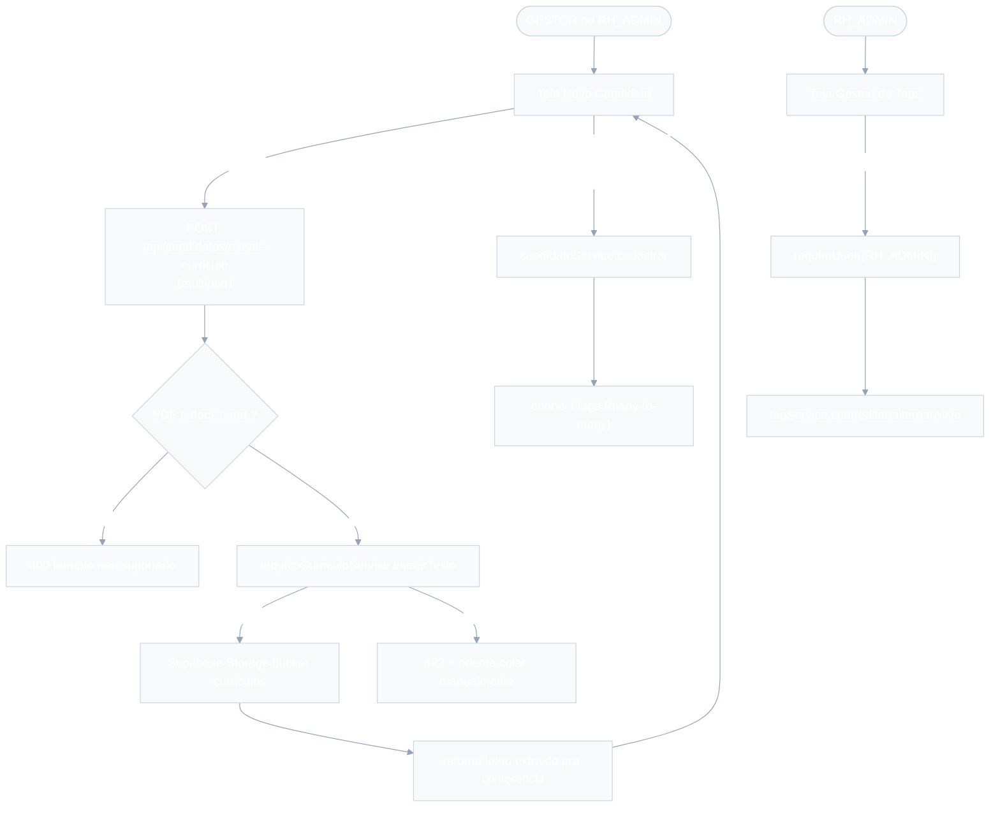
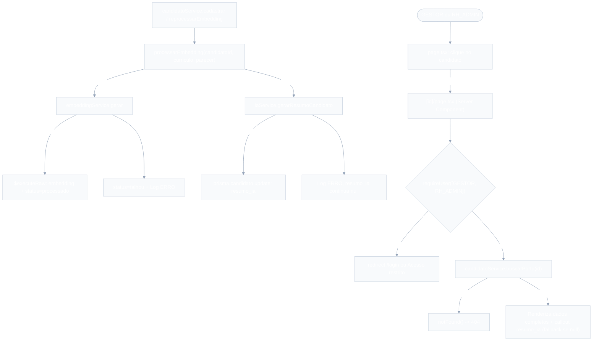

# Banco de Talentos — Design

**Spec**: `.specs/features/banco-de-talentos/spec.md`
**Context**: `.specs/features/banco-de-talentos/context.md`
**Status**: Draft

---

## 0. Decisões técnicas desta sessão (resolvendo pontos deixados em aberto)

`context.md` deixou explicitamente para o Design 3 pontos técnicos (não de UX). Resolvidos agora, com base em precedente já existente no próprio código:

1. **Mecanismo de "background" para o embedding** (Questão em Aberto #1 do `spec.md`). O projeto **não tem fila/worker** (Next.js API routes, deploy Vercel serverless) — um `fire-and-forget` real seria arriscado: a função serverless pode ser congelada/encerrada assim que a resposta HTTP é enviada, matando a Promise não aguardada antes dela terminar. O próprio código já resolveu esse mesmo problema para `resumo_ia`: `aprovacaoService.listarPendentes` (`lib/services/aprovacaoService.ts:106-112`) gera o resumo **de forma síncrona, sob demanda**, dentro da própria requisição que precisa dele, e absorve a falha sem propagar (nunca em background real). **Decisão**: `embeddingService` segue o mesmo padrão — `candidatoService.cadastrar` chama e aguarda a geração do embedding de forma síncrona dentro do próprio `POST /api/candidatos` (aceitando a latência adicional), nunca dispara e esquece. Isso cumpre TAL-03/TAL-05 sem inventar infraestrutura de fila que não existe no projeto.
2. **Onde mora o teto configurável de N** (`context.md`, Agent's Discretion) — variável de ambiente `TALENTO_BUSCA_N_MAXIMO`, lida em `talentoSearchService` com fallback para `100` se ausente/inválida. Ajustável sem alterar código (só variável de ambiente), sem exigir tabela de configuração nova.
3. **Unicidade de e-mail** (`context.md`, decisão de bloquear duplicata) — implementada como `@@unique` no próprio schema (`Candidato.email`), mesmo padrão já usado em `TipoFluxo.nome` (`tipoFluxoService.ts:100-110`, captura `P2002` e traduz para erro de domínio). Reaproveita o padrão, não inventa um novo.

**Ponto de incerteza sinalizado (não fabricado):** a sintaxe exata para habilitar a extensão `pgvector` no schema Prisma nesta versão instalada (`prisma@^7.9.1`, `@prisma/adapter-pg`) — se via `previewFeatures = ["postgresqlExtensions"]` + `extensions = [vector]` no `datasource`, ou apenas uma migration SQL manual (`CREATE EXTENSION IF NOT EXISTS vector;`) antes de `Unsupported("vector(1536)")` — **não foi verificado contra a documentação oficial desta versão nesta sessão**. Recomendação: validar isso como o primeiro passo técnico da fase Tasks, antes de escrever qualquer código que dependa do tipo `vector` (é o risco #1 do PRD §12, e é isolado — não bloqueia o design dos demais componentes).

---

## Architecture Overview

Mesmas camadas do resto do RHOP (`CLAUDE.md`): Route (Zod + `requireUser`) → Service → Prisma. A única exceção documentada é a coluna `embedding`: como é `Unsupported("vector(1536)")`, todo acesso a ela (escrita no cadastro/reprocessamento, leitura na busca por similaridade) passa por `prisma.$executeRaw`/`prisma.$queryRaw` dentro do service — nunca pela API padrão do Prisma Client, que ignora colunas `Unsupported`.





---

## Code Reuse Analysis

### Existing Components to Leverage

| Component | Location | How to Use |
| --- | --- | --- |
| `requireUser([Role.GESTOR, Role.RH_ADMIN])` | `lib/services/authService.ts` | Bloqueia SOLICITANTE em toda rota do módulo (TAL-02, TAL-10, TAL-18) — mesmo padrão de `tipos-fluxo/route.ts`. |
| `logService.registrar` | `lib/services/logService.ts` | `AUDITORIA` no cadastro/reprocessamento bem-sucedido; `ERRO` em falha de embedding/justificativa — mesmo contrato usado em todo o projeto. |
| Padrão "gerar sob demanda, síncrono, falha não propaga" | `lib/services/iaService.ts`, `lib/services/aprovacaoService.ts:374-398` | Modelo direto para `embeddingService.gerar` e `iaService.gerarJustificativaRanking` — nunca lança, sempre retorna `null` em falha, registra `Log ERRO` internamente. |
| Padrão de erro de domínio traduzido de `P2002` | `lib/services/tipoFluxoService.ts:100-110` | Mesmo padrão para e-mail duplicado (`ErroEmailDuplicado`). |
| Padrão de rota (`try/catch` mapeando erros de serviço para status HTTP) | `app/api/tipos-fluxo/route.ts` | Mesmo formato para todas as rotas novas. |
| Padrão de página protegida (Server Component + gate) | `app/(dashboard)/configuracao-fluxos/page.tsx` | Mesmo gate (`requireUser` + `redirect`/mensagem "Acesso restrito") para as 3 telas novas. |
| `OpenAI` client (`openai` SDK já instalado) | `lib/services/iaService.ts:1-2` | Reusa a mesma lib para `client.embeddings.create` (novo) e chat completions (justificativa). |
| `prisma` singleton com `PrismaPg` adapter | `lib/prisma.ts` | Mesmo cliente para `$executeRaw`/`$queryRaw` do embedding — não cria conexão paralela. |

### Integration Points

| System | Integration Method |
| --- | --- |
| `Solicitacao` (feature `solicitacoes`, já existente) | Leitura opcional via `solicitacao_id` — `Candidato` aponta para `Solicitacao.id`; busca nunca depende desse vínculo (P2, TAL-23/24). |
| `iaService` (existente) | Ganha `gerarJustificativaRanking(candidato, queryTexto)`, mesmo arquivo, mesmo padrão de resiliência. |
| `logService`/`authService` (existentes) | Reuso direto, sem alteração nesses services. |

---

## Components

### `prisma/schema.prisma` (novo)

- **Purpose**: entidade `Candidato` com embedding vetorial.
- **Location**: `prisma/schema.prisma`
- **Reuses**: `Role` (não usado diretamente aqui), `User` (`criado_por`), `Solicitacao` (vínculo opcional).

```prisma
enum StatusEmbedding {
  pendente
  processado
  falhou
}

model Candidato {
  id                    String          @id @default(cuid())
  nome                  String
  email                 String          @unique
  telefone              String
  curriculo_texto       String
  curriculo_arquivo_url String?
  transcricao_texto     String
  embedding             Unsupported("vector(1536)")?
  status_embedding      StatusEmbedding @default(pendente)
  solicitacao_id        String?
  solicitacao           Solicitacao?    @relation(fields: [solicitacao_id], references: [id])
  criado_por            String          @db.Uuid
  criador               User            @relation(fields: [criado_por], references: [id])
  criado_em             DateTime        @default(now())

  @@index([status_embedding])
  @@index([solicitacao_id])
  @@map("candidatos")
}
```

> `User` e `Solicitacao` ganham relação inversa (`candidatos Candidato[]`) — adição aditiva, sem impacto nas features existentes.

### `lib/services/embeddingService.ts` (novo)

- **Purpose**: encapsula a chamada de embeddings da OpenAI e a escrita/leitura da coluna `vector` via SQL raw (TAL-03, TAL-04, TAL-05, TAL-12, TAL-19, TAL-29).
- **Location**: `lib/services/embeddingService.ts`
- **Interfaces**:
  - `gerar(texto: string): Promise<number[] | null>` — chama `client.embeddings.create({ model: "text-embedding-3-small", input: texto })`; qualquer falha (chave ausente, erro de API, timeout) → grava `Log ERRO` (`acao: FALHA_IA`) internamente e retorna `null`; nunca lança.
  - `persistirEmbedding(candidatoId: string, vetor: number[]): Promise<void>` — `$executeRaw` `UPDATE candidatos SET embedding = ${vetorComoTextoVector}::vector, status_embedding = 'processado' WHERE id = ${candidatoId}`.
  - `marcarFalha(candidatoId: string): Promise<void>` — `$executeRaw`/`prisma.candidato.update` (campo `status_embedding` não é `Unsupported`, então isso pode ser Prisma Client normal) `status_embedding = 'falhou'`.
- **Dependencies**: `lib/prisma.ts`, `openai`, `logService.registrar`.
- **Reuses**: mesmo padrão de resiliência de `iaService.gerarResumoSolicitacao`.

### `lib/services/candidatoService.ts` (novo)

- **Purpose**: CRUD de `Candidato`, orquestra `embeddingService` no cadastro e no reprocessamento (TAL-01, TAL-04 a TAL-11, TAL-28, TAL-29).
- **Location**: `lib/services/candidatoService.ts`
- **Interfaces**:
  - `cadastrar(input: CandidatoInput, usuarioId: string): Promise<Candidato>` — `prisma.candidato.create` com `status_embedding: 'pendente'`; captura `P2002` (email) → `ErroEmailDuplicado`; em seguida chama `embeddingService.gerar` de forma síncrona (ver seção 0) com o texto combinado (`curriculo_texto + "\n" + transcricao_texto`); sucesso → `persistirEmbedding`; falha → `marcarFalha`; grava `Log AUDITORIA` (`acao: CRIACAO`) ao final, independente do resultado do embedding.
  - `listar(): Promise<CandidatoResumo[]>` — `findMany` sem filtro por `criado_por` (visibilidade colaborativa, TAL-08), ordenado por `criado_em desc`; seleciona `id, nome, email, status_embedding, criado_em` (nunca seleciona `embedding` — coluna `Unsupported`, o client nem a expõe).
  - `reprocessarEmbedding(id: string, usuarioId: string): Promise<Candidato>` — busca candidato; lança `ErroNaoEncontrado` se ausente; lança `ErroReprocessamentoNaoPermitido` se `status_embedding !== 'falhou'` (edge case do `spec.md`); repete o mesmo fluxo síncrono de geração de `cadastrar`.
- **Dependencies**: `lib/prisma.ts`, `embeddingService`, `logService.registrar`.
- **Reuses**: mesmo padrão de `tipoFluxoService` (erros de domínio traduzidos, nunca erro bruto do Prisma).

### `lib/services/talentoSearchService.ts` (novo)

- **Purpose**: orquestra busca — embedding da query → `$queryRaw` de similaridade → justificativa por IA (TAL-12 a TAL-19, TAL-30, TAL-31).
- **Location**: `lib/services/talentoSearchService.ts`
- **Interfaces**:
  - `N_MAXIMO_PADRAO = 100` (usado quando `TALENTO_BUSCA_N_MAXIMO` ausente/inválida — ver seção 0).
  - `buscar(texto: string, n: number): Promise<ResultadoBusca>` — valida `n` (1 a teto); chama `embeddingService.gerar(texto)`; se `null` → lança `ErroBuscaIndisponivel` (rota converte em 422 + já logado por `embeddingService`); senão executa `$queryRaw` (`SELECT id, nome, email, solicitacao_id, 1 - (embedding <=> ${vetor}::vector) AS score FROM candidatos WHERE status_embedding = 'processado' ORDER BY embedding <=> ${vetor}::vector LIMIT ${n}`); se vazio → retorna `{ candidatos: [], disponivel: false }` (TAL-16); senão, para cada resultado chama `iaService.gerarJustificativaRanking` (falha isolada por item, não interrompe o loop — TAL-17) e retorna `{ candidatos, disponivel: true }` com `score` já normalizado 0–1 (cosine similarity, não distância) pra UI renderizar a barra percentual direto (decisão de `context.md`).
- **Dependencies**: `lib/prisma.ts`, `embeddingService`, `iaService`.
- **Reuses**: mesmo padrão de resiliência por item já usado em `aprovacaoService.listarPendentes` (loop que tolera falha individual sem abortar a coleção).

### `lib/services/iaService.ts` (estende o existente)

- **Purpose**: ganha `gerarJustificativaRanking` (TAL-14).
- **Interface nova**: `gerarJustificativaRanking(input: { candidatoId: string; nome: string; curriculoTexto: string; transcricaoTexto: string; queryTexto: string }): Promise<string | null>` — mesmo padrão de `gerarResumoSolicitacao`: monta prompt (perfil buscado + currículo/transcrição do candidato), falha → `Log ERRO` (`entidade: "Candidato"`, `acao: FALHA_IA`) + retorna `null`, nunca lança.

### `lib/validations/candidato.ts` (novo)

- **Purpose**: schema Zod do envelope de cadastro.
- **Interface**: `candidatoInputSchema = z.object({ nome: z.string().min(1), email: z.string().email(), telefone: z.string().min(1), curriculo_texto: z.string().min(1), transcricao_texto: z.string().min(1), solicitacao_id: z.string().optional() })` (TAL-06).

### `lib/validations/talentoBusca.ts` (novo)

- **Purpose**: schema Zod do envelope de busca.
- **Interface**: `talentoBuscaInputSchema = z.object({ texto: z.string().min(1), n: z.number().int().positive().default(20) })` — o teto máximo (`TALENTO_BUSCA_N_MAXIMO`) é validado no SERVICE, não aqui, porque depende de variável de ambiente lida em runtime (mesmo racional de `solicitacaoDados.ts` — validação que depende de estado externo vive no service, TAL-30).

### API Routes

- **`app/api/candidatos/route.ts`**
  - `GET` → `requireUser([Role.GESTOR, Role.RH_ADMIN])` → `candidatoService.listar()` (TAL-08 a TAL-11).
  - `POST` → `requireUser([...])` → Zod → `candidatoService.cadastrar` → `ErroEmailDuplicado` → 409 (TAL-01 a TAL-07, TAL-28).
- **`app/api/candidatos/[id]/route.ts`**
  - `GET` → `requireUser([...])` → `candidatoService.buscarPorId(id)` (suporte à P3, detalhe do candidato).
- **`app/api/candidatos/[id]/reprocessar/route.ts`**
  - `POST` → `requireUser([...])` → `candidatoService.reprocessarEmbedding(id, usuario.id)` → `ErroReprocessamentoNaoPermitido` → 409 (TAL-29).
- **`app/api/candidatos/busca/route.ts`**
  - `POST` → `requireUser([...])` → Zod (envelope) → `talentoSearchService.buscar` → `ErroBuscaIndisponivel` → 422 (TAL-12 a TAL-19, TAL-30).
- **Reuses**: `authService.requireUser`, mesmo formato de `try/catch` de `tipos-fluxo/route.ts`.

### UI — `app/(dashboard)/banco-de-talentos/`

- **`page.tsx`** — Server Component: gate `requireUser([GESTOR, RH_ADMIN])`; chama `candidatoService.listar()` DIRETO (mesmo padrão de `configuracao-fluxos/page.tsx`); lista com nome, e-mail, badge de `status_embedding`; botão "Reprocessar" só na linha com `falhou` (Client Component pequeno pra disparar o `POST /reprocessar` e dar feedback); link "Novo Candidato" e "Buscar Candidatos".
- **`novo/page.tsx`** + **`novo/_components/NovoCandidatoForm.tsx`** — formulário com os 5 campos obrigatórios do P0 (nome, e-mail, telefone, currículo, transcrição colados); submete `POST /api/candidatos`; exibe erro 409 (e-mail duplicado) inline no campo e-mail.
- **`busca/page.tsx`** + **`busca/_components/BuscaForm.tsx`** + **`busca/_components/CandidatoCard.tsx`** — campo de texto livre + campo N (padrão 20); submete `POST /api/candidatos/busca`; resultados em **cards** (decisão de `context.md`): nome, e-mail, vaga vinculada (se houver), score em barra + percentual, justificativa; estado vazio "nenhum candidato disponível para busca ainda" (TAL-16); N inválido bloqueia com mensagem antes de submeter (validação client-side espelhando a regra do service).
- **Reuses**: mesmo estilo inline (`style={{ padding: "2rem" }}` etc.) de `configuracao-fluxos/page.tsx` — este projeto não usa biblioteca de componentes.

---

## Data Models

```typescript
interface CandidatoResumo {
  id: string
  nome: string
  email: string
  status_embedding: 'pendente' | 'processado' | 'falhou'
  criado_em: Date
}

interface CandidatoRankeado {
  id: string
  nome: string
  email: string
  solicitacao_id: string | null
  score: number // 0-1, cosine similarity (1 - distancia)
  justificativa: string | null // null se a IA falhou para este item
}

interface ResultadoBusca {
  candidatos: CandidatoRankeado[]
  disponivel: boolean // false quando nao ha nenhum status_embedding=processado
}
```

**Relationships**: `Candidato.criado_por` → `User.id` (obrigatório, real FK). `Candidato.solicitacao_id` → `Solicitacao.id` (opcional, real FK, nunca condição de busca).

---

## Error Handling Strategy

| Error Scenario | Handling | User Impact |
| --- | --- | --- |
| Usuário SOLICITANTE acessa qualquer rota do módulo | `requireUser([GESTOR, RH_ADMIN])` lança `ErroNaoAutorizado` → 403 | "Você não tem permissão" |
| E-mail já cadastrado | `P2002` capturado → `ErroEmailDuplicado` → 409 | "Já existe candidato com este e-mail" |
| Campo obrigatório ausente no cadastro | Zod rejeita → 400 | Mensagem de validação por campo, nada persistido |
| Falha na geração do embedding (cadastro ou reprocessamento) | `embeddingService.gerar` retorna `null`; `status_embedding = falhou`; `Log ERRO` | Candidato salvo e visível, fora de buscas até reprocessar — nunca bloqueia o cadastro |
| "Reprocessar" acionado em candidato que não está `falhou` | `ErroReprocessamentoNaoPermitido` → 409 | Ação não disponível (também escondida na UI) |
| Falha no embedding da própria busca | `ErroBuscaIndisponivel` → 422 | "Não foi possível processar a busca agora, tente novamente" + `Log ERRO` |
| Busca sem nenhum candidato `processado` | `disponivel: false`, sem lançar erro | "Nenhum candidato disponível para busca ainda" |
| Falha na justificativa de IA para um candidato do ranking | `iaService.gerarJustificativaRanking` retorna `null` para aquele item | Card aparece sem justificativa, resto do ranking intacto |
| N inválido (zero, negativo, não numérico, acima do teto) | Service rejeita antes de montar a query → 400 | Mensagem clara com o teto atual |

---

## Tech Decisions (only non-obvious ones)

| Decision | Choice | Rationale |
| --- | --- | --- |
| Mecanismo de "background" do embedding | Síncrono, sob demanda, dentro da própria request | Sem infraestrutura de fila no projeto; mesmo padrão já usado por `resumo_ia` (`aprovacaoService`) — ver seção 0 |
| Teto de N | `TALENTO_BUSCA_N_MAXIMO` (env var), fallback 100 | Decisão de `context.md`: configurável sem alterar código |
| Unicidade de e-mail | `@@unique` no schema + tradução de `P2002` | Decisão de `context.md`; mesmo padrão de `TipoFluxo.nome` |
| Score exibido | Cosine similarity normalizada (0–1), não distância bruta | UI (`context.md`) pede percentual + barra — `1 - distância` já entrega isso pronto, sem transformação extra na UI |
| Acesso à coluna `embedding` | Apenas via `$executeRaw`/`$queryRaw`, nunca pela API padrão do Prisma Client | `Unsupported("vector(1536)")` não é exposto pelo client — documentado também no `CLAUDE.md` (PRD §7) |
| Extensão `pgvector` no schema Prisma | **Não decidido nesta sessão — flagged como incerto** (ver seção 0) | Evita fabricar sintaxe não verificada; primeiro passo técnico da fase Tasks |
| Edição/exclusão de candidato | Fora de escopo (não implementado) | Confirmado como assumido no `spec.md`, sem objeção na discussão |

---

## Requirement Traceability (mapeamento para Design)

| Requirement ID | Coberto por |
| --- | --- |
| TAL-01 | `candidatoService.cadastrar` — `prisma.candidato.create` com `status_embedding=pendente` |
| TAL-02 | `requireUser([GESTOR, RH_ADMIN])` em `POST /api/candidatos` |
| TAL-03 | Geração síncrona de embedding dentro de `cadastrar` (seção 0) |
| TAL-04 | `embeddingService.persistirEmbedding` em sucesso |
| TAL-05 | `embeddingService.marcarFalha` + `Log ERRO` em falha |
| TAL-06 | `candidatoInputSchema` (Zod) na rota |
| TAL-07 | `logService.registrar` (`AUDITORIA`) ao final de `cadastrar` |
| TAL-08 | `candidatoService.listar` sem filtro por `criado_por` |
| TAL-09 | Seleção de `nome, email, status_embedding` em `listar` |
| TAL-10 | `requireUser([...])` em `GET /api/candidatos` |
| TAL-11 | UI: estado vazio em `page.tsx` |
| TAL-12 | `talentoSearchService.buscar` → `embeddingService.gerar(texto)` |
| TAL-13 | `$queryRaw` com `ORDER BY embedding <=> ... WHERE status_embedding = 'processado'` |
| TAL-14 | `iaService.gerarJustificativaRanking` por item do Top N |
| TAL-15 | UI: `CandidatoCard` exibe nome, e-mail, vaga, score, justificativa |
| TAL-16 | `ResultadoBusca.disponivel = false` quando não há `processado` |
| TAL-17 | Loop de justificativa tolera falha isolada por item |
| TAL-18 | `requireUser([...])` em `POST /api/candidatos/busca` |
| TAL-19 | `ErroBuscaIndisponivel` (422) + `Log ERRO` quando embedding da query falha |
| TAL-20 a TAL-22 | Fora deste ciclo — P2 (Upload PDF), não desenhado agora |
| TAL-23/24 | Fora deste ciclo — P2 (Vínculo a Vaga), campo `solicitacao_id` já modelado no schema pra não exigir migration futura |
| TAL-25 | Fora deste ciclo — P3 (Detalhe + histórico) |
| TAL-26 | `talentoSearchService.buscar` valida `n` (1..teto) antes da query |
| TAL-27 | Ver seção 0 — flagged como incerto, validar na fase Tasks |
| TAL-28 | `@@unique` em `Candidato.email` + `ErroEmailDuplicado` (409) |
| TAL-29 | `reprocessarEmbedding` + rota `POST /api/candidatos/[id]/reprocessar` + UI condicional |
| TAL-30 | Validação de N no service, 400 com mensagem clara |
| TAL-31 | UI: `CandidatoCard` com score em barra + percentual |

---

## Rodada 2 — Parecer Técnico, Tags e Upload Multi-formato

**Contexto**: `context.md` (seção "Rodada 2") resolveu as decisões de produto. Esta seção resolve as decisões técnicas equivalentes à seção 0 da rodada 1.

### 0.1 Decisões técnicas desta sessão (rodada 2)

1. **Rename `transcricao_texto` → `parecer_tecnico`**: migration `ALTER TABLE candidatos RENAME COLUMN transcricao_texto TO parecer_tecnico` (via `prisma migrate dev`, gerado a partir do rename no schema — Prisma detecta rename se o campo for editado no mesmo `prisma migrate dev` sem remover+adicionar; caso o Prisma gere `DROP`+`ADD` em vez de `RENAME COLUMN`, a migration deve ser editada manualmente antes de aplicar, pra não perder dados de candidatos já cadastrados). Nenhuma outra mudança de tipo/nulidade.
2. **Tags como relação implícita many-to-many do Prisma**: `model Tag { candidatos Candidato[] }` / `model Candidato { tags Tag[] }` — Prisma gera a tabela de junção automaticamente (`_CandidatoToTag`), sem precisar de campos extras na junção (nenhum requisito pede atributos no vínculo em si, ex: "quem marcou", "quando"). Se isso for necessário no futuro, vira uma migration própria pra tabela explícita.
3. **Unicidade de nome da Tag**: mesmo padrão de `TipoFluxo.nome` — `@@unique` no schema, captura de `P2002` traduzida em `tagService`. Comparação case-insensitive fica a cargo do service (normaliza pra lowercase antes de comparar/gravar, ou usa índice funcional — mais simples: normalizar e comparar em lowercase no service antes do `create`/`update`, já que o Postgres/Prisma não tem `citext` habilitado no projeto).
4. **Upload multi-formato**: sem fila/worker (mesmo racional da seção 0 original) — extração de texto acontece de forma síncrona numa rota dedicada (`POST /api/candidatos/extrair-curriculo`), separada do `POST /api/candidatos` que persiste. Isso evita misturar upload de arquivo (multipart/form-data) com o envelope JSON existente de cadastro, e permite ao usuário conferir/editar o texto extraído antes de salvar (TAL-43), exatamente como o P2 original já previa.
5. **Bibliotecas de extração** (Step 3/4 da Knowledge Verification Chain — não fabricado, escolha por precedente de mercado + já citado no PRD original para PDF):
   - PDF: `pdf-parse` (já citado no PRD §9 original).
   - Word (`.docx`): `mammoth` (`mammoth.extractRawText({ buffer })`) — biblioteca padrão de mercado pra extrair texto puro de `.docx`, não requer LibreOffice/dependência de sistema.
   - Markdown (`.md`): nenhuma lib nova — é texto puro, então o arquivo é lido como UTF-8 diretamente (`buffer.toString("utf-8")`), sem parsing de sintaxe Markdown (o texto vira input do embedding do jeito que está, marcações `#`/`*` não atrapalham a qualidade do embedding).
   - **Ponto de incerteza sinalizado**: nem `pdf-parse` nem `mammoth` estão no `package.json` atual — precisam ser adicionados (`npm install pdf-parse mammoth`) na primeira task que os usa. Compatibilidade com Next.js 16 (App Router, Node runtime nas API routes) não foi verificada nesta sessão contra a documentação oficial de nenhuma das duas libs; ambas são amplamente usadas em Node puro, risco baixo, mas primeiro passo técnico da fase Tasks (mesmo padrão do risco `pgvector` da rodada 1).
6. **Armazenamento do arquivo**: reaproveita a coluna `curriculo_arquivo_url` já existente no schema (rodada 1, nunca usada até agora) — nenhuma migration nova pra isso. Usa `createAdminClient()` (`lib/supabase/admin.ts`) para `storage.from("curriculos").upload(...)`, mesmo client já usado por outras integrações administrativas do projeto. O nome/extensão original do arquivo fica embutido no path do Storage (ex: `${candidatoId}-${nomeOriginal}`), sem precisar de coluna nova pra "tipo de arquivo" — dá pra inferir pela extensão do path se necessário no futuro.
7. **Limite de tamanho de arquivo**: 5MB, constante `TALENTO_CURRICULO_TAMANHO_MAXIMO_MB` (não variável de ambiente como o teto de N — não foi pedido que fosse configurável em `context.md`, é "Agent's Discretion"; constante simples já documentada é suficiente, evita over-engineering).

### Architecture Overview (incremento)



### Code Reuse Analysis (incremento)

| Component | Location | How to Use |
| --- | --- | --- |
| Padrão `P2002` → erro de domínio | `lib/services/tipoFluxoService.ts:100-110` | Mesmo padrão para `Tag.nome` duplicado (`ErroTagDuplicada`). |
| Padrão de tela RH_ADMIN-only (Server Component + gate) | `app/(dashboard)/configuracao-fluxos/page.tsx` | Mesmo gate para `app/(dashboard)/banco-de-talentos/tags/page.tsx`. |
| `createAdminClient()` | `lib/supabase/admin.ts` | Reuso direto para `storage.from("curriculos").upload(...)` — primeira vez que o projeto usa Storage, mas o client já existe. |
| Padrão de rota (`try/catch` mapeando erro → status) | `app/api/tipos-fluxo/route.ts` | Mesmo formato para `app/api/tags/**` e `app/api/candidatos/extrair-curriculo/route.ts`. |

### Components (incremento)

#### `prisma/schema.prisma` (altera + adiciona)

```prisma
model Tag {
  id            String      @id @default(cuid())
  nome          String      @unique
  funcao        String
  ativo         Boolean     @default(true)
  criado_em     DateTime    @default(now())
  atualizado_em DateTime    @updatedAt
  candidatos    Candidato[]

  @@map("tags")
}

model Candidato {
  // ...campos existentes da rodada 1, sem mudança de tipo...
  curriculo_texto       String
  curriculo_arquivo_url String?
  parecer_tecnico       String   // renomeado de transcricao_texto (TAL-32)
  tags                  Tag[]
  // ...demais campos inalterados...
}
```

> `parecer_tecnico` substitui `transcricao_texto` via `RENAME COLUMN` — preserva dados existentes. `tags Tag[]` é relação implícita many-to-many (TAL-33), Prisma cria a tabela de junção automaticamente.

#### `lib/services/tagService.ts` (novo)

- **Purpose**: CRUD de `Tag` (TAL-37 a TAL-41).
- **Location**: `lib/services/tagService.ts`
- **Interfaces**:
  - `listar(somenteAtivas?: boolean): Promise<Tag[]>` — `somenteAtivas=true` usado pelo formulário de cadastro de candidato (só oferece Tags ativas, TAL-36); tela de gestão chama sem o filtro (mostra todas, TAL-37).
  - `criar(dados: TagInput): Promise<Tag>` — normaliza `nome` (trim) e compara case-insensitive contra existentes antes de `create`; `P2002` → `ErroTagDuplicada` (TAL-38, TAL-39).
  - `editar(id: string, dados: TagInput): Promise<Tag>` — mesma checagem de duplicidade; `id` inexistente → `ErroNaoEncontrado` (TAL-40).
  - `alternarAtivo(id: string, ativo: boolean): Promise<Tag>` — `update` simples do campo `ativo` (TAL-41).
- **Dependencies**: `lib/prisma.ts`.
- **Reuses**: mesmo padrão de erro de domínio de `tipoFluxoService.ts`.

#### `lib/validations/tag.ts` (novo)

- **Interface**: `tagInputSchema = z.object({ nome: z.string().min(1), funcao: z.string().min(1) })` (TAL-38).

#### `lib/services/arquivoCurriculoService.ts` (novo)

- **Purpose**: extrai texto de PDF/Word/Markdown e armazena o arquivo original (TAL-43 a TAL-47).
- **Location**: `lib/services/arquivoCurriculoService.ts`
- **Interfaces**:
  - `TIPOS_SUPORTADOS = ["application/pdf", "application/vnd.openxmlformats-officedocument.wordprocessingml.document", "text/markdown"]` (mais checagem de extensão `.md` — nem todo browser envia `text/markdown` corretamente, então valida por extensão do nome do arquivo como fallback).
  - `extrairTexto(arquivo: { buffer: Buffer; nomeOriginal: string; tipoMime: string }): Promise<{ texto: string } | { erro: string }>` — roteia por extensão/mime: `.pdf` → `pdf-parse`; `.docx` → `mammoth.extractRawText`; `.md`/`.markdown` → `buffer.toString("utf-8")`; extensão não reconhecida → `{ erro: "Formato nao suportado" }` (TAL-46) sem tentar processar; falha de parsing (PDF escaneado, docx corrompido) → `{ erro: "Nao foi possivel extrair texto deste arquivo" }` (TAL-45), nunca lança.
  - `armazenarArquivo(candidatoIdOuTemp: string, arquivo: { buffer: Buffer; nomeOriginal: string }): Promise<string>` — `createAdminClient().storage.from("curriculos").upload(...)`, retorna a URL pública/assinada (TAL-47).
- **Dependencies**: `pdf-parse`, `mammoth`, `lib/supabase/admin.ts`.
- **Reuses**: nenhum código existente pra extração (biblioteca nova); reaproveita `createAdminClient` já existente pra storage.

#### `lib/services/candidatoService.ts` (altera)

- `cadastrar` passa a aceitar `tag_ids?: string[]` no input e usar `parecer_tecnico` no lugar de `transcricao_texto` em todas as referências (`create`, `processarEmbedding`, `reprocessarEmbedding`); vínculo de tags via `tags: { connect: tag_ids?.map(id => ({ id })) }` dentro do mesmo `prisma.candidato.create` (TAL-32, TAL-33).
- `listar()` passa a incluir `tags: { select: { id: true, nome: true } }` no `select` (TAL-34).

#### `lib/services/talentoSearchService.ts` (altera)

- `$queryRaw` da busca por similaridade não muda (ainda não suporta `include` do Prisma Client por rodar via SQL raw) — após obter os candidatos ordenados, o service faz um segundo `prisma.tag.findMany` (ou `candidato.findMany` com `include: { tags: true }` filtrado pelos IDs já retornados) pra anexar as Tags de cada resultado antes de montar `CandidatoRankeado` (TAL-35).

#### API Routes (novo/altera)

- **`app/api/tags/route.ts`** (novo)
  - `GET` → `requireUser([Role.GESTOR, Role.RH_ADMIN])` → `tagService.listar(somenteAtivas=true` se query-param `ativo=true`) (usado pelo formulário de candidato, TAL-33 — GESTOR só lê, nunca escreve).
  - `POST` → `requireUser([Role.RH_ADMIN])` → Zod (`tagInputSchema`) → `tagService.criar` → `ErroTagDuplicada` → 409 (TAL-38, TAL-39, TAL-42).
- **`app/api/tags/[id]/route.ts`** (novo)
  - `PATCH` → `requireUser([Role.RH_ADMIN])` → aceita `{ nome?, funcao?, ativo? }` → `tagService.editar`/`alternarAtivo` conforme os campos presentes (TAL-40, TAL-41, TAL-42).
- **`app/api/candidatos/extrair-curriculo/route.ts`** (novo)
  - `POST` (multipart) → `requireUser([Role.GESTOR, Role.RH_ADMIN])` → `arquivoCurriculoService.extrairTexto` → formato não suportado ou falha de extração → 422 com mensagem; sucesso → 200 `{ texto, arquivo_url }` (arquivo já armazenado nesse ponto, TAL-43, TAL-45, TAL-46, TAL-47).
- **`app/api/candidatos/route.ts`** (altera)
  - `POST` passa a aceitar `parecer_tecnico` (renomeado) e `tag_ids?: string[]` no corpo — Zod atualizado (TAL-32, TAL-33).

#### UI (novo/altera)

- **`app/(dashboard)/banco-de-talentos/tags/page.tsx`** + **`_components/TagForm.tsx`** + **`_components/TagList.tsx`** (novo) — mesmo padrão de gate RH_ADMIN-only de `configuracao-fluxos/page.tsx`; lista com nome/função/badge ativo, botão toggle ativo por linha, form de criar/editar (TAL-37 a TAL-42).
- **`NovoCandidatoForm.tsx`** (altera) — campo "Transcrição da entrevista" renomeado para "Parecer técnico" (mesmo `textarea`, novo `id`/label); novo bloco de upload (`<input type="file" accept=".pdf,.docx,.md">`) que chama `POST /api/candidatos/extrair-curriculo` ao selecionar, preenche o `textarea` de currículo com o texto retornado pra conferência/edição (usuário pode ainda editar manualmente após a extração); novo multi-select de Tags (`GET /api/tags?ativo=true`), enviando `tag_ids` no submit final (TAL-32, TAL-33, TAL-43, TAL-44).
- **`page.tsx`** (listagem, altera) — cada linha ganha badges de Tags vinculadas (TAL-34).
- **`CandidatoCard.tsx`** (altera) — ganha badges de Tags vinculadas (TAL-35).

### Data Models (incremento)

```typescript
interface CandidatoResumo {
  id: string
  nome: string
  email: string
  status_embedding: 'pendente' | 'processado' | 'falhou'
  criado_em: Date
  tags: { id: string; nome: string }[] // novo, rodada 2
}

interface CandidatoRankeado {
  // ...campos existentes...
  tags: { id: string; nome: string }[] // novo, rodada 2
}

interface Tag {
  id: string
  nome: string
  funcao: string
  ativo: boolean
  criado_em: Date
  atualizado_em: Date
}
```

### Error Handling Strategy (incremento)

| Error Scenario | Handling | User Impact |
| --- | --- | --- |
| Nome de Tag duplicado (case-insensitive) | `P2002`/checagem prévia → `ErroTagDuplicada` → 409 | "Já existe uma tag com este nome" |
| GESTOR/SOLICITANTE tenta gerenciar Tags | `requireUser([RH_ADMIN])` → `ErroNaoAutorizado` → 403 | "Você não tem permissão" |
| Arquivo de currículo em formato não suportado | `arquivoCurriculoService.extrairTexto` retorna `{ erro }` antes de processar → 422 | "Formato não suportado — envie PDF, Word (.docx) ou Markdown (.md), ou cole o texto" |
| Extração de texto falha (PDF escaneado, docx corrompido) | `{ erro }` → 422 | "Não foi possível extrair o texto — cole manualmente" |
| Falha ao subir arquivo pro Supabase Storage | Erro não tratado propaga (infraestrutura, não regra de negócio) → 500 | "Erro ao processar o arquivo, tente novamente" |

### Tech Decisions (only non-obvious ones, incremento)

| Decision | Choice | Rationale |
| --- | --- | --- |
| Rename `transcricao_texto` | `RENAME COLUMN` via migration, preserva dados | Campo já em produção (rodada 1 implementada); `DROP`+`ADD` perderia dados de candidatos já cadastrados |
| Relação Candidato↔Tag | Implicit many-to-many do Prisma (sem tabela explícita) | Nenhum requisito pede atributos no vínculo em si; menor superfície de schema |
| Unicidade de nome de Tag | `@@unique` + normalização case-insensitive no service | Mesmo padrão de `TipoFluxo.nome`; Postgres sem `citext` habilitado, comparação feita em código |
| Upload separado do cadastro (`/extrair-curriculo` antes de `POST /api/candidatos`) | Duas requisições em vez de uma multipart única | Preserva o fluxo de "conferência antes de salvar" já decidido no P2 original, sem misturar multipart com o envelope JSON existente |
| Extensão `.md` sem parsing de Markdown | Texto bruto (UTF-8), marcações não removidas | Simplicidade — embedding não precisa de texto "limpo", e nenhum requisito pede renderização do Markdown |
| Limite de tamanho de arquivo | Constante `5MB`, não env var | `context.md` deixou como discricionário; não é decisão de produto como o teto de N, não precisa de ponto de ajuste externo |

### Requirement Traceability (rodada 2)

| Requirement ID | Coberto por |
| --- | --- |
| TAL-32 | `RENAME COLUMN` na migration + `parecer_tecnico` em schema/service/validation/UI |
| TAL-33 | `candidatoService.cadastrar` — `tags: { connect: tag_ids } }` |
| TAL-34 | `candidatoService.listar` inclui `tags`; UI badges na listagem |
| TAL-35 | `talentoSearchService.buscar` anexa `tags`; `CandidatoCard` exibe badges |
| TAL-36 | `tagService.listar(somenteAtivas=true)` usado no formulário de cadastro |
| TAL-37 | `tagService.listar()` (sem filtro) + tela de gestão |
| TAL-38 | `tagService.criar` + `POST /api/tags` |
| TAL-39 | Normalização case-insensitive + `@@unique` + `ErroTagDuplicada` |
| TAL-40 | `tagService.editar` + `PATCH /api/tags/[id]` |
| TAL-41 | `tagService.alternarAtivo` + `PATCH /api/tags/[id]` |
| TAL-42 | `requireUser([RH_ADMIN])` em todas as rotas `/api/tags/**` |
| TAL-43 | `arquivoCurriculoService.extrairTexto` + `POST /api/candidatos/extrair-curriculo` |
| TAL-44 | `NovoCandidatoForm` mantém `textarea` de currículo editável independente do upload |
| TAL-45 | `extrairTexto` retorna `{ erro }` sem lançar, rota converte em 422 |
| TAL-46 | `extrairTexto` valida extensão/mime antes de tentar parsear |
| TAL-47 | `arquivoCurriculoService.armazenarArquivo` (Supabase Storage, bucket `curriculos`) |

### Riscos / Pontos a verificar na fase de Tasks (rodada 2)

- **Migration de rename**: confirmar que `npx prisma migrate dev` gera `RENAME COLUMN` e não `DROP`+`ADD` — se gerar drop+add, editar a migration SQL manualmente antes de aplicar (risco de perda de dados de candidatos já cadastrados em produção/staging).
- **`pdf-parse` e `mammoth` não instalados ainda** — adicionar como dependência real na primeira task que os usa; validar que rodam em runtime Node das API routes do Next 16 (não Edge runtime).
- **Tamanho de arquivo**: sem validação de tamanho no client, um arquivo grande poderia demorar/estourar timeout de função serverless — teto de 5MB deve ser validado tanto no client (antes do upload) quanto no service (defesa em profundidade).

---

## Riscos / Pontos a verificar na fase de Tasks

- **Extensão `pgvector`** (TAL-27): primeiro passo técnico antes de qualquer código que toque a coluna `embedding` — confirmar sintaxe Prisma 7.9.1 + `@prisma/adapter-pg` pra habilitar a extensão, e confirmar que o projeto Supabase já a suporta (risco já citado no PRD §12).
- **Latência do cadastro síncrono**: como o embedding é gerado dentro da mesma request de `POST /api/candidatos` (seção 0), o cadastro fica sujeito à latência da OpenAI. Se isso se mostrar um problema de UX real, é um retrabalho isolado em `candidatoService`/rota (ex.: revisitar fila real), não uma mudança de schema.
- **`solicitacao_id` modelado desde já** (P0) mesmo com a feature de vínculo (RF7) sendo P2 — decisão deliberada pra evitar uma migration aditiva depois; o campo fica presente e `null` até a P2 ser implementada.

---

## Rodada 3 — Detalhe do Candidato com Resumo de IA

**Contexto**: `spec.md` (Rodada 3, TAL-48 a TAL-57) e `context.md` (seção "Rodada 3") — nova tela de detalhe por clique na listagem, com um `resumo_ia` persistido que hoje não existe (só a `justificativa` efêmera de busca).

### 0.2 Decisões técnicas desta sessão (rodada 3)

1. **Onde a tela de detalhe busca os dados**: o projeto já tem um precedente direto e recente — `app/(dashboard)/solicitacoes/[id]/page.tsx` (Server Component) chama `solicitacaoService.buscarDetalhePorId` DIRETO, sem round-trip por API route, captura `ErroNaoEncontrado` → `notFound()` (`next/navigation`), e já renderiza um callout de `resumo_ia_solicitante` com fallback textual quando `null` — usando exatamente as classes `.calloutIa`/`.calloutIaTag`/`.detailGrid`/`.detailField`/`.detailLabel`/`.detailValue`/`.sectionDivider` do CSS module da feature. **Decisão**: `app/(dashboard)/banco-de-talentos/[id]/page.tsx` segue o mesmo padrão, ponto a ponto — nenhuma rota `GET /api/candidatos/[id]` é criada (a menção a essa rota no design da rodada 1, seção "API Routes", nunca chegou a ser implementada nas rodadas 1/2 e é substituída por este padrão, mais consistente com o resto do projeto).
2. **Geração do `resumo_ia`**: mesmo racional da seção 0 (sem fila/worker) — gerado de forma síncrona, dentro da mesma chamada que já gera o embedding (`processarEmbedding`, usado tanto por `cadastrar` quanto por `reprocessarEmbedding`). As duas chamadas de IA (embedding + resumo) rodam em paralelo (`Promise.all`) dentro dessa função — são independentes uma da outra: falha de uma não afeta o resultado da outra, cada uma persiste seu próprio campo (`embedding`/`status_embedding` via `$executeRaw`; `resumo_ia` via `prisma.candidato.update` comum, pois não é `Unsupported`). Isso faz `reprocessarEmbedding` (já existente, TAL-29) também regenerar `resumo_ia` de graça, sem nenhuma rota ou botão novo (TAL-51).
3. **Prompt do `gerarResumoCandidato`**: mesmo padrão estrutural de `gerarResumoSolicitacao`/`gerarJustificativaRanking` (já em `iaService.ts`) — monta um prompt com currículo + parecer técnico do candidato, pede uma síntese objetiva do perfil (não uma comparação contra vaga nenhuma, já que este resumo é gerado no cadastro, antes de qualquer busca existir). Falha (chave ausente, erro de API, conteúdo vazio) → `Log ERRO` (`entidade: "Candidato"`, `acao: FALHA_IA`) + retorna `null`, nunca lança — mesmo contrato dos outros dois.
4. **Candidatos sem `resumo_ia` (falha ou cadastrados antes desta rodada)**: tratados exatamente como `solicitacoes/[id]/page.tsx` trata `resumo_ia_solicitante == null` hoje — mesmo texto de fallback ("Resumo da IA indisponível no momento."), mesmo `.calloutIa` (sem uma variante visual "fallback" separada, já que o próprio `solicitacoes` não usa uma) — decisão de manter consistência visual com o padrão já em produção, em vez do `.calloutFallback` diferente que existe em `busca.module.css` (dois padrões já coexistem no projeto para o mesmo conceito; escolhido o mais recente/direto — `solicitacoes` — por ser literalmente o mesmo campo `resumo_ia`, mesmo se em modelo diferente).
5. **Clique na listagem**: a linha da tabela (`page.tsx`) ganha um `<Link>` envolvendo o bloco de nome/e-mail/tags (não a `<tr>` inteira, pra não aninhar `<a>` dentro do `<td>` que já tem o botão "Reprocessar" — aninhar elemento interativo dentro de outro é HTML inválido e quebraria o clique do botão).

### Architecture Overview (incremento)



### Code Reuse Analysis (incremento)

| Component | Location | How to Use |
| --- | --- | --- |
| Página de detalhe por `id` (Server Component, `requireUser` + `notFound()`) | `app/(dashboard)/solicitacoes/[id]/page.tsx` | Padrão ponto a ponto para `banco-de-talentos/[id]/page.tsx` — mesma estrutura de try/catch, mesmo uso de `notFound()`. |
| Callout de resumo de IA com fallback textual | `app/(dashboard)/solicitacoes/[id]/page.tsx` + `solicitacoes.module.css` (`.calloutIa`, `.calloutIaTag`, `.detailGrid`, `.detailField`, `.detailLabel`, `.detailValue`, `.sectionDivider`) | Mesmas classes copiadas para o novo `detalhe.module.css` do candidato — mesmo visual, mesmo texto de fallback. |
| Padrão "gerar sob demanda, síncrono, falha não propaga" | `lib/services/iaService.ts` (`gerarResumoSolicitacao`, `gerarJustificativaRanking`) | Modelo direto para `gerarResumoCandidato` — mesma assinatura de resiliência. |
| `ErroNaoEncontrado` (já existe) | `lib/services/candidatoService.ts` | Reusado por `buscarPorId`, mesma classe já usada por `reprocessarEmbedding`. |
| Padrão de página protegida (Server Component + gate) | `app/(dashboard)/banco-de-talentos/page.tsx` | Mesmo gate `requireUser([GESTOR, RH_ADMIN])` para a nova página de detalhe. |

### Components (incremento)

#### `prisma/schema.prisma` (altera)

```prisma
model Candidato {
  // ...campos existentes, sem mudança de tipo...
  parecer_tecnico       String
  resumo_ia             String?  // novo, rodada 3 (TAL-48/TAL-49)
  // ...demais campos inalterados...
}
```

> Coluna nova, opcional (`String?`), aditiva — sem risco de perda de dado, ao contrário do rename da rodada 2. Migration simples (`ALTER TABLE candidatos ADD COLUMN resumo_ia TEXT`), mas o mesmo procedimento manual (`prisma migrate diff` + `db execute` + `migrate resolve --applied`) documentado em "Notas da execução real" da rodada 2 deve ser repetido, já que o drift causado pelas extensões do Supabase (`pg_stat_statements`, `pgcrypto`, etc.) não é específico da rodada 2 — é uma característica do ambiente.

#### `lib/services/iaService.ts` (estende)

- **Interface nova**: `gerarResumoCandidato(input: { candidatoId: string; nome: string; curriculoTexto: string; parecerTecnico: string }): Promise<string | null>` — monta prompt com currículo + parecer técnico, pede síntese objetiva do perfil (sem comparação com vaga); falha → `Log ERRO` (`entidade: "Candidato"`, `entidade_id: candidatoId`, `acao: FALHA_IA`) + `null`, nunca lança (TAL-48, TAL-50).

#### `lib/services/candidatoService.ts` (altera)

- `processarEmbedding` passa a rodar `embeddingService.gerar` e `iaService.gerarResumoCandidato` em paralelo (`Promise.all`), cada um persistindo seu próprio resultado de forma independente — falha de um não afeta o outro (TAL-48, TAL-49, TAL-50). Chamado por `cadastrar` e por `reprocessarEmbedding` sem mudança de assinatura — regeneração de `resumo_ia` no reprocessamento vem de graça (TAL-51).
- Nova função `buscarPorId(id: string): Promise<CandidatoDetalhe>` — `prisma.candidato.findUnique`, seleciona todos os campos exceto `embedding` (`Unsupported`, nunca exposta), inclui `tags: { select: { id, nome } }` e `solicitacao: { select: { id, tipoFluxo: { select: { nome: true } } } }`; `id` sem registro → lança `ErroNaoEncontrado` (classe já existente, reusada) (TAL-53, TAL-57).
- **Dependencies**: `embeddingService`, `iaService` (função nova), `logService` — todas já dependências existentes do arquivo.

### API Routes

Nenhuma rota nova — `buscarPorId` é chamado direto pelo Server Component (ver decisão técnica #1). As rotas de cadastro/reprocessamento existentes (`POST /api/candidatos`, `POST /api/candidatos/[id]/reprocessar`) não mudam de assinatura — o `resumo_ia` é efeito colateral interno de `processarEmbedding`, invisível ao contrato HTTP.

### UI (novo/altera)

- **`app/(dashboard)/banco-de-talentos/[id]/page.tsx`** (novo) — Server Component: gate `requireUser([GESTOR, RH_ADMIN])` (mesmo formato de `solicitacoes/[id]/page.tsx`); `candidatoService.buscarPorId(id)`; `ErroNaoEncontrado` → `notFound()`; renderiza nome, e-mail, telefone, `status_embedding` (mesmo `stamp` da listagem), Tags (badges), vaga vinculada (se `solicitacao` não for `null`, mostra `tipoFluxo.nome` + id curto), callout de `resumo_ia` (texto ou fallback), e duas seções com `sectionDivider` para currículo completo e parecer técnico completo (TAL-52 a TAL-57).
- **`app/(dashboard)/banco-de-talentos/[id]/detalhe.module.css`** (novo) — cópia adaptada de `solicitacoes.module.css` (`.calloutIa`, `.calloutIaTag`, `.detailGrid`, `.detailField`, `.detailLabel`, `.detailValue`, `.sectionDivider`, `.backLink`, `.card`, `.cardPad`) + `.stamp*` copiado de `banco-de-talentos.module.css` (badge de status), mesma convenção de um módulo CSS por rota já usada em `busca/`, `novo/`, `tags/`.
- **`app/(dashboard)/banco-de-talentos/page.tsx`** (altera) — bloco de nome/e-mail/tags de cada linha passa a ser um `<Link href={`/banco-de-talentos/${candidato.id}`}>` (TAL-52); botão "Reprocessar" continua fora do `<Link>`, em `<td>` separado, sem aninhamento de elementos interativos.

### Data Models (incremento)

```typescript
interface CandidatoDetalhe {
  id: string
  nome: string
  email: string
  telefone: string
  curriculo_texto: string
  curriculo_arquivo_url: string | null
  parecer_tecnico: string
  resumo_ia: string | null
  status_embedding: 'pendente' | 'processado' | 'falhou'
  criado_em: Date
  tags: { id: string; nome: string }[]
  solicitacao: { id: string; tipoFluxo: { nome: string } } | null
}
```

**Relationships**: mesmas relações já existentes de `Candidato` — nenhum modelo novo, só um campo (`resumo_ia`) e uma projeção de leitura nova (`CandidatoDetalhe`).

### Error Handling Strategy (incremento)

| Error Scenario | Handling | User Impact |
| --- | --- | --- |
| Falha na geração do `resumo_ia` (cadastro ou reprocessamento) | `gerarResumoCandidato` retorna `null`; `Log ERRO`; `resumo_ia` permanece `null` | Candidato salvo e visível normalmente; tela de detalhe mostra fallback no lugar do resumo — nunca bloqueia cadastro, embedding ou reprocessamento |
| `id` de candidato inexistente na URL de detalhe | `buscarPorId` lança `ErroNaoEncontrado` → `notFound()` | Página 404 padrão do Next.js |
| Usuário SOLICITANTE acessa a URL de detalhe | `requireUser([GESTOR, RH_ADMIN])` lança `ErroNaoAutorizado` → "Acesso restrito" | Mesma mensagem já usada nas outras telas do módulo |
| Candidato sem `resumo_ia` (nunca gerado, cadastrado antes desta rodada) | Mesmo tratamento de falha — `resumo_ia == null` | Fallback textual, tela abre normalmente |

### Tech Decisions (only non-obvious ones, incremento)

| Decision | Choice | Rationale |
| --- | --- | --- |
| Onde a tela de detalhe busca os dados | Server Component chama `candidatoService.buscarPorId` direto, sem rota `GET /api/candidatos/[id]` | Mesmo padrão já em produção em `solicitacoes/[id]/page.tsx`; a rota mencionada no design da rodada 1 nunca foi implementada |
| Geração do `resumo_ia` | Síncrona, em paralelo (`Promise.all`) com o embedding, dentro de `processarEmbedding` | Sem fila/worker no projeto (mesmo racional da rodada 1); reaproveita `reprocessarEmbedding` já existente sem criar rota nova (TAL-51) |
| Estilo do callout de resumo/fallback | Copia `.calloutIa` de `solicitacoes.module.css` (sem a variante `.calloutFallback` de `busca.module.css`) | Mesmo campo conceitual (`resumo_ia`) já tem um padrão visual em produção; prioriza consistência com o mais recente/direto em vez de introduzir um terceiro estilo |
| Backfill de `resumo_ia` para candidatos antigos | Nenhum mecanismo novo — só regenera via "Reprocessar" (já existe, só decisão de UX pra rodada 2) | `context.md` (Rodada 3) deixou como Questão em Aberto #13 da spec; assumido aceitável nesta rodada, fallback cobre o caso |

### Requirement Traceability (rodada 3)

| Requirement ID | Coberto por |
| --- | --- |
| TAL-48 | `processarEmbedding` chama `iaService.gerarResumoCandidato` em paralelo ao embedding |
| TAL-49 | Sucesso → `prisma.candidato.update({ resumo_ia })` |
| TAL-50 | Falha → `Log ERRO`, `resumo_ia` permanece `null`, nunca lança |
| TAL-51 | `reprocessarEmbedding` (já existente) chama o mesmo `processarEmbedding` — regenera `resumo_ia` de graça |
| TAL-52 | `page.tsx`: `<Link>` no bloco de nome/e-mail de cada linha |
| TAL-53 | `candidatoService.buscarPorId` + `[id]/page.tsx` renderiza todos os campos |
| TAL-54 | Callout `.calloutIa` exibido quando `resumo_ia` não é `null` |
| TAL-55 | Mesmo callout com texto de fallback quando `resumo_ia == null` |
| TAL-56 | `requireUser([GESTOR, RH_ADMIN])` em `[id]/page.tsx` |
| TAL-57 | `ErroNaoEncontrado` → `notFound()` |

### Riscos / Pontos a verificar na fase de Tasks (rodada 3)

- **Migration aditiva mais simples que a da rodada 2** (sem rename), mas o mesmo drift de ambiente (extensões que o Supabase já injeta) provavelmente exige o mesmo fluxo manual (`migrate diff` + `db execute` + `migrate resolve --applied`) documentado nas notas de execução real da rodada 2 — não assumir que `prisma migrate dev` direto vai funcionar sem revalidar.
- **Backfill de candidatos antigos** (Questão em Aberto #13 da spec) não é resolvido nesta rodada — fica documentado como comportamento esperado (fallback), não um bug a corrigir depois sem novo pedido do usuário.
- **`Promise.all` na `processarEmbedding`**: confirmar que uma falha em uma das duas chamadas (embedding ou resumo) não derruba a outra — `Promise.all` rejeita inteiro se qualquer uma rejeitar; como `embeddingService.gerar` e `gerarResumoCandidato` já nunca lançam (retornam `null` em falha), isso não deveria acontecer, mas vale um teste explícito garantindo que nenhuma das duas funções foi alterada pra lançar em algum caminho de erro não coberto.
