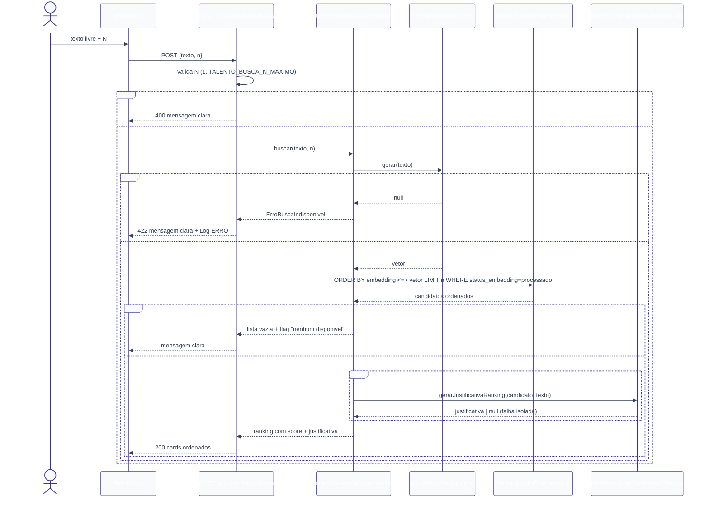

# Banco de Talentos — Design

**Spec**: `.specs/features/banco-de-talentos/spec.md`
**Context**: `.specs/features/banco-de-talentos/context.md`
**Status**: Draft

---

## 0. Decisões técnicas desta sessão (resolvendo pontos deixados em aberto)

`context.md` deixou explicitamente para o Design 3 pontos técnicos (não de UX). Resolvidos agora, com base em precedente já existente no próprio código:

1. **Mecanismo de "background" para o embedding** (Questão em Aberto #1 do `spec.md`). O projeto **não tem fila/worker** (Next.js API routes, deploy Vercel serverless) — um `fire-and-forget` real seria arriscado: a função serverless pode ser congelada/encerrada assim que a resposta HTTP é enviada, matando a Promise não aguardada antes dela terminar. O próprio código já resolveu esse mesmo problema para `resumo_ia`: `aprovacaoService.listarPendentes` (`lib/services/aprovacaoService.ts:106-112`) gera o resumo **de forma síncrona, sob demanda**, dentro da própria requisição que precisa dele, e absorve a falha sem propagar (nunca em background real). **Decisão**: `embeddingService` segue o mesmo padrão — `candidatoService.cadastrar` chama e aguarda a geração do embedding de forma síncrona dentro do próprio `POST /api/candidatos` (aceitando a latência adicional), nunca dispara e esquece. Isso cumpre TAL-03/TAL-05 sem inventar infraestrutura de fila que não existe no projeto.
2. **Onde mora o teto configurável de N** (`context.md`, Agent's Discretion) — variável de ambiente `TALENTO_BUSCA_N_MAXIMO`, lida em `talentoSearchService` com fallback para `100` se ausente/inválida. Ajustável sem alterar código (só variável de ambiente), sem exigir tabela de configuração nova.
3. **Unicidade de e-mail** (`context.md`, decisão de bloquear duplicata) — implementada como `@@unique` no próprio schema (`Candidato.email`), mesmo padrão já usado em `TipoFluxo.nome` (`tipoFluxoService.ts:100-110`, captura `P2002` e traduz para erro de domínio). Reaproveita o padrão, não inventa um novo.

**Ponto de incerteza sinalizado (não fabricado):** a sintaxe exata para habilitar a extensão `pgvector` no schema Prisma nesta versão instalada (`prisma@^7.9.1`, `@prisma/adapter-pg`) — se via `previewFeatures = ["postgresqlExtensions"]` + `extensions = [vector]` no `datasource`, ou apenas uma migration SQL manual (`CREATE EXTENSION IF NOT EXISTS vector;`) antes de `Unsupported("vector(1536)")` — **não foi verificado contra a documentação oficial desta versão nesta sessão**. Recomendação: validar isso como o primeiro passo técnico da fase Tasks, antes de escrever qualquer código que dependa do tipo `vector` (é o risco #1 do PRD §12, e é isolado — não bloqueia o design dos demais componentes).

---

## Architecture Overview

Mesmas camadas do resto do RHOP (`CLAUDE.md`): Route (Zod + `requireUser`) → Service → Prisma. A única exceção documentada é a coluna `embedding`: como é `Unsupported("vector(1536)")`, todo acesso a ela (escrita no cadastro/reprocessamento, leitura na busca por similaridade) passa por `prisma.$executeRaw`/`prisma.$queryRaw` dentro do service — nunca pela API padrão do Prisma Client, que ignora colunas `Unsupported`.




---

## Code Reuse Analysis

### Existing Components to Leverage

| Component | Location | How to Use |
| --- | --- | --- |
| `requireUser([Role.GESTOR, Role.RH_ADMIN])` | `lib/services/authService.ts` | Bloqueia SOLICITANTE em toda rota do módulo (TAL-02, TAL-10, TAL-18) — mesmo padrão de `tipos-fluxo/route.ts`. |
| `logService.registrar` | `lib/services/logService.ts` | `AUDITORIA` no cadastro/reprocessamento bem-sucedido; `ERRO` em falha de embedding/justificativa — mesmo contrato usado em todo o projeto. |
| Padrão "gerar sob demanda, síncrono, falha não propaga" | `lib/services/iaService.ts`, `lib/services/aprovacaoService.ts:374-398` | Modelo direto para `embeddingService.gerar` e `iaService.gerarJustificativaRanking` — nunca lança, sempre retorna `null` em falha, registra `Log ERRO` internamente. |
| Padrão de erro de domínio traduzido de `P2002` | `lib/services/tipoFluxoService.ts:100-110` | Mesmo padrão para e-mail duplicado (`ErroEmailDuplicado`). |
| Padrão de rota (`try/catch` mapeando erros de serviço para status HTTP) | `app/api/tipos-fluxo/route.ts` | Mesmo formato para todas as rotas novas. |
| Padrão de página protegida (Server Component + gate) | `app/(dashboard)/configuracao-fluxos/page.tsx` | Mesmo gate (`requireUser` + `redirect`/mensagem "Acesso restrito") para as 3 telas novas. |
| `OpenAI` client (`openai` SDK já instalado) | `lib/services/iaService.ts:1-2` | Reusa a mesma lib para `client.embeddings.create` (novo) e chat completions (justificativa). |
| `prisma` singleton com `PrismaPg` adapter | `lib/prisma.ts` | Mesmo cliente para `$executeRaw`/`$queryRaw` do embedding — não cria conexão paralela. |

### Integration Points

| System | Integration Method |
| --- | --- |
| `Solicitacao` (feature `solicitacoes`, já existente) | Leitura opcional via `solicitacao_id` — `Candidato` aponta para `Solicitacao.id`; busca nunca depende desse vínculo (P2, TAL-23/24). |
| `iaService` (existente) | Ganha `gerarJustificativaRanking(candidato, queryTexto)`, mesmo arquivo, mesmo padrão de resiliência. |
| `logService`/`authService` (existentes) | Reuso direto, sem alteração nesses services. |

---

## Components

### `prisma/schema.prisma` (novo)

- **Purpose**: entidade `Candidato` com embedding vetorial.
- **Location**: `prisma/schema.prisma`
- **Reuses**: `Role` (não usado diretamente aqui), `User` (`criado_por`), `Solicitacao` (vínculo opcional).

```prisma
enum StatusEmbedding {
  pendente
  processado
  falhou
}

model Candidato {
  id                    String          @id @default(cuid())
  nome                  String
  email                 String          @unique
  telefone              String
  curriculo_texto       String
  curriculo_arquivo_url String?
  transcricao_texto     String
  embedding             Unsupported("vector(1536)")?
  status_embedding      StatusEmbedding @default(pendente)
  solicitacao_id        String?
  solicitacao           Solicitacao?    @relation(fields: [solicitacao_id], references: [id])
  criado_por            String          @db.Uuid
  criador               User            @relation(fields: [criado_por], references: [id])
  criado_em             DateTime        @default(now())

  @@index([status_embedding])
  @@index([solicitacao_id])
  @@map("candidatos")
}
```

> `User` e `Solicitacao` ganham relação inversa (`candidatos Candidato[]`) — adição aditiva, sem impacto nas features existentes.

### `lib/services/embeddingService.ts` (novo)

- **Purpose**: encapsula a chamada de embeddings da OpenAI e a escrita/leitura da coluna `vector` via SQL raw (TAL-03, TAL-04, TAL-05, TAL-12, TAL-19, TAL-29).
- **Location**: `lib/services/embeddingService.ts`
- **Interfaces**:
  - `gerar(texto: string): Promise<number[] | null>` — chama `client.embeddings.create({ model: "text-embedding-3-small", input: texto })`; qualquer falha (chave ausente, erro de API, timeout) → grava `Log ERRO` (`acao: FALHA_IA`) internamente e retorna `null`; nunca lança.
  - `persistirEmbedding(candidatoId: string, vetor: number[]): Promise<void>` — `$executeRaw` `UPDATE candidatos SET embedding = ${vetorComoTextoVector}::vector, status_embedding = 'processado' WHERE id = ${candidatoId}`.
  - `marcarFalha(candidatoId: string): Promise<void>` — `$executeRaw`/`prisma.candidato.update` (campo `status_embedding` não é `Unsupported`, então isso pode ser Prisma Client normal) `status_embedding = 'falhou'`.
- **Dependencies**: `lib/prisma.ts`, `openai`, `logService.registrar`.
- **Reuses**: mesmo padrão de resiliência de `iaService.gerarResumoSolicitacao`.

### `lib/services/candidatoService.ts` (novo)

- **Purpose**: CRUD de `Candidato`, orquestra `embeddingService` no cadastro e no reprocessamento (TAL-01, TAL-04 a TAL-11, TAL-28, TAL-29).
- **Location**: `lib/services/candidatoService.ts`
- **Interfaces**:
  - `cadastrar(input: CandidatoInput, usuarioId: string): Promise<Candidato>` — `prisma.candidato.create` com `status_embedding: 'pendente'`; captura `P2002` (email) → `ErroEmailDuplicado`; em seguida chama `embeddingService.gerar` de forma síncrona (ver seção 0) com o texto combinado (`curriculo_texto + "\n" + transcricao_texto`); sucesso → `persistirEmbedding`; falha → `marcarFalha`; grava `Log AUDITORIA` (`acao: CRIACAO`) ao final, independente do resultado do embedding.
  - `listar(): Promise<CandidatoResumo[]>` — `findMany` sem filtro por `criado_por` (visibilidade colaborativa, TAL-08), ordenado por `criado_em desc`; seleciona `id, nome, email, status_embedding, criado_em` (nunca seleciona `embedding` — coluna `Unsupported`, o client nem a expõe).
  - `reprocessarEmbedding(id: string, usuarioId: string): Promise<Candidato>` — busca candidato; lança `ErroNaoEncontrado` se ausente; lança `ErroReprocessamentoNaoPermitido` se `status_embedding !== 'falhou'` (edge case do `spec.md`); repete o mesmo fluxo síncrono de geração de `cadastrar`.
- **Dependencies**: `lib/prisma.ts`, `embeddingService`, `logService.registrar`.
- **Reuses**: mesmo padrão de `tipoFluxoService` (erros de domínio traduzidos, nunca erro bruto do Prisma).

### `lib/services/talentoSearchService.ts` (novo)

- **Purpose**: orquestra busca — embedding da query → `$queryRaw` de similaridade → justificativa por IA (TAL-12 a TAL-19, TAL-30, TAL-31).
- **Location**: `lib/services/talentoSearchService.ts`
- **Interfaces**:
  - `N_MAXIMO_PADRAO = 100` (usado quando `TALENTO_BUSCA_N_MAXIMO` ausente/inválida — ver seção 0).
  - `buscar(texto: string, n: number): Promise<ResultadoBusca>` — valida `n` (1 a teto); chama `embeddingService.gerar(texto)`; se `null` → lança `ErroBuscaIndisponivel` (rota converte em 422 + já logado por `embeddingService`); senão executa `$queryRaw` (`SELECT id, nome, email, solicitacao_id, 1 - (embedding <=> ${vetor}::vector) AS score FROM candidatos WHERE status_embedding = 'processado' ORDER BY embedding <=> ${vetor}::vector LIMIT ${n}`); se vazio → retorna `{ candidatos: [], disponivel: false }` (TAL-16); senão, para cada resultado chama `iaService.gerarJustificativaRanking` (falha isolada por item, não interrompe o loop — TAL-17) e retorna `{ candidatos, disponivel: true }` com `score` já normalizado 0–1 (cosine similarity, não distância) pra UI renderizar a barra percentual direto (decisão de `context.md`).
- **Dependencies**: `lib/prisma.ts`, `embeddingService`, `iaService`.
- **Reuses**: mesmo padrão de resiliência por item já usado em `aprovacaoService.listarPendentes` (loop que tolera falha individual sem abortar a coleção).

### `lib/services/iaService.ts` (estende o existente)

- **Purpose**: ganha `gerarJustificativaRanking` (TAL-14).
- **Interface nova**: `gerarJustificativaRanking(input: { candidatoId: string; nome: string; curriculoTexto: string; transcricaoTexto: string; queryTexto: string }): Promise<string | null>` — mesmo padrão de `gerarResumoSolicitacao`: monta prompt (perfil buscado + currículo/transcrição do candidato), falha → `Log ERRO` (`entidade: "Candidato"`, `acao: FALHA_IA`) + retorna `null`, nunca lança.

### `lib/validations/candidato.ts` (novo)

- **Purpose**: schema Zod do envelope de cadastro.
- **Interface**: `candidatoInputSchema = z.object({ nome: z.string().min(1), email: z.string().email(), telefone: z.string().min(1), curriculo_texto: z.string().min(1), transcricao_texto: z.string().min(1), solicitacao_id: z.string().optional() })` (TAL-06).

### `lib/validations/talentoBusca.ts` (novo)

- **Purpose**: schema Zod do envelope de busca.
- **Interface**: `talentoBuscaInputSchema = z.object({ texto: z.string().min(1), n: z.number().int().positive().default(20) })` — o teto máximo (`TALENTO_BUSCA_N_MAXIMO`) é validado no SERVICE, não aqui, porque depende de variável de ambiente lida em runtime (mesmo racional de `solicitacaoDados.ts` — validação que depende de estado externo vive no service, TAL-30).

### API Routes

- **`app/api/candidatos/route.ts`**
  - `GET` → `requireUser([Role.GESTOR, Role.RH_ADMIN])` → `candidatoService.listar()` (TAL-08 a TAL-11).
  - `POST` → `requireUser([...])` → Zod → `candidatoService.cadastrar` → `ErroEmailDuplicado` → 409 (TAL-01 a TAL-07, TAL-28).
- **`app/api/candidatos/[id]/route.ts`**
  - `GET` → `requireUser([...])` → `candidatoService.buscarPorId(id)` (suporte à P3, detalhe do candidato).
- **`app/api/candidatos/[id]/reprocessar/route.ts`**
  - `POST` → `requireUser([...])` → `candidatoService.reprocessarEmbedding(id, usuario.id)` → `ErroReprocessamentoNaoPermitido` → 409 (TAL-29).
- **`app/api/candidatos/busca/route.ts`**
  - `POST` → `requireUser([...])` → Zod (envelope) → `talentoSearchService.buscar` → `ErroBuscaIndisponivel` → 422 (TAL-12 a TAL-19, TAL-30).
- **Reuses**: `authService.requireUser`, mesmo formato de `try/catch` de `tipos-fluxo/route.ts`.

### UI — `app/(dashboard)/banco-de-talentos/`

- **`page.tsx`** — Server Component: gate `requireUser([GESTOR, RH_ADMIN])`; chama `candidatoService.listar()` DIRETO (mesmo padrão de `configuracao-fluxos/page.tsx`); lista com nome, e-mail, badge de `status_embedding`; botão "Reprocessar" só na linha com `falhou` (Client Component pequeno pra disparar o `POST /reprocessar` e dar feedback); link "Novo Candidato" e "Buscar Candidatos".
- **`novo/page.tsx`** + **`novo/_components/NovoCandidatoForm.tsx`** — formulário com os 5 campos obrigatórios do P0 (nome, e-mail, telefone, currículo, transcrição colados); submete `POST /api/candidatos`; exibe erro 409 (e-mail duplicado) inline no campo e-mail.
- **`busca/page.tsx`** + **`busca/_components/BuscaForm.tsx`** + **`busca/_components/CandidatoCard.tsx`** — campo de texto livre + campo N (padrão 20); submete `POST /api/candidatos/busca`; resultados em **cards** (decisão de `context.md`): nome, e-mail, vaga vinculada (se houver), score em barra + percentual, justificativa; estado vazio "nenhum candidato disponível para busca ainda" (TAL-16); N inválido bloqueia com mensagem antes de submeter (validação client-side espelhando a regra do service).
- **Reuses**: mesmo estilo inline (`style={{ padding: "2rem" }}` etc.) de `configuracao-fluxos/page.tsx` — este projeto não usa biblioteca de componentes.

---

## Data Models

```typescript
interface CandidatoResumo {
  id: string
  nome: string
  email: string
  status_embedding: 'pendente' | 'processado' | 'falhou'
  criado_em: Date
}

interface CandidatoRankeado {
  id: string
  nome: string
  email: string
  solicitacao_id: string | null
  score: number // 0-1, cosine similarity (1 - distancia)
  justificativa: string | null // null se a IA falhou para este item
}

interface ResultadoBusca {
  candidatos: CandidatoRankeado[]
  disponivel: boolean // false quando nao ha nenhum status_embedding=processado
}
```

**Relationships**: `Candidato.criado_por` → `User.id` (obrigatório, real FK). `Candidato.solicitacao_id` → `Solicitacao.id` (opcional, real FK, nunca condição de busca).

---

## Error Handling Strategy

| Error Scenario | Handling | User Impact |
| --- | --- | --- |
| Usuário SOLICITANTE acessa qualquer rota do módulo | `requireUser([GESTOR, RH_ADMIN])` lança `ErroNaoAutorizado` → 403 | "Você não tem permissão" |
| E-mail já cadastrado | `P2002` capturado → `ErroEmailDuplicado` → 409 | "Já existe candidato com este e-mail" |
| Campo obrigatório ausente no cadastro | Zod rejeita → 400 | Mensagem de validação por campo, nada persistido |
| Falha na geração do embedding (cadastro ou reprocessamento) | `embeddingService.gerar` retorna `null`; `status_embedding = falhou`; `Log ERRO` | Candidato salvo e visível, fora de buscas até reprocessar — nunca bloqueia o cadastro |
| "Reprocessar" acionado em candidato que não está `falhou` | `ErroReprocessamentoNaoPermitido` → 409 | Ação não disponível (também escondida na UI) |
| Falha no embedding da própria busca | `ErroBuscaIndisponivel` → 422 | "Não foi possível processar a busca agora, tente novamente" + `Log ERRO` |
| Busca sem nenhum candidato `processado` | `disponivel: false`, sem lançar erro | "Nenhum candidato disponível para busca ainda" |
| Falha na justificativa de IA para um candidato do ranking | `iaService.gerarJustificativaRanking` retorna `null` para aquele item | Card aparece sem justificativa, resto do ranking intacto |
| N inválido (zero, negativo, não numérico, acima do teto) | Service rejeita antes de montar a query → 400 | Mensagem clara com o teto atual |

---

## Tech Decisions (only non-obvious ones)

| Decision | Choice | Rationale |
| --- | --- | --- |
| Mecanismo de "background" do embedding | Síncrono, sob demanda, dentro da própria request | Sem infraestrutura de fila no projeto; mesmo padrão já usado por `resumo_ia` (`aprovacaoService`) — ver seção 0 |
| Teto de N | `TALENTO_BUSCA_N_MAXIMO` (env var), fallback 100 | Decisão de `context.md`: configurável sem alterar código |
| Unicidade de e-mail | `@@unique` no schema + tradução de `P2002` | Decisão de `context.md`; mesmo padrão de `TipoFluxo.nome` |
| Score exibido | Cosine similarity normalizada (0–1), não distância bruta | UI (`context.md`) pede percentual + barra — `1 - distância` já entrega isso pronto, sem transformação extra na UI |
| Acesso à coluna `embedding` | Apenas via `$executeRaw`/`$queryRaw`, nunca pela API padrão do Prisma Client | `Unsupported("vector(1536)")` não é exposto pelo client — documentado também no `CLAUDE.md` (PRD §7) |
| Extensão `pgvector` no schema Prisma | **Não decidido nesta sessão — flagged como incerto** (ver seção 0) | Evita fabricar sintaxe não verificada; primeiro passo técnico da fase Tasks |
| Edição/exclusão de candidato | Fora de escopo (não implementado) | Confirmado como assumido no `spec.md`, sem objeção na discussão |

---

## Requirement Traceability (mapeamento para Design)

| Requirement ID | Coberto por |
| --- | --- |
| TAL-01 | `candidatoService.cadastrar` — `prisma.candidato.create` com `status_embedding=pendente` |
| TAL-02 | `requireUser([GESTOR, RH_ADMIN])` em `POST /api/candidatos` |
| TAL-03 | Geração síncrona de embedding dentro de `cadastrar` (seção 0) |
| TAL-04 | `embeddingService.persistirEmbedding` em sucesso |
| TAL-05 | `embeddingService.marcarFalha` + `Log ERRO` em falha |
| TAL-06 | `candidatoInputSchema` (Zod) na rota |
| TAL-07 | `logService.registrar` (`AUDITORIA`) ao final de `cadastrar` |
| TAL-08 | `candidatoService.listar` sem filtro por `criado_por` |
| TAL-09 | Seleção de `nome, email, status_embedding` em `listar` |
| TAL-10 | `requireUser([...])` em `GET /api/candidatos` |
| TAL-11 | UI: estado vazio em `page.tsx` |
| TAL-12 | `talentoSearchService.buscar` → `embeddingService.gerar(texto)` |
| TAL-13 | `$queryRaw` com `ORDER BY embedding <=> ... WHERE status_embedding = 'processado'` |
| TAL-14 | `iaService.gerarJustificativaRanking` por item do Top N |
| TAL-15 | UI: `CandidatoCard` exibe nome, e-mail, vaga, score, justificativa |
| TAL-16 | `ResultadoBusca.disponivel = false` quando não há `processado` |
| TAL-17 | Loop de justificativa tolera falha isolada por item |
| TAL-18 | `requireUser([...])` em `POST /api/candidatos/busca` |
| TAL-19 | `ErroBuscaIndisponivel` (422) + `Log ERRO` quando embedding da query falha |
| TAL-20 a TAL-22 | Fora deste ciclo — P2 (Upload PDF), não desenhado agora |
| TAL-23/24 | Fora deste ciclo — P2 (Vínculo a Vaga), campo `solicitacao_id` já modelado no schema pra não exigir migration futura |
| TAL-25 | Fora deste ciclo — P3 (Detalhe + histórico) |
| TAL-26 | `talentoSearchService.buscar` valida `n` (1..teto) antes da query |
| TAL-27 | Ver seção 0 — flagged como incerto, validar na fase Tasks |
| TAL-28 | `@@unique` em `Candidato.email` + `ErroEmailDuplicado` (409) |
| TAL-29 | `reprocessarEmbedding` + rota `POST /api/candidatos/[id]/reprocessar` + UI condicional |
| TAL-30 | Validação de N no service, 400 com mensagem clara |
| TAL-31 | UI: `CandidatoCard` com score em barra + percentual |

---

## Riscos / Pontos a verificar na fase de Tasks

- **Extensão `pgvector`** (TAL-27): primeiro passo técnico antes de qualquer código que toque a coluna `embedding` — confirmar sintaxe Prisma 7.9.1 + `@prisma/adapter-pg` pra habilitar a extensão, e confirmar que o projeto Supabase já a suporta (risco já citado no PRD §12).
- **Latência do cadastro síncrono**: como o embedding é gerado dentro da mesma request de `POST /api/candidatos` (seção 0), o cadastro fica sujeito à latência da OpenAI. Se isso se mostrar um problema de UX real, é um retrabalho isolado em `candidatoService`/rota (ex.: revisitar fila real), não uma mudança de schema.
- **`solicitacao_id` modelado desde já** (P0) mesmo com a feature de vínculo (RF7) sendo P2 — decisão deliberada pra evitar uma migration aditiva depois; o campo fica presente e `null` até a P2 ser implementada.
