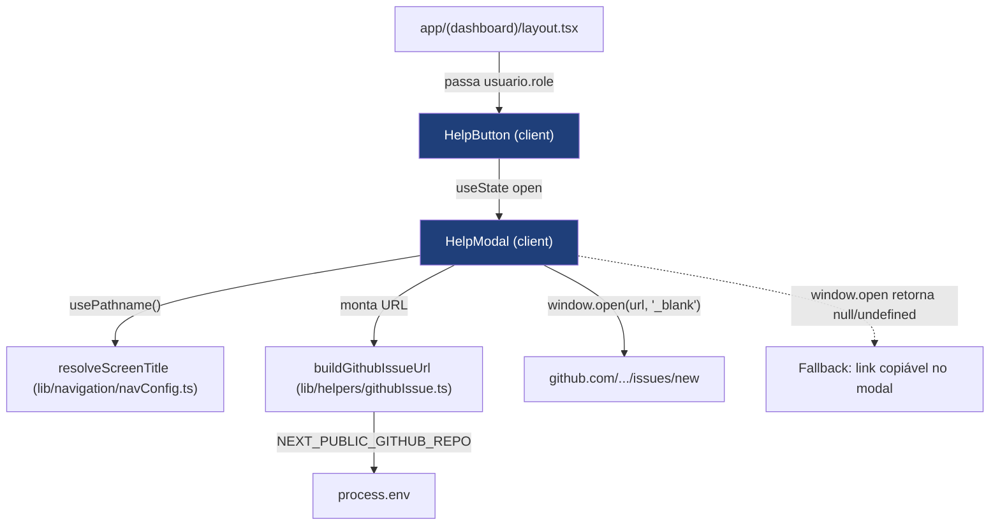

# Botão de Ajuda com Abertura de Issue no GitHub Design

**Spec**: `.specs/features/botao-ajuda-github/spec.md`
**Status**: Draft

> Layout de referência: `docs/design-ux-ui/fluxorh-ui-layout-specs.md` §4.11 (Componente Flutuante: Botão de Ajuda & Modal de Issue) e markup/CSS correspondente em `docs/design-ux-ui/fluxorh-mockup.html` (`.help-fab`, `.modal-overlay`, `.modal-card`, linhas ~437-458 e ~1108-1148).

---

## Architecture Overview

Feature 100% client-side (V1), sem rota de API nem Prisma. Um utilitário puro monta a URL do GitHub; um componente de UI cuida do botão flutuante e do modal; o ponto de montagem é o layout compartilhado do grupo de rotas autenticadas.



Nenhuma chamada a `app/api/**`, nenhum acesso a `lib/prisma.ts`, nenhum `Log` gravado — consistente com a seção 7 do PRD ("não há chamada a nenhuma rota do FluxoRH nem ao Prisma nessa versão").

---

## Code Reuse Analysis

### Existing Components to Leverage

| Component | Location | How to Use |
| --- | --- | --- |
| `resolveScreenTitle(pathname)` | `lib/navigation/navConfig.ts` | Reusado para obter o nome amigável da tela atual (HELP-03/HELP-04) — mesma fonte de verdade que a `Topbar` usa para o título, evita um segundo dicionário de nomes de tela divergente. Também cobre o caso de rota não mapeada via seu fallback já existente (`{ eyebrow: "OP Conecta", titulo: "Tela" }`), sem precisar de tratamento especial nesta feature. |
| `Role` (enum) | `lib/generated/prisma/client` | Tipo do prop `papel` recebido pelo `HelpButton`/`HelpModal` — mesmo enum já usado em `authService.ts` e `navConfig.ts`. |
| `AuthenticatedUser.role` | `lib/services/authService.ts` (via `requireUser()`) | Resolvido uma vez no `layout.tsx` (introduzido por `menu-navegacao`) e repassado como prop — nenhuma nova chamada de sessão. |
| Design tokens (`--azul-800`, `--azul-900`, `--amarelo-600`, `--linha`, `--radius`, `--shadow`, `--font-fraunces`, `--font-inter`, `--font-ibm-plex-mono`) | `app/globals.css` | Já definidos (introduzidos por `menu-navegacao`) — este CSS Module só referencia `var(--...)`, não redefine cores. |
| Padrão de CSS Module por componente (`.btn`, `.btnPrimary`, `.btnGhost`, `.field`, `.card`) | `app/(dashboard)/aprovacoes/aprovacoes.module.css` | Mesma convenção de nomes/estrutura replicada em `ajuda.module.css` — o projeto não usa Tailwind nem uma lib de componentes compartilhada; cada módulo define os próprios estilos de botão. |

### Integration Points

| Sistema | Método de Integração |
| --- | --- |
| `app/(dashboard)/layout.tsx` (shell compartilhado, ver `menu-navegacao/design.md`) | `HelpButton` é renderizado como irmão de `{children}` dentro desse layout, recebendo `papel={usuario.role}`. Isso garante presença em toda tela do grupo `(dashboard)` (RF1) e ausência automática em `/login` (fora do grupo) sem nenhuma lógica condicional própria. |
| `lib/navigation/navConfig.ts` | Consumido só para leitura (`resolveScreenTitle`) — nenhuma alteração nesse arquivo. |
| Variável de ambiente `NEXT_PUBLIC_GITHUB_REPO` | Lida via `process.env.NEXT_PUBLIC_GITHUB_REPO!` dentro de `HelpModal`, mesmo padrão já usado para `NEXT_PUBLIC_SUPABASE_URL` em `lib/supabase/client.ts`/`server.ts`. |

**Dependência entre specs**: esta feature assume que `app/(dashboard)/layout.tsx` (de `menu-navegacao`) existe. Ver Riscos/Observações abaixo para a ordem de execução caso `menu-navegacao` ainda não tenha sido implementada.

---

## Components

### `lib/helpers/githubIssue.ts`

- **Purpose**: Função pura que monta a URL de `.../issues/new` a partir de tipo, tela, papel, título e descrição — nunca aceita e-mail ou nome, então é estruturalmente impossível vazar esses dados por essa função (reforça HELP-08 no nível de tipo, não só de disciplina).
- **Location**: `lib/helpers/githubIssue.ts` (+ `lib/helpers/githubIssue.test.ts`)
- **Interfaces**:
  - `buildGithubIssueUrl(input: BuildGithubIssueUrlInput): string` — monta título (`[tipo] titulo`, ou `[tipo] (sem título)` se `titulo` vier vazio/só espaços — HELP-06), corpo (`**Tipo:** ...\n**Tela:** ...\n**Papel:** ...\n\n{descricao}`) e retorna a URL final com `encodeURIComponent` em `title`/`body`.
  - `type BuildGithubIssueUrlInput = { repo: string; tipo: 'Bug' | 'Melhoria' | 'Dúvida'; tela: string; papel: Role; titulo: string; descricao: string }`
- **Dependencies**: `Role` (`lib/generated/prisma/client`, só para o tipo do parâmetro — o valor vira string no corpo via `String(papel)`)
- **Reuses**: nenhuma dependência externa nova.

### `components/ajuda/HelpButton.tsx`

- **Purpose**: Renderiza o FAB ("?") fixo e o estado aberto/fechado do modal (RF1).
- **Location**: `components/ajuda/HelpButton.tsx` — **Client Component** (`'use client'`, `useState`).
- **Interfaces**: `HelpButton({ papel: Role }): JSX.Element`
- **Dependencies**: `HelpModal`
- **Reuses**: `ajuda.module.css` (`.fab`)

### `components/ajuda/HelpModal.tsx`

- **Purpose**: Formulário do relato (tipo/título/descrição), exibição da tela atual somente leitura, montagem da URL e abertura em nova aba, com fallback para pop-up bloqueado.
- **Location**: `components/ajuda/HelpModal.tsx` — **Client Component** (`'use client'`, `usePathname`, `useState`).
- **Interfaces**: `HelpModal({ papel: Role; onClose: () => void }): JSX.Element`
- **Dependencies**: `usePathname` (`next/navigation`), `resolveScreenTitle` (`lib/navigation/navConfig.ts`), `buildGithubIssueUrl` (`lib/helpers/githubIssue.ts`)
- **Reuses**: `ajuda.module.css` (`.overlay`, `.modalCard`, `.modalHead`, `.modalClose`, `.modalBody`, `.tabToggle`, `.field`, `.cellSub`, `.btn`, `.btnGhost`, `.btnPrimary`, `.aviso`, `.fallbackLink`)

### `components/ajuda/ajuda.module.css`

- **Purpose**: Estilos do FAB e do modal, portando literalmente os tokens/classes do mockup (`.help-fab`, `.modal-overlay`, `.modal-card`, `.modal-head`, `.modal-close`, `.modal-body`) para CSS Module, seguindo a mesma convenção de `aprovacoes.module.css`.
- **Location**: `components/ajuda/ajuda.module.css`
- **Reuses**: tokens de `app/globals.css`.

---

## Data Models

Nenhum — V1 não persiste nada (spec, seção "Out of Scope"; PRD, seção 7). Sem alteração em `schema.prisma`.

```typescript
// lib/helpers/githubIssue.ts — não é um model persistido, é o contrato de entrada da função pura.
import type { Role } from "@/lib/generated/prisma/client";

interface BuildGithubIssueUrlInput {
  repo: string;
  tipo: "Bug" | "Melhoria" | "Dúvida";
  tela: string;
  papel: Role;
  titulo: string;
  descricao: string;
}
```

**Relationships**: Nenhuma — não depende de `Solicitacao`, `User` ou qualquer tabela do Prisma.

---

## Error Handling Strategy

| Error Scenario | Handling | User Impact |
| --- | --- | --- |
| `window.open()` retorna `null`/`undefined` (pop-up bloqueado) | `HelpModal` verifica o retorno; se falsy, mantém o modal aberto e exibe uma seção de fallback com a URL montada em texto selecionável + botão "Copiar link" (`navigator.clipboard.writeText`, com `try/catch` silencioso — se a Clipboard API falhar, o link continua visível e selecionável manualmente). | Usuário vê a mensagem "Não foi possível abrir automaticamente. Copie o link abaixo:" e o link, sem nenhum erro visível fora do modal (HELP-10). |
| `pathname` atual não corresponde a nenhum item de `navConfig.ts` (rota não mapeada, incluindo hipotéticas páginas dinâmicas futuras) | `resolveScreenTitle` já retorna um fallback genérico (`{ eyebrow: "OP Conecta", titulo: "Tela" }`) — comportamento herdado, sem código adicional nesta feature. | Campo "Tela atual" mostra "Tela" em vez de ficar vazio ou quebrar o modal. |
| Título vazio/só espaços ao confirmar | `buildGithubIssueUrl` aplica o padrão `"(sem título)"` antes de montar a URL — nunca bloqueia o envio (HELP-06). | Issue é criada com título `"[Bug] (sem título)"` (exemplo), sem mensagem de erro de validação. |
| `NEXT_PUBLIC_GITHUB_REPO` não definido em runtime | Fora do escopo de tratamento em código — é erro de configuração de ambiente, não de fluxo do usuário; documentado nas Tech Decisions e no `.env.example`. | Se não configurado, a URL fica malformada; mitigação é operacional (checklist de deploy), não uma branch de código. |

---

## Tech Decisions (only non-obvious ones)

| Decision | Choice | Rationale |
| --- | --- | --- |
| Onde montar o `HelpButton` | Dentro de `app/(dashboard)/layout.tsx` (de `menu-navegacao`), como irmão de `{children}` | O grupo de rotas `(dashboard)` já delimita exatamente "toda tela autenticada, exceto login" (login vive em `app/login`, fora do grupo) — reaproveitar essa fronteira evita reimplementar a checagem "estou numa tela autenticada?" e satisfaz RF1/HELP-01/HELP-02 automaticamente. |
| Detecção de pop-up bloqueado | Checar o valor de retorno de `window.open()` (`null`/`undefined` → bloqueado) | É o único sinal síncrono e multi-navegador disponível sem depender de heurísticas de timeout (`newWindow.closed` após `setTimeout` é inconsistente entre navegadores). Documentado como verificação best-effort: alguns navegadores podem retornar um objeto `Window` mesmo bloqueando visualmente — não há forma 100% confiável de detectar isso só no client; por isso o fallback com link copiável funciona como rede de segurança em ambos os casos (o usuário sempre pode copiar o link manualmente pelo texto exibido, esteja o `window.open` reportando bloqueio ou não). |
| Função de URL como pura, sem aceitar dados do usuário (e-mail/nome) | `buildGithubIssueUrl` só recebe `papel: Role`, nunca um objeto de usuário completo | Torna HELP-08 (nunca incluir dado sensível) uma garantia estrutural — impossível vazar e-mail/nome por essa função porque a assinatura não permite passá-los, em vez de depender apenas de disciplina do chamador. |
| Onde fica a lógica de montagem da URL | Função pura em `lib/helpers/` (não em `lib/services/`) | CLAUDE.md reserva `lib/services/*.ts` para lógica de negócio que envolve `Solicitacao`/Prisma/regras de aprovação; esta função não acessa banco nem regra de negócio de RH — é uma formatação de string pura e testável, mais próxima do padrão já usado em `lib/navigation/navConfig.ts` (dado/lógica de UI, não de domínio). |
| Escopo de acesso (papel) | Nenhuma checagem de papel — todo usuário autenticado vê o botão | Confirmado no PRD (seção 3) e no spec: sem distinção de permissão para reportar. |

---

## Riscos / Observações

1. **Dependência de `menu-navegacao`**: o ponto de montagem (`app/(dashboard)/layout.tsx`) é introduzido por `menu-navegacao`, cujo `design.md` está com **Status: Draft** e ainda não tem código correspondente (`app/(dashboard)/_components/AppShell.tsx` não existe no repo nesta data). Se `botao-ajuda-github` for implementada antes de `menu-navegacao`: a task de montagem cria um `app/(dashboard)/layout.tsx` mínimo (`return <>{children}<HelpButton papel={usuario.role} /></>`, chamando `requireUser()` sem papéis, igual ao contrato já definido em `menu-navegacao/design.md`) — quem implementar `menu-navegacao` depois só precisa envolver `{children}` com `AppShell`, sem remover o `HelpButton` já presente. Se `menu-navegacao` for implementada primeiro, a task apenas adiciona a linha `<HelpButton />` ao layout já existente. Nenhum dos dois casos exige retrabalho da outra feature.
2. **Confirmação de escopo com o time** (herdado do spec, Questão em Aberto 1): este design assume que V1 (client-side, sem token) foi aprovada. Se o time decidir por V2 antes da execução, este `design.md` fica obsoleto e precisa ser refeito com service/rota/tabela `Feedback`.
3. **Valor real de `NEXT_PUBLIC_GITHUB_REPO`**: ainda não confirmado (Questão em Aberto 2 do spec) — a task de configuração de ambiente usa um placeholder documentado até a confirmação.

---

## Tips (preenchidas)

- Nenhuma tela nova: este design só adiciona um componente flutuante global — reaproveita o grupo de rotas `(dashboard)` como fronteira de "autenticado", sem duplicar guarda de acesso.
- `resolveScreenTitle` evita um segundo dicionário de nomes de tela — mudou o nome de uma tela? Só `navConfig.ts` muda, `HelpModal` acompanha de graça.
