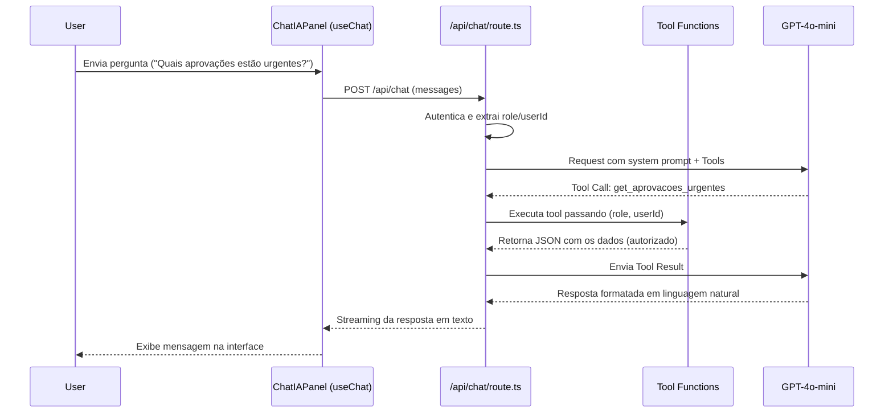

# Chat IA Interno - Design

## 1. Arquitetura

A funcionalidade "Chat IA Interno" será implementada usando **Vercel AI SDK**, que oferece hooks React otimizados (`useChat`) e suporte nativo a chamadas de ferramentas (Function Calling) com modelos como o GPT-4o-mini da OpenAI. 

A arquitetura se divide em duas camadas:
1. **Frontend (Client Components):** 
   - `ChatIAFab.tsx`: O botão flutuante sobreposto, ancorado acima do botão de ajuda existente.
   - `ChatIAPanel.tsx`: Um painel lateral ou overlay posicionado no canto inferior direito. Ele renderizará o array de `messages` (fornecido pelo `useChat`) e exibirá estados de loading e botões de ação.
2. **Backend (API Route):**
   - `app/api/chat/route.ts`: Rota responsável por instanciar a comunicação segura com a API da OpenAI através da `streamText` function. 
   - Receberá o array de mensagens e processará os tool calls no servidor, garantindo que o `userId` e `userRole` autenticados sejam usados.

## 2. Fluxo de Dados e Segurança

**Bloqueio de Contexto Externo:**
O `systemPrompt` será estrito: "Você é um assistente de RH interno do sistema OP Conecta. Responda apenas baseando-se nos resultados das ferramentas disponíveis. Se o usuário perguntar sobre assuntos externos ou não relacionados, decline educadamente informando que você é restrito ao contexto do sistema."

## 3. Componentes UI/UX (Pro Max)

**ChatIAFab**: 
Um botão usando o token `--amarelo-600` ou um outline forte `--azul-800` com um ícone de Sparkles/Chat. A cor de contraste do design será aplicada para destacá-lo da ajuda.

**ChatIAPanel**:
- Container: Fundo branco (`--paper-raised`) com sombra profunda (`var(--shadow)`), bordas arredondadas e cabeçalho `var(--azul-900)`.
- Bolhas do Usuário: Fundo `var(--azul-100)`.
- Bolhas da IA: Fundo `var(--amarelo-100)`, com texto em `var(--azul-900)`.

## 4. Integração das Ferramentas (Tools)

Implementaremos ferramentas via zod schemas para validar os retornos:
1. `get_indicadores_dashboard`: Usa o `insightsService` (ou chama Prisma direto se for simples) para somar quantas aprovações pendentes/atrasadas há, respeitando a visualização do usuário.
2. `get_solicitacoes`: Lista protocolos ou nomes recentes de solicitações na mesa do usuário.
