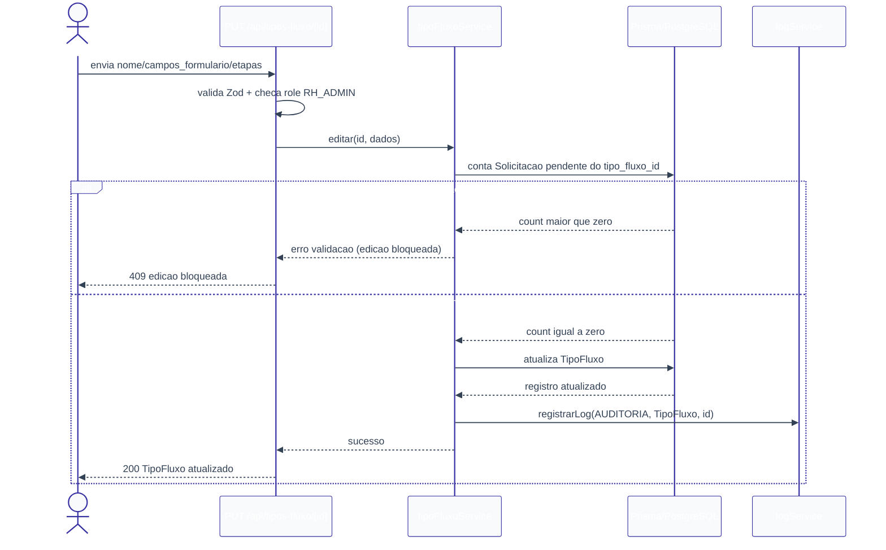

# Configuração de Fluxos — Design

**Spec**: `.specs/features/configuracao-fluxos/spec.md`
**Context**: `.specs/features/configuracao-fluxos/context.md`
**Status**: Approved

---

## 0. Nota de reconciliação (atualizado pós-implementação de `autenticacao-usuarios` e `auditoria-logs`)

Esta seção descrevia originalmente um plano de bootstrap (repositório greenfield, nenhuma feature com `design.md` ainda) onde `configuracao-fluxos` criaria `Role`, um helper de auth e um `logService` mínimos como fundação para as demais. **Isso já não é o estado real do repositório** — `autenticacao-usuarios` e `auditoria-logs` foram implementadas por completo desde então, com contratos reais (não stubs):

| Peça que este design ainda cita pelo nome antigo | Nome/local real já implementado | Situação |
| --- | --- | --- |
| Enum `Role` | `enum Role` em `prisma/schema.prisma` (`autenticacao-usuarios`) | ✅ Já existe — **reusar**, não recriar |
| `getUsuarioAutenticado` / `requireRole` | `authService.getSessionUser()` / `authService.requireUser(roles?)` em `lib/services/authService.ts` | ✅ Já existe — **reusar**. Lança `ErroNaoAutenticado`/`ErroNaoAutorizado` (não retorna void) |
| `logService.registrarLog(evento)` | `logService.registrar(evento)` em `lib/services/logService.ts` | ✅ Já existe — **reusar**. Mesma assinatura de campos (`tipo`, `entidade`, `entidade_id`, `acao`, `usuario_id?`, `detalhes?`), nome do método é `registrar` |

**O que esta feature ainda precisa criar como fundação mínima real**: só o model `Solicitacao` (ver seção Components) — necessário para a checagem de "solicitação pendente vinculada" ao editar um `TipoFluxo` (CONF-07), e que a feature `solicitacoes` ainda não desenhou. Segue o mesmo padrão já usado por `auditoria-logs` (modelo mínimo real, não stub) — quando `solicitacoes` for desenhada, deve **estender** este model, não recriá-lo.

Todas as referências abaixo a `getUsuarioAutenticado`, `requireRole` e `registrarLog` devem ser lidas como `authService.getSessionUser`/`requireUser` e `logService.registrar`, respectivamente — não corrigido em cada ocorrência do texto/diagramas abaixo para não invalidar o histórico do documento, mas a fase de Tasks usa os nomes reais.

---

## Architecture Overview

Camadas conforme `CLAUDE.md`: Route (Zod + auth) → Service (regra de negócio) → Prisma (dados). Sem lógica de negócio na route.


Fluxo de edição (caso de borda relevante: bloqueio por solicitação pendente):



---

## Code Reuse Analysis

### Existing Components to Leverage

Nenhum — greenfield, nenhuma linha de código no repositório ainda. Todo componente abaixo é novo.

### Integration Points

| System | Integration Method |
| --- | --- |
| `solicitacoes` | Lê `TipoFluxo` (nome, `campos_formulario`, `etapas`) via `tipoFluxoService.listar`/`buscarPorId` para popular "Nova Solicitação". Não escreve. |
| `aprovacoes` | Lê `TipoFluxo.etapas` para saber a próxima etapa/papel. Não escreve. |
| `auditoria-logs` | Já implementada — esta feature só chama `logService.registrar` (contrato AUD-01), ver seção 0. |
| `autenticacao-usuarios` | Já implementada — fornece `Role` enum + `authService.requireUser`, ver seção 0. |

---

## Components

### `prisma/schema.prisma` (extensão)

- **Purpose**: define o enum `Role` (fundação) e o model `TipoFluxo`.
- **Location**: `prisma/schema.prisma`
- **Reuses**: nenhum (primeiro corte do schema)

```prisma
enum Role {
  SOLICITANTE
  GESTOR
  RH_ADMIN
}

model TipoFluxo {
  id                String        @id @default(cuid())
  nome              String        @unique
  campos_formulario Json
  etapas            Json          // Role[] serializado, ex: ["GESTOR", "RH_ADMIN"]
  criado_em         DateTime      @default(now())
  atualizado_em     DateTime      @updatedAt
  solicitacoes      Solicitacao[]

  @@map("tipos_fluxo")
}
```

> `Log` já existe (model completo, `auditoria-logs`) — nada a criar aqui, só chamar `logService.registrar`. `Solicitacao` ainda não existe (feature `solicitacoes` ainda não desenhada) — esta feature cria uma versão mínima real, restrita aos campos que a checagem de "pendente vinculada" (CONF-07) precisa:
>
> ```prisma
> enum StatusSolicitacao {
>   PENDENTE
>   APROVADA
>   REJEITADA
> }
>
> model Solicitacao {
>   id            String            @id @default(cuid())
>   tipo_fluxo_id String
>   tipoFluxo     TipoFluxo         @relation(fields: [tipo_fluxo_id], references: [id])
>   status        StatusSolicitacao @default(PENDENTE)
>   criado_em     DateTime          @default(now())
>
>   @@index([tipo_fluxo_id])
>   @@index([status])
>   @@map("solicitacoes")
> }
> ```
>
> Quando `solicitacoes` for desenhada, deve **estender** este model (adicionar `usuario_id`, `dados`, `prazo_sla`, `etapa_atual`, etc.) — não recriá-lo. `TipoFluxo` ganha a relação inversa `solicitacoes Solicitacao[]` (exigência do Prisma para relações bidirecionais).

### `lib/services/authService.ts` (já implementada — reusar, ver seção 0)

- **Purpose**: resolver `{ id, nome, email, role, gestor_id }` a partir da sessão Supabase; exigir papel.
- **Location**: `lib/services/authService.ts` (já existe)
- **Interfaces reais**:
  - `getSessionUser(): Promise<AuthenticatedUser | null>`
  - `requireUser(roles?: Role[]): Promise<AuthenticatedUser>` — lança `ErroNaoAutenticado` (sem sessão/`User`) ou `ErroNaoAutorizado` (papel fora da lista).
- **Reuses**: nada a criar — esta feature só chama `requireUser(['RH_ADMIN'])` nas rotas/páginas.

### `lib/services/logService.ts` (já implementada — reusar, ver seção 0)

- **Purpose**: ponto único de gravação de `Log`, conforme contrato AUD-01.
- **Location**: `lib/services/logService.ts` (já existe)
- **Interface real**: `registrar(evento: { tipo: 'AUDITORIA' | 'ERRO'; entidade: string; entidade_id: string; acao: string; usuario_id?: string | null; detalhes?: unknown }): Promise<void>` — nunca lança exceção (contém falha internamente, AUD-03).
- **Reuses**: nada a criar — `tipoFluxoService` só chama `registrar(...)`.

### `lib/validations/tipoFluxo.ts`

- **Purpose**: schemas Zod de entrada para criação/edição.
- **Location**: `lib/validations/tipoFluxo.ts`
- **Interfaces**:
  - `campoFormularioSchema: ZodType<CampoFormularioDefinicao>`
  - `tipoFluxoInputSchema: ZodType<TipoFluxoInput>`
- **Reuses**: nada.

### `lib/services/tipoFluxoService.ts`

- **Purpose**: lógica de negócio de CRUD de `TipoFluxo` (CONF-01 a CONF-09).
- **Location**: `lib/services/tipoFluxoService.ts`
- **Interfaces**:
  - `listar(): Promise<TipoFluxoResumo[]>` — nome + id, todos os registros (CONF-06).
  - `buscarPorId(id: string): Promise<TipoFluxoDetalhe>` — lança `ErroNaoEncontrado` se não existir.
  - `criar(dados: TipoFluxoInput, usuarioId: string): Promise<TipoFluxoDetalhe>` — persiste e grava `Log AUDITORIA` (CONF-02 a CONF-05, CONF-09).
  - `editar(id: string, dados: TipoFluxoInput, usuarioId: string): Promise<TipoFluxoDetalhe>` — verifica `Solicitacao` pendente vinculada antes de atualizar; lança `ErroEdicaoBloqueada` se houver; grava `Log AUDITORIA` no sucesso (CONF-07).
- **Dependencies**: Prisma (`TipoFluxo`, `Solicitacao` — leitura mínima), `logService`.
- **Reuses**: `logService.registrar`.

### API Routes

- **`app/api/tipos-fluxo/route.ts`**
  - `GET` → `authService.requireUser(['RH_ADMIN'])` → `tipoFluxoService.listar()` (CONF-01, CONF-06).
  - `POST` → `authService.requireUser(['RH_ADMIN'])` → valida `tipoFluxoInputSchema` → `tipoFluxoService.criar()` (CONF-01 a CONF-05, CONF-08, CONF-09).
- **`app/api/tipos-fluxo/[id]/route.ts`**
  - `GET` → `authService.requireUser(['RH_ADMIN'])` → `tipoFluxoService.buscarPorId(id)` (CONF-06).
  - `PUT` → `authService.requireUser(['RH_ADMIN'])` → valida `tipoFluxoInputSchema` → `tipoFluxoService.editar(id, ...)` (CONF-01, CONF-07, CONF-08, CONF-09).
- **Reuses**: `authService.requireUser`, `tipoFluxoInputSchema`, `tipoFluxoService`.

### UI — `app/(dashboard)/configuracao-fluxos/`

- **`page.tsx`** — Server Component: lista `TipoFluxo` (chama service diretamente ou via fetch interno); RH_Admin only, redireciona/renderiza 403 para outros papéis.
- **`novo/page.tsx`** e **`[id]/editar/page.tsx`** — usam o mesmo `TipoFluxoForm` (Client Component).
- **`_components/TipoFluxoForm.tsx`** — nome + `EtapasEditor` + `CampoFormularioEditor`; submete para `POST`/`PUT`.
- **`_components/EtapasEditor.tsx`** — lista ordenável de papéis (`GESTOR`/`RH_ADMIN`); add/remove/reordenar.
- **`_components/CampoFormularioEditor.tsx`** — lista de campos (`chave`, `rotulo`, `tipo`, `obrigatorio`, `opcoes` quando `tipo=selecao`, `min`/`max` quando aplicável); add/remove/reordenar.
- **Dependencies**: rotas acima.
- **Reuses**: nada ainda (primeira tela do projeto).

---

## Data Models

### `CampoFormularioDefinicao` (item de `TipoFluxo.campos_formulario`)

Contrato compartilhado com `solicitacoes` (que renderiza/valida o formulário dinâmico a partir dele) — tipos **semânticos**, não um único tipo genérico.

```typescript
type TipoCampo = 'texto' | 'numero' | 'data' | 'selecao'

interface CampoFormularioDefinicao {
  chave: string        // identificador estável, ex: "cargo_pretendido" — chave em Solicitacao.dados
  rotulo: string        // label exibido no formulário
  tipo: TipoCampo
  obrigatorio: boolean
  opcoes?: string[]     // obrigatório quando tipo === 'selecao'; ausente nos demais
  min?: number           // 'numero': valor mínimo. 'texto': tamanho mínimo. Ignorado em 'data'/'selecao'.
  max?: number           // 'numero': valor máximo. 'texto': tamanho máximo. Ignorado em 'data'/'selecao'.
}
```

### `TipoFluxoInput` (payload de criação/edição)

```typescript
interface TipoFluxoInput {
  nome: string
  campos_formulario: CampoFormularioDefinicao[] // min 1 item
  etapas: Array<'GESTOR' | 'RH_ADMIN'>          // min 1 item, ordem = ordem de aprovação
}
```

**Relationships**: `TipoFluxo.etapas[i]` define o `aprovador_role` da etapa `i+1`, consumido por `aprovacoes`. `TipoFluxo.campos_formulario` define as chaves esperadas em `Solicitacao.dados`, consumido por `solicitacoes`.

---

## Error Handling Strategy

| Error Scenario | Handling | User Impact |
| --- | --- | --- |
| Usuário não autenticado | Route retorna 401 antes de chamar o service | Redirecionado/erro genérico de sessão |
| Usuário autenticado mas não `RH_ADMIN` | `authService.requireUser` lança `ErroNaoAutorizado` → route retorna 403 | Mensagem "acesso restrito ao RH" |
| `nome` vazio/só espaços, `etapas` vazio, papel inválido, `campos_formulario` vazio/malformado | Zod rejeita antes do service → 400 com detalhe do campo | Mensagem de validação por campo, nada é persistido |
| `nome` duplicado | Constraint `@unique` do Prisma → catch no service → 409 | "Já existe um tipo de fluxo com esse nome" |
| Edição de `TipoFluxo` com `Solicitacao` pendente vinculada | Service verifica antes do update, lança `ErroEdicaoBloqueada` → route retorna 409 | "Não é possível editar: existem N solicitação(ões) pendente(s) usando este tipo de fluxo" |
| Edição de `id` inexistente | Service lança `ErroNaoEncontrado` → route retorna 404 | "Tipo de fluxo não encontrado" |
| Falha ao gravar `Log AUDITORIA` | `logService` contém a falha internamente (nunca lança) | Operação principal (criar/editar) é concluída normalmente |

---

## Tech Decisions (only non-obvious ones)

| Decision | Choice | Rationale |
| --- | --- | --- |
| Fundação compartilhada (`Role`, `authService`, `logService`) | **Já implementada** por `autenticacao-usuarios`/`auditoria-logs` — esta feature só reusa (`requireUser`, `registrar`); só o model `Solicitacao` (mínimo) é criado aqui | Ver seção 0 (nota de reconciliação) — plano original previa criar essa fundação aqui, mas as features donas já entregaram antes desta |
| Unicidade de `nome` (Questão em Aberto #3 do spec) | `nome` é único (`@unique`) | Confirmado pelo usuário; evita ambiguidade em "Nova Solicitação" ao listar tipos por nome |
| `campos_formulario` vazio (Questão em Aberto #4 do spec) | Rejeitado — mínimo 1 campo | Confirmado pelo usuário; um fluxo sem nenhum dado a coletar é caso extremo não pedido |
| Tipos semânticos de campo | `texto`, `numero`, `data`, `selecao` | Conjunto citado no `context.md`; `selecao` cobre o caso de opções fixas sem expandir para tipos não pedidos |
| `min`/`max` por tipo | Só significativos em `texto` (tamanho) e `numero` (valor); ignorados em `data`/`selecao` | Evita over-engineering de regras de validação não pedidas |
| Bloqueio de edição (Questão em Aberto #2, já resolvida em `context.md`) | Checagem via `count` de `Solicitacao` com `status` pendente e `tipo_fluxo_id = id`, antes do update | Único ponto de leitura cross-feature necessário; não duplica lógica de status de `solicitacoes` |
| Exclusão/desativação de `TipoFluxo` (Questão em Aberto #5) | Não implementado | Fora de escopo explícito da spec (`Out of Scope`); mantido como ideia adiada |
| Mensagem de erro de edição bloqueada | Texto claro citando quantidade de solicitações pendentes (ver tabela de erros) | Resolve "Agent's Discretion" do `context.md` |

---

## Requirement Traceability (mapeamento para Design)

| Requirement ID | Coberto por |
| --- | --- |
| CONF-01 | `authService.requireUser(['RH_ADMIN'])` em ambas as rotas |
| CONF-02 | `tipoFluxoInputSchema` (`nome` não vazio) + `tipoFluxoService.criar` |
| CONF-03 | `TipoFluxo.campos_formulario` (Json) + `campoFormularioSchema` |
| CONF-04 | `TipoFluxo.etapas` (Json, ordem preservada) + enum `['GESTOR','RH_ADMIN']` no schema Zod |
| CONF-05 | Model `TipoFluxo` sem migration adicional por tipo (JSON) + `listar`/`buscarPorId` consumíveis imediatamente |
| CONF-06 | `GET /api/tipos-fluxo` e `GET /api/tipos-fluxo/[id]` |
| CONF-07 | `tipoFluxoService.editar` (bloqueio por pendência) |
| CONF-08 | `tipoFluxoInputSchema` (Zod) nas rotas `POST`/`PUT` |
| CONF-09 | `logService.registrar` chamado em `criar` e `editar` |
