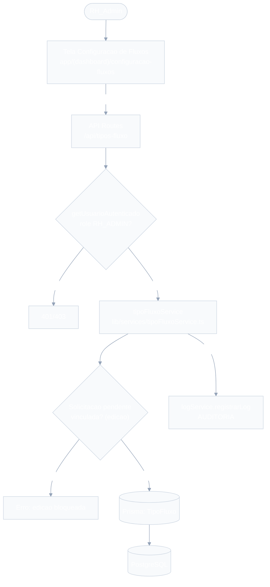
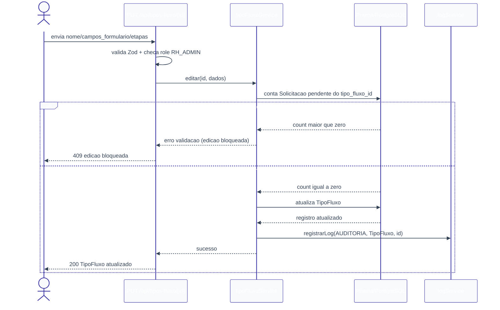

# Configuração de Fluxos — Design

**Spec**: `.specs/features/configuracao-fluxos/spec.md`
**Context**: `.specs/features/configuracao-fluxos/context.md`
**Status**: Approved

---

## 0. Nota de escopo: bootstrap de fundação compartilhada

O repositório ainda não tem código (`prisma/`, `app/`, `lib/` não existem). Nenhuma outra feature tem `design.md` ainda. `configuracao-fluxos` depende de duas peças que, no design doc, pertencem a outras features:

| Peça necessária | Dona conceitual | Situação |
| --- | --- | --- |
| Enum `Role` (`SOLICITANTE`, `GESTOR`, `RH_ADMIN`) e resolução do usuário autenticado (`getUsuarioAutenticado`) | `autenticacao-usuarios` | Ainda não implementada |
| `logService.registrarLog(...)` (contrato AUD-01) | `auditoria-logs` | Ainda não implementada |

**Decisão (confirmada pelo usuário)**: esta feature cria essas duas peças como fundação mínima (schema `Role`, helper de auth, `logService` básico) seguindo exatamente o contrato já descrito nos specs de `autenticacao-usuarios` e `auditoria-logs`, para não travar em uma dependência circular de "quem desenha primeiro". Quando essas features forem desenhadas/implementadas, devem **reaproveitar** (não recriar) esse enum/helper/service — apenas estendê-los (ex: `autenticacao-usuarios` adiciona o model `User` completo usando o mesmo enum `Role`).

---

## Architecture Overview

Camadas conforme `CLAUDE.md`: Route (Zod + auth) → Service (regra de negócio) → Prisma (dados). Sem lógica de negócio na route.



Fluxo de edição (caso de borda relevante: bloqueio por solicitação pendente):



---

## Code Reuse Analysis

### Existing Components to Leverage

Nenhum — greenfield, nenhuma linha de código no repositório ainda. Todo componente abaixo é novo.

### Integration Points

| System | Integration Method |
| --- | --- |
| `solicitacoes` | Lê `TipoFluxo` (nome, `campos_formulario`, `etapas`) via `tipoFluxoService.listar`/`buscarPorId` para popular "Nova Solicitação". Não escreve. |
| `aprovacoes` | Lê `TipoFluxo.etapas` para saber a próxima etapa/papel. Não escreve. |
| `auditoria-logs` | Consome `logService.registrarLog` (contrato AUD-01) — implementado aqui como fundação mínima, ver seção 0. |
| `autenticacao-usuarios` | Fornece (ou, por ora, recebe desta feature) `Role` enum + `getUsuarioAutenticado`. |

---

## Components

### `prisma/schema.prisma` (extensão)

- **Purpose**: define o enum `Role` (fundação) e o model `TipoFluxo`.
- **Location**: `prisma/schema.prisma`
- **Reuses**: nenhum (primeiro corte do schema)

```prisma
enum Role {
  SOLICITANTE
  GESTOR
  RH_ADMIN
}

model TipoFluxo {
  id                String   @id @default(cuid())
  nome              String   @unique
  campos_formulario Json
  etapas            Json     // Role[] serializado, ex: ["GESTOR", "RH_ADMIN"]
  criado_em         DateTime @default(now())
  atualizado_em     DateTime @updatedAt

  @@map("tipos_fluxo")
}
```

> `Solicitacao` (para a checagem de "pendente vinculada") e `Log` (para `logService`) ainda não existem no schema. Ver seção "Tech Decisions" — esta feature cria versões mínimas desses models no mesmo `schema.prisma`, restritas aos campos que `configuracao-fluxos` precisa tocar; a feature dona (`solicitacoes`, `auditoria-logs`) deve estender o mesmo model, não recriar.

### `lib/auth/getUsuarioAutenticado.ts` (fundação mínima)

- **Purpose**: resolver `{ id, role, gestor_id }` a partir da sessão Supabase; lançar/retornar não-autenticado se ausente.
- **Location**: `lib/auth/getUsuarioAutenticado.ts`
- **Interfaces**:
  - `getUsuarioAutenticado(req): Promise<UsuarioAutenticado | null>`
  - `requireRole(usuario: UsuarioAutenticado | null, roles: Role[]): void` — lança `ErroNaoAutorizado` se `usuario` for nulo ou `role` não estiver em `roles`.
- **Dependencies**: Supabase Auth (sessão).
- **Reuses**: nada (fundação criada aqui, ver seção 0).

### `lib/services/logService.ts` (fundação mínima)

- **Purpose**: ponto único de gravação de `Log`, conforme contrato AUD-01.
- **Location**: `lib/services/logService.ts`
- **Interfaces**:
  - `registrarLog(evento: { tipo: 'AUDITORIA' | 'ERRO'; entidade: string; entidade_id: string; acao: string; usuario_id?: string | null; detalhes?: unknown }): Promise<void>` — nunca lança exceção (contém falha internamente, AUD-03).
- **Reuses**: nada (fundação criada aqui, ver seção 0).

### `lib/validations/tipoFluxo.ts`

- **Purpose**: schemas Zod de entrada para criação/edição.
- **Location**: `lib/validations/tipoFluxo.ts`
- **Interfaces**:
  - `campoFormularioSchema: ZodType<CampoFormularioDefinicao>`
  - `tipoFluxoInputSchema: ZodType<TipoFluxoInput>`
- **Reuses**: nada.

### `lib/services/tipoFluxoService.ts`

- **Purpose**: lógica de negócio de CRUD de `TipoFluxo` (CONF-01 a CONF-09).
- **Location**: `lib/services/tipoFluxoService.ts`
- **Interfaces**:
  - `listar(): Promise<TipoFluxoResumo[]>` — nome + id, todos os registros (CONF-06).
  - `buscarPorId(id: string): Promise<TipoFluxoDetalhe>` — lança `ErroNaoEncontrado` se não existir.
  - `criar(dados: TipoFluxoInput, usuarioId: string): Promise<TipoFluxoDetalhe>` — persiste e grava `Log AUDITORIA` (CONF-02 a CONF-05, CONF-09).
  - `editar(id: string, dados: TipoFluxoInput, usuarioId: string): Promise<TipoFluxoDetalhe>` — verifica `Solicitacao` pendente vinculada antes de atualizar; lança `ErroEdicaoBloqueada` se houver; grava `Log AUDITORIA` no sucesso (CONF-07).
- **Dependencies**: Prisma (`TipoFluxo`, `Solicitacao` — leitura mínima), `logService`.
- **Reuses**: `logService.registrarLog`.

### API Routes

- **`app/api/tipos-fluxo/route.ts`**
  - `GET` → `requireRole(usuario, ['RH_ADMIN'])` → `tipoFluxoService.listar()` (CONF-01, CONF-06).
  - `POST` → `requireRole` → valida `tipoFluxoInputSchema` → `tipoFluxoService.criar()` (CONF-01 a CONF-05, CONF-08, CONF-09).
- **`app/api/tipos-fluxo/[id]/route.ts`**
  - `GET` → `requireRole` → `tipoFluxoService.buscarPorId(id)` (CONF-06).
  - `PUT` → `requireRole` → valida `tipoFluxoInputSchema` → `tipoFluxoService.editar(id, ...)` (CONF-01, CONF-07, CONF-08, CONF-09).
- **Reuses**: `getUsuarioAutenticado`, `requireRole`, `tipoFluxoInputSchema`, `tipoFluxoService`.

### UI — `app/(dashboard)/configuracao-fluxos/`

- **`page.tsx`** — Server Component: lista `TipoFluxo` (chama service diretamente ou via fetch interno); RH_Admin only, redireciona/renderiza 403 para outros papéis.
- **`novo/page.tsx`** e **`[id]/editar/page.tsx`** — usam o mesmo `TipoFluxoForm` (Client Component).
- **`_components/TipoFluxoForm.tsx`** — nome + `EtapasEditor` + `CampoFormularioEditor`; submete para `POST`/`PUT`.
- **`_components/EtapasEditor.tsx`** — lista ordenável de papéis (`GESTOR`/`RH_ADMIN`); add/remove/reordenar.
- **`_components/CampoFormularioEditor.tsx`** — lista de campos (`chave`, `rotulo`, `tipo`, `obrigatorio`, `opcoes` quando `tipo=selecao`, `min`/`max` quando aplicável); add/remove/reordenar.
- **Dependencies**: rotas acima.
- **Reuses**: nada ainda (primeira tela do projeto).

---

## Data Models

### `CampoFormularioDefinicao` (item de `TipoFluxo.campos_formulario`)

Contrato compartilhado com `solicitacoes` (que renderiza/valida o formulário dinâmico a partir dele) — tipos **semânticos**, não um único tipo genérico.

```typescript
type TipoCampo = 'texto' | 'numero' | 'data' | 'selecao'

interface CampoFormularioDefinicao {
  chave: string        // identificador estável, ex: "cargo_pretendido" — chave em Solicitacao.dados
  rotulo: string        // label exibido no formulário
  tipo: TipoCampo
  obrigatorio: boolean
  opcoes?: string[]     // obrigatório quando tipo === 'selecao'; ausente nos demais
  min?: number           // 'numero': valor mínimo. 'texto': tamanho mínimo. Ignorado em 'data'/'selecao'.
  max?: number           // 'numero': valor máximo. 'texto': tamanho máximo. Ignorado em 'data'/'selecao'.
}
```

### `TipoFluxoInput` (payload de criação/edição)

```typescript
interface TipoFluxoInput {
  nome: string
  campos_formulario: CampoFormularioDefinicao[] // min 1 item
  etapas: Array<'GESTOR' | 'RH_ADMIN'>          // min 1 item, ordem = ordem de aprovação
}
```

**Relationships**: `TipoFluxo.etapas[i]` define o `aprovador_role` da etapa `i+1`, consumido por `aprovacoes`. `TipoFluxo.campos_formulario` define as chaves esperadas em `Solicitacao.dados`, consumido por `solicitacoes`.

---

## Error Handling Strategy

| Error Scenario | Handling | User Impact |
| --- | --- | --- |
| Usuário não autenticado | Route retorna 401 antes de chamar o service | Redirecionado/erro genérico de sessão |
| Usuário autenticado mas não `RH_ADMIN` | `requireRole` lança `ErroNaoAutorizado` → route retorna 403 | Mensagem "acesso restrito ao RH" |
| `nome` vazio/só espaços, `etapas` vazio, papel inválido, `campos_formulario` vazio/malformado | Zod rejeita antes do service → 400 com detalhe do campo | Mensagem de validação por campo, nada é persistido |
| `nome` duplicado | Constraint `@unique` do Prisma → catch no service → 409 | "Já existe um tipo de fluxo com esse nome" |
| Edição de `TipoFluxo` com `Solicitacao` pendente vinculada | Service verifica antes do update, lança `ErroEdicaoBloqueada` → route retorna 409 | "Não é possível editar: existem N solicitação(ões) pendente(s) usando este tipo de fluxo" |
| Edição de `id` inexistente | Service lança `ErroNaoEncontrado` → route retorna 404 | "Tipo de fluxo não encontrado" |
| Falha ao gravar `Log AUDITORIA` | `logService` contém a falha internamente (nunca lança) | Operação principal (criar/editar) é concluída normalmente |

---

## Tech Decisions (only non-obvious ones)

| Decision | Choice | Rationale |
| --- | --- | --- |
| Fundação compartilhada (`Role`, auth, `logService`) | Criada por esta feature, seguindo os contratos já escritos em `autenticacao-usuarios`/`auditoria-logs` | Sem isso `configuracao-fluxos` não tem como bloquear no backend nem auditar (regras invioláveis do `CLAUDE.md`); ver seção 0 — confirmado pelo usuário |
| Unicidade de `nome` (Questão em Aberto #3 do spec) | `nome` é único (`@unique`) | Confirmado pelo usuário; evita ambiguidade em "Nova Solicitação" ao listar tipos por nome |
| `campos_formulario` vazio (Questão em Aberto #4 do spec) | Rejeitado — mínimo 1 campo | Confirmado pelo usuário; um fluxo sem nenhum dado a coletar é caso extremo não pedido |
| Tipos semânticos de campo | `texto`, `numero`, `data`, `selecao` | Conjunto citado no `context.md`; `selecao` cobre o caso de opções fixas sem expandir para tipos não pedidos |
| `min`/`max` por tipo | Só significativos em `texto` (tamanho) e `numero` (valor); ignorados em `data`/`selecao` | Evita over-engineering de regras de validação não pedidas |
| Bloqueio de edição (Questão em Aberto #2, já resolvida em `context.md`) | Checagem via `count` de `Solicitacao` com `status` pendente e `tipo_fluxo_id = id`, antes do update | Único ponto de leitura cross-feature necessário; não duplica lógica de status de `solicitacoes` |
| Exclusão/desativação de `TipoFluxo` (Questão em Aberto #5) | Não implementado | Fora de escopo explícito da spec (`Out of Scope`); mantido como ideia adiada |
| Mensagem de erro de edição bloqueada | Texto claro citando quantidade de solicitações pendentes (ver tabela de erros) | Resolve "Agent's Discretion" do `context.md` |

---

## Requirement Traceability (mapeamento para Design)

| Requirement ID | Coberto por |
| --- | --- |
| CONF-01 | `requireRole` em ambas as rotas |
| CONF-02 | `tipoFluxoInputSchema` (`nome` não vazio) + `tipoFluxoService.criar` |
| CONF-03 | `TipoFluxo.campos_formulario` (Json) + `campoFormularioSchema` |
| CONF-04 | `TipoFluxo.etapas` (Json, ordem preservada) + enum `['GESTOR','RH_ADMIN']` no schema Zod |
| CONF-05 | Model `TipoFluxo` sem migration adicional por tipo (JSON) + `listar`/`buscarPorId` consumíveis imediatamente |
| CONF-06 | `GET /api/tipos-fluxo` e `GET /api/tipos-fluxo/[id]` |
| CONF-07 | `tipoFluxoService.editar` (bloqueio por pendência) |
| CONF-08 | `tipoFluxoInputSchema` (Zod) nas rotas `POST`/`PUT` |
| CONF-09 | `logService.registrarLog` chamado em `criar` e `editar` |
