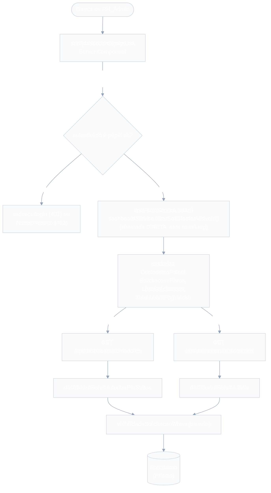
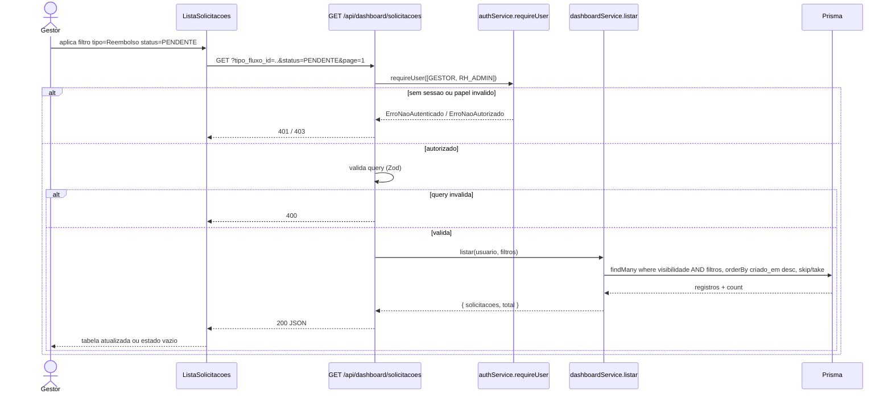

# Dashboard de Visão Geral — Design

**Spec**: `.specs/features/dashboard-visao-geral/spec.md`
**Context**: `.specs/features/dashboard-visao-geral/context.md`
**Status**: Draft

---

## 0. Nota de reconciliação (decisões tomadas nesta sessão)

| Ponto | Decisão neste Design | Origem |
| --- | --- | --- |
| Campo de "atrasado" | `atrasada_em DateTime?` em `Solicitacao` (`null` = não atrasada). **Mesmo nome/tipo já fixado em `sla-cobranca/design.md`** — `sla-cobranca` ainda não tem `tasks.md`/migration aplicada, então esta feature cria o campo (é aditivo, não conflita) e `sla-cobranca`, quando executada, só passa a escrever nele. Não redefino a regra de quando marcar (isso continua sendo dono de `sla-cobranca`). | `sla-cobranca/design.md` §0 + Out of Scope do `spec.md` desta feature |
| Q. Aberto #1 (SOLICITANTE acessa?) | **Não.** `requireUser([GESTOR, RH_ADMIN])` bloqueia no backend (página e rotas), mesmo padrão de `auditoria-logs`. | Premissa do `spec.md`, mantida |
| Q. Aberto #2 (contadores seguem filtro?) | **Não.** Contadores sempre refletem o escopo de visibilidade completo, independente dos filtros aplicados à lista. `GET /api/dashboard/contadores` não aceita nenhum filtro. DASH-10 funciona na direção oposta (clique no contador só ajusta o filtro de status da lista). | Premissa do `spec.md`, mantida |
| Q. Aberto #4 (paginação) | Paginação por página (`page`/`pageSize`, padrão 20), mesmo padrão de `auditoria-logs` (`logService.listar` + `LogPaginacao`). | Sem definição no design doc original; resolvido por analogia com feature irmã já implementada |
| Q. Aberto #5 (filtro de período) | Confirmado: **não existe** nesta tela. | Premissa do `spec.md`, mantida |
| Filtro `tipo_fluxo_id`/`solicitante_id` com valor bem formado mas inexistente/fora de escopo | **Não é erro** — a query simplesmente não encontra correspondência (lista vazia). Zod só rejeita formato inválido (string vazia) ou `status` fora do enum. | Consistente com o edge case já explícito do spec para `solicitante_id` fora de escopo (lista vazia, nunca vazamento); aplicar a mesma regra a `tipo_fluxo_id` evita dois comportamentos diferentes para o mesmo tipo de situação |
| Local da tela | `app/(dashboard)/page.tsx` (raiz do route group `(dashboard)`, hoje inexistente) | Route group não adiciona segmento de URL — a Visão Geral é a tela inicial pós-login; nenhuma outra feature reivindica esta rota |

Nenhuma decisão contradiz o `spec.md`/`context.md` — só fecha zonas cinzentas explicitamente deixadas para o Design.

---

## Architecture Overview

Camadas conforme `CLAUDE.md`: Route (Zod + auth) → Service (regra de visibilidade + contagem/filtro) → Prisma. Dois endpoints somente-leitura, sem geração de IA, sem gráficos, sem ação de aprovação (fora de escopo, ver `spec.md`).





---

## Code Reuse Analysis

### Existing Components to Leverage

| Component | Location | How to Use |
| --- | --- | --- |
| `authService.requireUser([GESTOR, RH_ADMIN])` | `lib/services/authService.ts` | Gate de página e das duas rotas — mesmo padrão de `auditoria-logs` (`requireUser([RH_ADMIN])`), só muda a lista de papéis |
| `tipoFluxoService.listar()` | `lib/services/tipoFluxoService.ts` | Popula as opções do filtro de tipo de fluxo — chamada DIRETA no Server Component, sem round-trip (mesmo padrão de `solicitacoes/nova/page.tsx`) |
| `logService.registrar` | `lib/services/logService.ts` | Não usado nesta feature — tela é só leitura, não há transição de status nem decisão para auditar (CLAUDE.md exige `Log AUDITORIA` só em transição/decisão) |
| Padrão filtro-via-URL + fetch em `useEffect` + estado local | `app/(dashboard)/auditoria-logs/_components/LogFiltros.tsx`, `LogTabela.tsx` | Reaplicado quase 1:1 para `SolicitacoesFiltros`/`ListaSolicitacoes` — mesma decisão de engenharia (estado na URL, não `useState` elevado) |
| Padrão paginação com "external store" (`useSyncExternalStore`) | `app/(dashboard)/auditoria-logs/_components/AuditoriaLogsContext.tsx`, `LogPaginacao.tsx` | Reaplicado como `DashboardListaContext.tsx`/`DashboardPaginacao.tsx` — mesmo problema (lista e paginação são irmãs, não pai/filho) |
| Padrão página protegida com mensagem "Acesso restrito" | `app/(dashboard)/auditoria-logs/page.tsx` | Mesmo bloco try/catch (`ErroNaoAutenticado` → `redirect('/login')`; `ErroNaoAutorizado` → mensagem, sem renderizar filhos) |
| Padrão rota Zod + `requireUser` + service + `Response.json` | `app/api/logs/route.ts` | Mesmo estilo para as duas novas rotas |
| `model Solicitacao`, `enum StatusSolicitacao`, `enum Role` | `prisma/schema.prisma` | Já tem tudo que a feature precisa exceto `atrasada_em` (ver seção 0) |

### Integration Points

| System | Integration Method |
| --- | --- |
| `configuracao-fluxos` | Lê `TipoFluxo` via `tipoFluxoService.listar()` (leitura, não escreve) |
| `sla-cobranca` (Design feito, não implementada) | Lê `atrasada_em`; esta feature CRIA o campo no schema (ver seção 0) por ser a primeira a precisar dele — `sla-cobranca`, quando executada, só passa a escrevê-lo |
| `aprovacoes`/`solicitacoes` | Leitura pura de `Solicitacao`; nenhuma escrita, nenhuma chamada de serviço dessas features |
| `auditoria-logs` | Não integrado — esta tela não grava `Log` (somente leitura, sem transição de estado) |

---

## Components

### `prisma/schema.prisma` (extensão do `model Solicitacao`)

- **Purpose**: adicionar o campo aditivo de atraso que o contador/lista precisam consumir (DASH-01 AC3).
- **Location**: `prisma/schema.prisma`
- **Reuses**: `model Solicitacao` já existente (`solicitacoes`/`aprovacoes`).

```prisma
model Solicitacao {
  // ... campos existentes ...
  atrasada_em DateTime?

  @@index([atrasada_em])
}
```

> Não adiciono `ultima_cobranca_em` aqui — esse campo é exclusivo do throttle de cobrança de `sla-cobranca` e esta feature não o consome; fica para a migration daquela feature quando for executada.

### `lib/validations/dashboardFiltros.ts`

- **Purpose**: schema Zod dos query params de `GET /api/dashboard/solicitacoes`. `GET /api/dashboard/contadores` não tem query params (não precisa de schema).
- **Location**: `lib/validations/dashboardFiltros.ts`
- **Interface**:

```typescript
export const dashboardListaQuerySchema = z.object({
  tipo_fluxo_id: z.string().min(1).optional(),
  status: z.enum(["PENDENTE", "ATRASADO", "APROVADA", "REJEITADA"]).optional(),
  solicitante_id: z.string().min(1).optional(),
  page: z.coerce.number().int().positive().optional(),
  pageSize: z.coerce.number().int().positive().optional(),
});
export type DashboardListaFiltro = z.infer<typeof dashboardListaQuerySchema>;
```

- Mesma estrutura de `queryLogsSchema` (`lib/validations/log... ` — na verdade em `app/api/logs/route.ts`); aqui isolado em `lib/validations` por já existir mais de um filtro complexo o suficiente para justificar arquivo próprio, e por precisar ser importado tanto pela rota quanto (indiretamente, mesmo shape) pelo service.

### `lib/services/dashboardService.ts`

- **Purpose**: contagem por status e listagem filtrada/paginada de `Solicitacao`, sempre respeitando visibilidade por papel (DASH-01 a DASH-08).
- **Location**: `lib/services/dashboardService.ts`
- **Interfaces**:
  - `contarPorStatus(usuario: AuthenticatedUser): Promise<ContadoresDashboard>` — 4 `count` em paralelo (`Promise.all`), todos com `visibilidadeSolicitacaoWhere(usuario)` aplicado; **nunca** aceita filtro (ver seção 0, Q#2).
  - `listar(usuario: AuthenticatedUser, filtro: DashboardListaFiltro): Promise<{ solicitacoes: SolicitacaoListItem[]; total: number }>` — combina `visibilidadeSolicitacaoWhere` + filtros (AND lógico), `orderBy criado_em desc`, `skip`/`take` (`pageSize` padrão 20).
  - `listarSolicitantesVisiveis(usuario: AuthenticatedUser): Promise<{ id: string; nome: string }[]>` — opções do filtro "solicitante": `RH_ADMIN` → todos os `User`; `GESTOR` → ele mesmo + `equipe` (`gestor_id = usuario.id`).
  - `visibilidadeSolicitacaoWhere(usuario)` (helper interno, não exportado) — `RH_ADMIN` → `{}` (sem filtro); `GESTOR` → `{ OR: [{ solicitante_id: usuario.id }, { solicitante: { gestor_id: usuario.id } } ] }`.
- **Dependencies**: `lib/prisma.ts`, `AuthenticatedUser` (tipo de `authService`).
- **Reuses**: nenhum service existente reaproveitado diretamente (é a primeira feature a agregar `Solicitacao` por status/visibilidade), mas replica o padrão de `where` condicional por papel já usado em `aprovacaoService.listarPendentes`.

**Lógica de `status` no `where`** (resolve o AC "atrasado é aditivo sobre pendente", `context.md` #3):

```typescript
const statusWhere =
  filtro.status === "ATRASADO"
    ? { atrasada_em: { not: null } }
    : filtro.status
      ? { status: filtro.status as StatusSolicitacao }
      : {};
```

Filtrar por `status=PENDENTE` retorna TODAS as `PENDENTE` (inclusive as atrasadas — consistente com o contador, que também não é exclusivo). Filtrar por `status=ATRASADO` restringe às que têm `atrasada_em` preenchido (implicitamente também `PENDENTE`, por contrato de `sla-cobranca`, mas a query não precisa impor isso).

### API Routes

- **`app/api/dashboard/contadores/route.ts`**
  - `GET` → `requireUser([Role.GESTOR, Role.RH_ADMIN])` → `dashboardService.contarPorStatus(usuario)` → `200 ContadoresDashboard`.
- **`app/api/dashboard/solicitacoes/route.ts`**
  - `GET` → `requireUser([Role.GESTOR, Role.RH_ADMIN])` → valida query com `dashboardListaQuerySchema` → `dashboardService.listar(usuario, filtros)` → `200 { solicitacoes, total }`.
- **Reuses**: `authService.requireUser`, padrão try/catch → status HTTP de `app/api/logs/route.ts`.

### UI — `app/(dashboard)/`

- **`page.tsx`** — Server Component: `requireUser([GESTOR, RH_ADMIN])` (mesmo bloco try/catch de `auditoria-logs/page.tsx`: `ErroNaoAutenticado` → `redirect('/login')`; `ErroNaoAutorizado` → "Acesso restrito", sem renderizar os filhos). Em caso de sucesso, chama `tipoFluxoService.listar()` e `dashboardService.listarSolicitantesVisiveis(usuario)` DIRETO (sem round-trip) para montar as opções dos filtros, e renderiza os 4 componentes abaixo lado a lado.
- **`_components/ContadoresPainel.tsx`** (Client) — no mount, `fetch('/api/dashboard/contadores')` (sem depender de `searchParams` — não recalcula com os filtros da lista, por decisão da seção 0); renderiza 4 cards (pendentes/atrasados/aprovados/rejeitados); clique em um card (DASH-10) escreve `status` na URL via `router.push` (mesmo mecanismo de navegação de `LogFiltros`), sem re-fetch dos próprios contadores.
- **`_components/SolicitacoesFiltros.tsx`** (Client) — dropdowns de tipo de fluxo, status (`Todos`/`Pendente`/`Atrasado`/`Aprovada`/`Rejeitada`) e solicitante, recebendo `tiposDisponiveis`/`solicitantesDisponiveis` como props vindas de `page.tsx`; ao submeter, escreve os filtros na URL e reseta `page=1` (mesmo padrão de `LogFiltros`, incluindo botão "Limpar filtros").
- **`_components/ListaSolicitacoes.tsx`** (Client) — lê `searchParams`, `fetch('/api/dashboard/solicitacoes?...')` a cada mudança (mesmo padrão de `LogTabela`); mostra tipo de fluxo, solicitante, status (com indicador visual de "atrasado" quando `atrasada_em` presente), data de criação; linha clicável navega para o detalhe da solicitação (DASH-09, P3 — rota alvo é de `solicitacoes`, que ainda não existe nesta base; renderiza o link mesmo assim, sem quebrar caso a rota não exista ainda: é responsabilidade de outra feature); estado vazio explícito quando `solicitacoes.length === 0`; publica `{ total, pageSize }` em `DashboardListaContext`.
- **`_components/DashboardPaginacao.tsx`** (Client) — mesmo componente/lógica de `LogPaginacao`, lendo de `DashboardListaContext`.
- **`_components/DashboardListaContext.tsx`** — mesma "cola" de estado de `AuditoriaLogsContext.tsx` (`useSyncExternalStore`), documentando a mesma justificativa (lista e paginação são irmãs, sem pai comum que não seja `page.tsx`).
- **Reuses**: `GET /api/tipos-fluxo` não é usado aqui — as opções de tipo vêm de `tipoFluxoService.listar()` chamado direto no Server Component (mais barato que round-trip de API).

---

## Data Models

```typescript
interface ContadoresDashboard {
  pendentes: number;
  atrasados: number;
  aprovados: number;
  rejeitados: number;
}

interface SolicitacaoListItem {
  id: string;
  tipo_fluxo_nome: string;
  solicitante_nome: string;
  status: "PENDENTE" | "APROVADA" | "REJEITADA";
  atrasada: boolean; // deriva de atrasada_em !== null
  criado_em: Date;
}
```

**Relationships**: `SolicitacaoListItem` é uma projeção de `Solicitacao` + `tipoFluxo.nome` + `solicitante.nome` (join de leitura, sem novo modelo). `ContadoresDashboard` é um DTO agregado, não persistido.

---

## Error Handling Strategy

| Error Scenario | Handling | User Impact |
| --- | --- | --- |
| Usuário não autenticado | `requireUser` lança `ErroNaoAutenticado` → 401 (rota) / `redirect('/login')` (página) | Redirecionado ao login |
| Usuário `SOLICITANTE` (papel fora da lista permitida) | `requireUser` lança `ErroNaoAutorizado` → 403 (rota) / "Acesso restrito" (página, sem renderizar filhos) | Mensagem de acesso restrito |
| `status` fora do enum (`ex: "foo"`) | Zod rejeita → 400, `listar` nunca é chamado | Erro de validação, lista não é buscada |
| `tipo_fluxo_id`/`solicitante_id` bem formado mas inexistente/fora de escopo | Não é erro — `where` combinado não encontra linhas → lista vazia (200) | Estado vazio explícito, nunca vazamento |
| Escopo do usuário sem nenhuma `Solicitacao` | `contarPorStatus` retorna todos os `count` como `0`; `listar` retorna `{ solicitacoes: [], total: 0 }` | Contadores zerados + estado vazio, sem erro |
| Combinação de filtros sem resultado | Idem acima | Estado vazio |

---

## Tech Decisions (only non-obvious ones)

| Decision | Choice | Rationale |
| --- | --- | --- |
| `atrasada_em` criado por esta feature, não por `sla-cobranca` | Aditivo no schema, mesmo nome já fixado no design daquela feature | `sla-cobranca` ainda não tem tasks/migration; esperar bloquearia esta feature sem necessidade — ver seção 0 |
| Dois endpoints (`contadores` + `solicitacoes`), não um único agregado | Separados | Contadores e lista têm regras de re-fetch diferentes (contadores nunca mudam com filtro, lista muda com filtro+página); um endpoint único obrigaria a lista sempre recalcular contadores também, contradizendo Q#2 da seção 0 |
| `status=PENDENTE` no filtro inclui atrasadas | Sim (não exclusivo) | Mesma regra aditiva do contador (`context.md` #3) — evita a lista e o contador divergirem sobre o que conta como "pendente" |
| Opções de filtro "solicitante" vêm de `dashboardService.listarSolicitantesVisiveis`, não de um dropdown livre-texto | Novo método de service | Já era o padrão desejável (evita digitar um `id` cru, como em `LogFiltros`); aqui há dado suficiente (poucos usuários por equipe) para justificar um `<select>` de verdade |
| Paginação por página (não infinite scroll/cursor) | `page`/`pageSize`, padrão 20 | Reaproveita 1:1 o padrão já implementado e testado em `auditoria-logs`; volume esperado (uma empresa) não justifica cursor-based |

---

## Requirement Traceability (mapeamento para Design)

| Requirement ID | Coberto por |
| --- | --- |
| DASH-01 | `dashboardService.contarPorStatus` + `GET /api/dashboard/contadores` + `ContadoresPainel` |
| DASH-02 | `dashboardService.listar` + `GET /api/dashboard/solicitacoes` + `ListaSolicitacoes` |
| DASH-03 | `visibilidadeSolicitacaoWhere` aplicado em `contarPorStatus` e `listar`; `requireUser([GESTOR, RH_ADMIN])` bloqueia acesso não autenticado |
| DASH-04 | Filtro `tipo_fluxo_id` em `listar` + `SolicitacoesFiltros` |
| DASH-05 | Filtro `status` (incl. `ATRASADO`) em `listar` |
| DASH-06 | Filtro `solicitante_id` em `listar` + `listarSolicitantesVisiveis` |
| DASH-07 | Todos os filtros combinados via AND no mesmo `where`, sempre com `visibilidadeSolicitacaoWhere` incluído |
| DASH-08 | Estado vazio explícito em `ListaSolicitacoes`; contadores zerados quando `count` retorna 0 |
| DASH-09 | Linha da lista navega para detalhe (rota de `solicitacoes`, fora desta feature) |
| DASH-10 | `ContadoresPainel` escreve `status` na URL ao clicar um card |

---

## Riscos / Pontos a verificar na fase de Tasks

- **`atrasada_em` fica "adiantado"**: quando `sla-cobranca` for desenhada para `tasks`/execução, sua migration não deve recriar o campo — só passar a escrevê-lo. Registrar isso no `design.md`/`tasks.md` de `sla-cobranca` quando chegar a vez.
- **DASH-09 (navegação para detalhe)** aponta para uma rota de `solicitacoes` (`app/(dashboard)/solicitacoes/[id]`) que ainda não existe no código (só existe no `design.md`/`tasks.md` daquela feature). O link é renderizado mesmo assim (P3, não bloqueia o restante) — 404 até `solicitacoes` ser implementada, comportamento aceitável para uma feature P3.
- **`app/(dashboard)/page.tsx` hoje não existe** — esta é a primeira feature a reivindicar a raiz do route group; nenhuma outra feature/spec faz isso, então não há conflito, mas é a única tela sem uma pasta de segmento própria (`_components` fica direto em `app/(dashboard)/_components/`, não em `app/(dashboard)/dashboard/_components/`).
