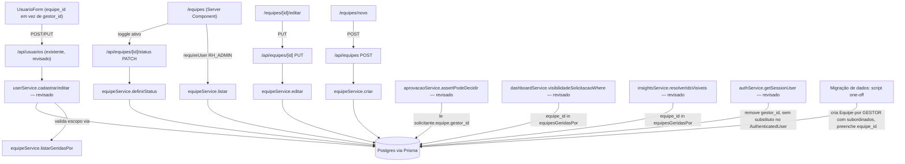

# Gestão de Equipes Design

**Spec**: `.specs/features/gestao-equipes/spec.md`
**Context**: `.specs/features/gestao-equipes/context.md`
**Status**: Draft

---

## Decisões travadas em `context.md` (não reabrir sem novo `/discuss`)

- `Equipe` substitui `User.gestor_id` como fonte de verdade de aprovação/visibilidade — `gestor_id` e a auto-relação `"Hierarquia"` são removidos do schema (não coexistem como fallback).
- Cardinalidade: 1 `Equipe` = 1 `gestor_id`; 1 `User` `GESTOR` pode ser responsável por N `Equipe`s.
- `RH_ADMIN` fora do modelo de equipes — nunca tem `equipe_id`, nunca é elegível como `gestor_id` de uma `Equipe`.
- Tela dedicada `/equipes` (RH_Admin-only) para CRUD de `Equipe` — atribuição "quem é o gestor responsável" vive lá, não no formulário de usuário.
- Sem hard delete de `Equipe` (soft, campo `ativo`); desativação bloqueada se houver membro ativo associado.
- Migração de dados legados (`gestor_id` → `Equipe`) é pré-requisito de deploy, roda antes da remoção do campo do schema.

---

## Architecture Overview



Mesmo padrão síncrono já usado no resto do projeto — sem fila/job. A migração de dados é um script one-off (`scripts/migrate-equipes.ts`, mesmo estilo de `scripts/seed-users.ts`), executado manualmente antes do deploy da remoção de `gestor_id`, não uma rota HTTP.

---

## Ordem de execução (obrigatória — evita quebrar produção)

Diferente de features anteriores, esta feature **não pode** seguir "schema primeiro, serviços depois" da forma ingênua — `gestor_id` está em uso real. Ordem:

1. Schema **aditivo**: cria `Equipe`, adiciona `User.equipe_id` (nullable) — `User.gestor_id` continua existindo em paralelo por enquanto.
2. Migração de dados: popula `Equipe` + `User.equipe_id` a partir do `gestor_id` existente (script one-off, roda contra o banco real).
3. Serviços/rotas/UI migram para ler `equipe_id`/`Equipe.gestor_id` — `gestor_id` já não é mais lido por nenhum código novo, mas ainda existe na coluna.
4. Schema **remove** `User.gestor_id` e a auto-relação `"Hierarquia"` — só depois de confirmar (passo 3) que nada mais lê o campo.
5. `CLAUDE.md` atualizado para descrever a regra de visibilidade em termos de `Equipe`.

Ver `tasks.md` para o mapeamento exato dessa ordem em tasks/dependências.

---

## Code Reuse Analysis

### Existing Components to Leverage

| Component | Location | How to Use |
| --- | --- | --- |
| `authService.requireUser(roles?)` | `lib/services/authService.ts` | Gate de rota nas novas rotas/páginas `/equipes` (RH_ADMIN-only) — mesmo padrão de `configuracao-fluxos`. |
| Padrão `criar`/`editar`/`ErroValidacao*`/`ErroEdicaoBloqueada*` | `lib/services/tipoFluxoService.ts` | `equipeService` reusa exatamente essa forma: `P2002` → erro de nome duplicado, checagem de dependência antes do `update`, `logService.registrar` em toda escrita. |
| `userService.listarElegiveisComoGestor` | `lib/services/userService.ts` | Reusado (sem mudança de contrato) para popular o `<select>` de `gestor_id` no form de `Equipe` — já filtra `role IN (GESTOR, RH_ADMIN)`; `equipeService` filtra o resultado só para `role === GESTOR` (RH_ADMIN não é elegível, decisão travada). |
| `logService.registrar` | `lib/services/logService.ts` | Toda auditoria (`CRIACAO`, `EDICAO`, `DESATIVACAO`, `REATIVACAO` de `Equipe`) e erro (migração pulando registro inconsistente) passam por aqui. |
| Padrão de rota fina (auth → Zod → service → status HTTP) | `app/api/tipos-fluxo/**`, `app/api/usuarios/**` | Mesmo padrão aplicado a `app/api/equipes/**`. |
| Padrão de Server Component com gate de papel | `app/(dashboard)/configuracao-fluxos/page.tsx` | Mesmo padrão de `try/catch` em `ErroNaoAutenticado`/`ErroNaoAutorizado` aplicado às 3 páginas novas de `/equipes`. |
| `navConfig.ts` (grupo "Administração") | `lib/navigation/navConfig.ts` | Adiciona 1 item novo (`Equipes`, `RH_ADMIN`-only), reusando a mesma fonte única de verdade. |
| Design tokens (`.stamp-badge`) | `docs/design-ux-ui/fluxorh-ui-layout-specs.md` §1 | Badge Ativo/Inativo de `Equipe` reusa o mesmo padrão já usado em `User.ativo` (`cadastro-usuarios`). |
| Estrutura de `UsuarioForm.tsx`/páginas `/usuarios/novo`/`[id]/editar` | `app/(dashboard)/usuarios/**` | Modificadas in-place (não recriadas) — troca o campo `gestor_id` por `equipe_id`, com opções carregadas de `equipeService` em vez de `userService.listarElegiveisComoGestor`. |

### Integration Points

| Sistema | Método de integração |
| --- | --- |
| Postgres (via Prisma) | Novo model `Equipe`; `User.equipe_id` novo; `User.gestor_id`/relação `"Hierarquia"` removidos (fase final). |
| `cadastro-usuarios` | Revisão in-place de `userService` (`assertEscopoGestao`, `cadastrar`, `editar`, `listar`, `buscarPorId`) e de `lib/validations/usuario.ts`. |
| `aprovacoes` | Revisão de `aprovacaoService.assertPodeDecidir`/`listarPendentes`. |
| `dashboard-visao-geral` | Revisão de `dashboardService.visibilidadeSolicitacaoWhere`. |
| `painel-insights` | Revisão de `insightsService.resolverIdsVisiveis`. |
| `autenticacao-usuarios` | Revisão de `authService.AuthenticatedUser`/`getSessionUser` (remove `gestor_id` do shape — não é substituído por `equipe_id` no ator; ver Tech Decisions). |
| `auditoria-logs` | `logService.registrar` para toda auditoria/erro desta feature. |
| `scripts/seed-users.ts` | **Não migrado nesta feature** — continua criando `User` com `gestor_id` (campo que deixará de existir). Precisa de ajuste próprio antes do schema remover o campo (ver Riscos) — fora do escopo desta spec decidir o novo formato do seed, mas é um bloqueador de deploy. |

---

## Components

### `prisma/schema.prisma` (Equipe — novo model)

- **Purpose**: Entidade nomeada com 1 gestor responsável, substituindo `gestor_id` como fonte de verdade de hierarquia.
- **Interfaces**: ver seção "Data Models".
- **Dependencies**: `User` (via `gestor_id` e via membros).
- **Reuses**: mesmo padrão de `id` (`cuid()`), `ativo` (`Boolean @default(true)`, mesmo de `User`), `criado_em`/`atualizado_em` (mesmo de `TipoFluxo`).

### `lib/services/equipeService.ts` (novo)

- **Purpose**: CRUD de `Equipe` + funções de leitura reusadas por `userService`/`aprovacaoService`/`dashboardService`/`insightsService`.
- **Location**: `lib/services/equipeService.ts`.
- **Interfaces**:
  - `criar(dados: EquipeInput, atorId: string): Promise<Equipe>` — valida `gestor_id` (existe, `role === GESTOR`, `ativo === true`), `nome` único (`P2002` → `ErroValidacaoEquipe`), grava `AUDITORIA`/`CRIACAO`.
  - `editar(id: string, dados: EquipeInput, atorId: string): Promise<Equipe>` — mesma validação de `criar`; `id` inexistente (`P2025`) → `ErroNaoEncontradoEquipe`; grava `AUDITORIA`/`EDICAO`.
  - `definirStatus(id: string, ativo: boolean, atorId: string): Promise<Equipe>` — `ativo = false` conta `User.count({ equipe_id: id, ativo: true })`; > 0 → `ErroEdicaoBloqueadaEquipe`; grava `AUDITORIA`/`DESATIVACAO`|`REATIVACAO`.
  - `listar(): Promise<EquipeResumo[]>` — todas, com nome do gestor e contagem de membros ativos (RH_Admin-only, gate na rota/página).
  - `buscarPorId(id: string): Promise<Equipe>` — `ErroNaoEncontradoEquipe` se não existir; usado pela página de edição e pelo detalhe P2 (EQP-26).
  - `listarAtivasParaSelecao(): Promise<{ id: string; nome: string }[]>` — usado pelo form de usuário quando `RH_ADMIN` cadastra/edita `SOLICITANTE` (todas as equipes ativas).
  - `listarGeridasPor(gestorId: string): Promise<{ id: string; nome: string }[]>` — só `Equipe` `ativo = true` com `gestor_id = gestorId`; reusado por `userService` (escopo de cadastro/listagem do Gestor), `aprovacaoService` (não usado — decisão é 1 solicitante:1 equipe, ver abaixo), `dashboardService`/`insightsService` (visibilidade agregada).
- **Dependencies**: `lib/prisma.ts`, `logService.registrar`.
- **Novos erros exportados**:
  - `ErroNaoEncontradoEquipe` — rota mapeia 404.
  - `ErroValidacaoEquipe` — `nome` duplicado ou `gestor_id` inválido (não existe, não é `GESTOR`, ou inativo) → rota mapeia 409.
  - `ErroEdicaoBloqueadaEquipe` — desativação com membros ativos → rota mapeia 409.

### `lib/validations/equipe.ts` (novo)

- **Purpose**: Schemas Zod dos payloads de `Equipe`, mesma convenção de `lib/validations/tipoFluxo.ts`.
- **Interfaces**:
  - `equipeInputSchema` — `nome` (`trim().min(1)`), `gestor_id` (`z.string().uuid()`, obrigatório — sem `Equipe` sem responsável, decisão de design registrada em `context.md`).
  - `definirStatusEquipeInputSchema` — `{ ativo: z.boolean() }` (mesmo schema de `definirStatusInputSchema` de usuário, mas arquivo próprio por consistência de 1-schema-por-entidade).
- **Dependencies**: `zod`.

### API Routes — `app/api/equipes/**` (novo)

- **Location**:
  - `app/api/equipes/route.ts` — `POST` (criar).
  - `app/api/equipes/[id]/route.ts` — `PUT` (editar).
  - `app/api/equipes/[id]/status/route.ts` — `PATCH` (definir `ativo`).
- **Interfaces**: `authService.requireUser([Role.RH_ADMIN])` primeiro (única diferença de `cadastro-usuarios`: aqui é RH_Admin-only, sem Gestor) → `safeParse` Zod → `equipeService` → mapeia erro:
  - `ErroNaoAutenticado` → 401; `ErroNaoAutorizado` → 403; Zod inválido → 400; `ErroNaoEncontradoEquipe` → 404; `ErroValidacaoEquipe`/`ErroEdicaoBloqueadaEquipe` → 409.
  - Sucesso `POST` → 201 `{ equipe }`; `PUT`/`PATCH` → 200 `{ equipe }`.
- **Dependencies**: `authService.requireUser`, `lib/validations/equipe.ts`, `equipeService`.

### UI — `/equipes` (novo, RH_Admin-only)

- **Location**: `app/(dashboard)/equipes/page.tsx` (listagem), `app/(dashboard)/equipes/novo/page.tsx`, `app/(dashboard)/equipes/[id]/editar/page.tsx`, `app/(dashboard)/equipes/_components/EquipeForm.tsx`, `app/(dashboard)/equipes/_components/StatusToggleButton.tsx` (reusa o mesmo padrão de `usuarios/_components/StatusToggleButton.tsx`, apontando pra `PATCH /api/equipes/[id]/status`).
- **Comportamento**:
  - Listagem: nome, gestor responsável, quantidade de membros ativos, status (badge), ações (Editar, Desativar/Reativar). Lista vazia → estado explícito.
  - Form: `nome` (texto) + `gestor_id` (`<select>` populado por `userService.listarElegiveisComoGestor()` filtrado a `role === GESTOR` no próprio componente ou já filtrado pelo service — decisão de implementação, ver Tech Decisions).
  - Detalhe de membros (EQP-26, P2): dentro da própria listagem ou página de edição, lista simples nome/e-mail/status dos `User` com `equipe_id = id` — pode ficar na mesma page de editar (sem rota nova) para não inflar o escopo de rotas.
- **Reuses**: Estrutura de `configuracao-fluxos` (listagem+form) e de `usuarios` (`StatusToggleButton`).

### `userService` (revisado)

- **Purpose**: Troca a fonte de verdade de escopo de `gestor_id` para `equipe_id`/`Equipe.gestor_id`.
- **Mudanças**:
  - `AlvoEscopo`/`estaNoEscopo`: `alvo.gestor_id` → `alvo.equipe_id`; `GESTOR` está no escopo se `alvo.role === SOLICITANTE` e `alvo.equipe_id` está entre as `Equipe`s retornadas por `equipeService.listarGeridasPor(ator.id)`.
  - `cadastrar`: quando `criador.role === GESTOR`, `dados.equipe_id` (novo campo, substitui `gestor_id`) precisa estar entre `listarGeridasPor(criador.id)` — senão `ErroPermissaoUsuario` antes de qualquer chamada ao Supabase Admin (mesmo padrão de "falha antes de efeito colateral" já usado). Quando `criador.role === RH_ADMIN`, `dados.equipe_id` só precisa existir e estar `ativo = true` (checagem delegada a `equipeService`/constraint de FK — ver Error Handling).
  - `provisionar`/`validarHierarquia`: trocam a checagem de `gestor_id` (obrigatório se não `RH_ADMIN`) por `equipe_id` (obrigatório só se `role === SOLICITANTE`; proibido/`null` forçado se `role !== SOLICITANTE`).
  - `editar`: bloqueio por "equipe dependente" (antigo USR-20, contava `gestor_id` de subordinados) passa a contar `Equipe.count({ gestor_id: id, ativo: true })` — ou seja, delega a mesma checagem de dependência para `equipeService` (reuso, não duplicação — ver Tech Decisions sobre onde essa checagem mora de fato).
  - `listar`: `where` do `GESTOR` passa de `{ gestor_id: ator.id }` para `{ equipe_id: { in: idsDasEquipesGeridas } }`.
  - `UsuarioResumo`: campo `gestor_nome`/`gestor_id` → `equipe_nome`/`equipe_id`.
- **Dependencies adicionadas**: `equipeService.listarGeridasPor`, `equipeService.listarAtivasParaSelecao`/`buscarPorId` (validar `equipe_id` submetido existe e está ativo).

### `aprovacaoService` (revisado)

- **Mudanças**:
  - `SolicitacaoComRelacoes.solicitante`: troca `gestor_id: string | null` por `equipe: { gestor_id: string } | null` (include `solicitante: { include: { equipe: { select: { gestor_id: true } } } } }`).
  - `assertPodeDecidir`: `solicitacao.solicitante.gestor_id` → `solicitacao.solicitante.equipe?.gestor_id`; sem `equipe` → mesma mensagem de erro ("sem aprovador elegível", EQP-17); `equipe.gestor_id !== usuario.id` → mesmo 403 de hoje.
  - `listarPendentes`: `where` do `GESTOR` troca `solicitante: { gestor_id: usuario.id }` por `solicitante: { equipe: { gestor_id: usuario.id } } }`.
  - `listarHistorico`: mesma troca de campo na checagem de visibilidade.
  - **Não** precisa checar "gestor responsável ativo" explicitamente em `assertPodeDecidir` — se o gestor responsável foi desativado, ele mesmo não consegue mais logar (`authService` já bloqueia `ativo = false`), então a checagem `equipe.gestor_id !== usuario.id` nunca é satisfeita por ninguém logado (EQP-18 é uma consequência, não uma checagem nova).

### `dashboardService`/`insightsService` (revisados)

- **Mudanças**: `visibilidadeSolicitacaoWhere`/`resolverIdsVisiveis` trocam `solicitante: { gestor_id: usuario.id }` / `prisma.user.findMany({ where: { gestor_id: usuario.id } })` por uma busca em 2 passos: `equipeService.listarGeridasPor(usuario.id)` → `ids` → `where: { solicitante: { equipe_id: { in: ids } } } }` (dashboard) / `prisma.user.findMany({ where: { equipe_id: { in: ids } } })` (insights).

### `authService` (revisado)

- **Mudanças**: `AuthenticatedUser` remove o campo `gestor_id` (não é substituído por `equipe_id` — o ator autenticado não precisa carregar a própria equipe; quem precisa "quais equipes eu gerencio" chama `equipeService.listarGeridasPor(ator.id)` sob demanda). `getSessionUser` para de selecionar/retornar `gestor_id`.
- **Impacto**: qualquer consumidor de `AuthenticatedUser.gestor_id` fora dos arquivos já listados nesta spec quebra a compilação (TypeScript pega em tempo de build) — bom sinal, não silencioso.

### `navConfig.ts` (revisado)

- **Mudança**: adiciona `{ label: "Equipes", href: "/equipes", roles: [Role.RH_ADMIN] }` ao grupo `administracao`.

### `scripts/migrate-equipes.ts` (novo, one-off)

- **Purpose**: Converter dados existentes antes da remoção de `gestor_id` do schema (EQP-22 a EQP-24).
- **Lógica**:
  1. Busca todos os `User` `role = GESTOR`.
  2. Para cada um, conta `User.count({ gestor_id: gestor.id })`; se `0`, pula (EQP-24).
  3. Se `> 0`, cria 1 `Equipe` (`nome: "Equipe de {gestor.nome}"`, `gestor_id: gestor.id`).
  4. `prisma.user.updateMany({ where: { gestor_id: gestor.id }, data: { equipe_id: equipeCriada.id } })`.
  5. Ao final, relata (stdout) quantos `User` tinham `gestor_id` apontando para um `User` que não é `role = GESTOR` (inconsistência) sem tocar esses registros — grava `Log` tipo `ERRO` por registro pulado (edge case do spec.md).
- **Execução**: manual, `npx tsx scripts/migrate-equipes.ts` (mesmo padrão de execução de `seed-users.ts`), antes da migration que remove a coluna `gestor_id`.
- **Dependencies**: `lib/prisma.ts`, `logService.registrar`.

### `CLAUDE.md` (revisado — task de documentação, não código)

- Frase atual: "gestor vê as próprias + as da equipe (usuários com `gestor_id` apontando para ele)".
- Nova frase: "gestor vê as próprias + as dos usuários cuja `Equipe` tem `gestor_id` igual ao dele (um gestor pode ser responsável por mais de uma `Equipe`)".

---

## Data Models

### `Equipe` (novo)

```prisma
model Equipe {
  id            String   @id @default(cuid())
  nome          String   @unique
  gestor_id     String   @db.Uuid
  gestor        User     @relation("EquipeGestor", fields: [gestor_id], references: [id])
  membros       User[]   @relation("EquipeMembros")
  ativo         Boolean  @default(true)
  criado_em     DateTime @default(now())
  atualizado_em DateTime @updatedAt

  @@index([gestor_id])
  @@map("equipes")
}
```

### `User` (revisado — campos trocados, não adicionados)

```prisma
model User {
  id        String  @id @db.Uuid
  nome      String
  email     String  @unique
  role      Role
  equipe_id String? // substitui gestor_id — obrigatorio em regra de app so para SOLICITANTE
  ativo     Boolean @default(true)

  equipe             Equipe?       @relation("EquipeMembros", fields: [equipe_id], references: [id])
  equipesGerenciadas Equipe[]      @relation("EquipeGestor")
  logs               Log[]
  notificacoes       Notificacao[] @relation("NotificacoesUsuario")
  solicitacoes       Solicitacao[]
  aprovacoes         Aprovacao[]
  feedbacks          Feedback[]
  candidatos         Candidato[]
}
```

**Removido**: `gestor_id`, `gestor` (auto-relação `"Hierarquia"` inteira — `fields`/`references` e o lado inverso `equipe: User[]`).

**Relationships**: `Equipe.gestor_id` é `@db.Uuid` (aponta pra `User.id`, que é `uuid`); `Equipe.id`/`User.equipe_id` são `String` sem `@db.Uuid` (mesmo padrão de `TipoFluxo.id`/`Solicitacao.tipo_fluxo_id` — `cuid()`, não corresponde a nada no Supabase Auth).

**Constraint de negócio não expressável em Prisma puro** (fica em `equipeService`/`userService`, não no schema): `Equipe.gestor_id` só pode referenciar um `User` com `role = GESTOR`; `User.equipe_id` só é obrigatório (regra de app, não `NOT NULL` de banco) quando `role = SOLICITANTE`.

---

## Error Handling Strategy

| Cenário | Tratamento | Impacto no usuário |
| --- | --- | --- |
| `Equipe.nome` duplicado (EQP-02) | `P2002` capturado em `criar`/`editar` → `ErroValidacaoEquipe` | 409, nada criado/alterado. |
| `Equipe.gestor_id` inválido — não existe, não é `GESTOR`, ou inativo (EQP-03) | Checagem explícita antes do `create`/`update` (não dá pra expressar `role = GESTOR` como FK constraint) → `ErroValidacaoEquipe` | 409, nada criado/alterado. |
| Desativar `Equipe` com membro ativo (EQP-07) | `prisma.user.count({ equipe_id: id, ativo: true })` antes do `update` → `ErroEdicaoBloqueadaEquipe` citando a quantidade | 409, nada alterado. |
| `RH_ADMIN` tenta remover papel `GESTOR` de alguém responsável por `Equipe` ativa | `prisma.equipe.count({ gestor_id: id, ativo: true })` antes do `update` em `userService.editar` → `ErroEdicaoBloqueadaUsuario` (mesma classe já existente, mensagem ajustada para citar "equipe(s)" em vez de "subordinado(s)") | 409, nada alterado. |
| `GESTOR` cadastra/edita `SOLICITANTE` com `equipe_id` fora do próprio escopo (EQP-11) | `equipeService.listarGeridasPor(ator.id)` não contém o `equipe_id` submetido → `ErroPermissaoUsuario` ANTES de qualquer escrita/chamada ao Supabase Admin | 403, nada criado/alterado. |
| Solicitante sem `equipe_id` ao decidir etapa `GESTOR` (EQP-17) | `solicitacao.solicitante.equipe` é `null` → `ErroNaoAutorizadoAprovacao` (mesma classe/mensagem já usada para "sem gestor_id") | 403, nenhuma decisão registrada. |
| Gestor responsável de uma `Equipe` foi desativado (EQP-18) | Nenhuma checagem nova — ele não consegue mais autenticar (`authService` já bloqueia `ativo = false`); qualquer outro usuário falha em `equipe.gestor_id !== usuario.id` | 401 (ele) / 403 (qualquer outro), fluxo trava até `RH_Admin` trocar o responsável — comportamento aceito, sem reatribuição automática (`context.md`, Deferred Ideas). |
| Migração encontra `gestor_id` apontando para um `User` que não é `role = GESTOR` | Script pula o registro, grava `Log` tipo `ERRO`, continua os demais | Nenhum usuário afetado tem `equipe_id` preenchido automaticamente — `RH_Admin` corrige manualmente depois via `/usuarios` + `/equipes`. |

---

## Tech Decisions (only non-obvious ones)

| Decisão | Escolha | Racional |
| --- | --- | --- |
| Migração de dados em script one-off separado, não em `prisma migrate` | `scripts/migrate-equipes.ts`, executado manualmente entre o schema aditivo e o schema que remove `gestor_id` | Migrations do Prisma fazem mudança de estrutura; a lógica de "criar 1 Equipe por Gestor com subordinados" é lógica de negócio (condicional, agrupamento), não uma transformação SQL direta — mesmo padrão já usado pra dados (`seed-users.ts` é executado manualmente, não é uma migration). |
| Bloqueio de dependência de `Equipe` (`gestor_id` de `User.editar`) mora em `userService`, consultando `prisma.equipe` direto (não via `equipeService.listarGeridasPor`) | Query direta `prisma.equipe.count(...)` dentro de `userService.editar` | `listarGeridasPor` retorna `{ id, nome }[]` pensado pra popular `<select>`; a checagem de bloqueio só precisa de uma contagem — criar uma função nova em `equipeService` só pra isso (`contarGeridasAtivasPor`) é aceitável e mais claro que forçar reuso de uma função com formato de retorno errado para o caso. Ver task correspondente para decidir o nome exato da função. |
| `AuthenticatedUser` não ganha `equipe_id`/`equipes_geridas` para substituir o `gestor_id` removido | Ator carrega só `{ id, nome, email, role }`; "quais equipes eu gerencio" é consultado sob demanda via `equipeService.listarGeridasPor(ator.id)` nos poucos lugares que precisam | Isso evita 1 query extra em `getSessionUser` (chamado em toda rota protegida) para um dado que só uns poucos consumidores (`userService`, `dashboardService`, `insightsService`) realmente usam — mesmo princípio de "não pagar custo em todo lugar pra um dado que só alguns lugares precisam" já implícito no design atual (`gestor_id` era barato porque era 1 coluna do próprio `User`; `equipes geridas` é uma relação 1:N que não cabe bem no mesmo lugar sem 1 query adicional sempre). |
| `Equipe.gestor_id` obrigatório na criação (não nullable) | `gestor_id String @db.Uuid` (não `String?`) | Evita o estado "Equipe existe mas sem aprovador elegível" logo na criação — força a ordem de operação já documentada em `context.md` (Gestor precisa existir antes da Equipe). Uma `Equipe` só fica "sem aprovador" depois, se o gestor responsável for desativado (caso já tratado, não evitável). |
| Filtro "`role === GESTOR`" no `<select>` do form de `Equipe` | Reusa `userService.listarElegiveisComoGestor()` (retorna `GESTOR` + `RH_ADMIN`) e filtra `role === GESTOR` no componente, em vez de criar uma segunda função de serviço quase idêntica | `listarElegiveisComoGestor` já é usada por `cadastro-usuarios` pra outro fim (elegível a receber subordinados, que inclui `RH_ADMIN`); duplicar a função só pra trocar o filtro do `where` é menos DRY que filtrar os ~10-50 resultados em memória no componente. Se o volume de usuários crescer a ponto de importar, revisitar. |

> **Nota de incerteza**: não foi confirmado nesta sessão se o Supabase/Postgres em uso aceita alterar uma coluna `NOT NULL` self-referencing (`gestor_id`) para removê-la em produção sem downtime perceptível — o volume de dados hoje é baixo (uso ainda não é em escala), então o risco é considerado aceitável, mas a task de remoção do campo deve confirmar `prisma migrate diff`/rodar em horário de baixo uso antes de aplicar.

---

## Riscos / Pontos a verificar na fase de Tasks

- **`scripts/seed-users.ts` fica inconsistente com o schema final** (ainda seta `gestor_id`, que deixará de existir) — precisa de uma task própria pra atualizar o seed pra usar `equipe_id`/criar `Equipe`s de exemplo, ANTES da task que remove a coluna do schema, senão o seed quebra a build/dev de qualquer outro dev que rodar `npm run build` ou o próprio script depois do merge.
- **`AuthenticatedUser.gestor_id` sendo removido é uma mudança de tipo que o compilador pega** — bom para segurança, mas a task que remove o campo deve rodar `npm run build` completo (não só `npm run test`) pra garantir que todo consumidor foi migrado antes de comitar.
- **Ordem de migração é crítica**: aplicar a migration que remove `gestor_id` ANTES de rodar `scripts/migrate-equipes.ts` contra o banco real destrói o único dado que permite reconstruir a hierarquia — a task de execução do script deve deixar isso explícito como pré-condição, não só como sugestão.
- **`assertEscopoGestao`/`estaNoEscopo` (userService) precisam de teste unitário por combinação de papel/alvo/equipe**, mesmo cuidado redobrado já exigido em `cadastro-usuarios/tasks.md` — a superfície de erro aumentou (agora precisa cobrir "Gestor com 2 equipes, alvo na equipe B" além dos casos antigos.
- Confirmar que nenhuma feature fora do blast radius já mapeado (`userService`, `aprovacaoService`, `dashboardService`, `insightsService`, `authService`, `navConfig`, `scripts/seed-users.ts`) lê `gestor_id`/`AuthenticatedUser.gestor_id` — a busca feita nesta sessão (`grep gestor_id|gestorId|Hierarquia`) cobriu todo `*.{ts,tsx}` do repo, mas revalidar no início da fase Tasks caso o código tenha mudado entre sessões.
