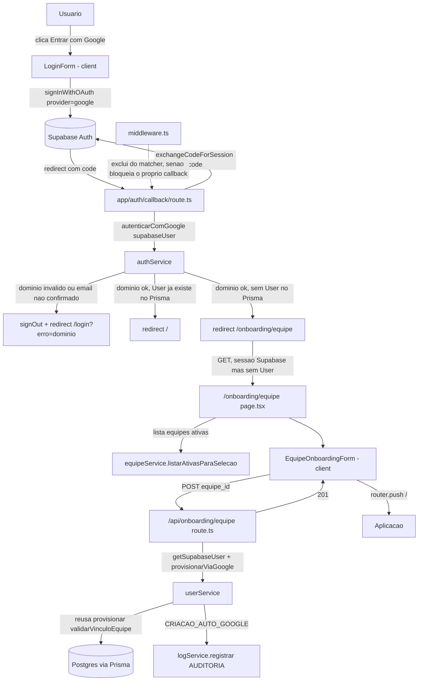

# Integrar Login Google Design

**Spec**: `.specs/features/integrar-login-google/spec.md`
**Context**: `.specs/features/integrar-login-google/context.md`
**Status**: Draft

---

## SPEC_DEVIATION — decisão tomada nesta fase (confirmada com o usuário)

O `spec.md` desta feature foi escrito referenciando o modelo antigo de `User.gestor_id`
(1 gestor por usuário). Entre a escrita do spec e esta fase de Design, a feature
`gestao-equipes` **removeu `gestor_id` do schema** e introduziu `Equipe`
(`User.equipe_id`), com a regra travada em `CLAUDE.md`/código (`userService.provisionar`
→ `validarVinculoEquipe`): **`equipe_id` é obrigatório para `role = SOLICITANTE`**, sem
exceção — não existe mais "SOLICITANTE sem responsável" no sistema.

Isso quebra a leitura literal de GAUTH-07 ("`gestor_id = null`") e do "Out of Scope" do
spec ("`gestor_id` fica nulo, correção manual depois"). Perguntado, o usuário decidiu:

> Quando o usuário logar [pela primeira vez, sem `User` prévio], abrir um popup
> obrigatório para selecionar a equipe. Se selecionar a equipe, cadastra; caso
> contrário, não cria e não deixa acessar.

**Consequência no design**:

- Auto-provisionamento via Google deixa de ser "silencioso" (GAUTH-07 original) e passa a
  ter um passo obrigatório de seleção de `Equipe` antes de qualquer `User` ser criado —
  ver componente `EquipeOnboardingForm` abaixo.
- GAUTH-07 é reinterpretado: `role = SOLICITANTE` continua fixo (auto-provisionamento
  nunca cria `GESTOR`/`RH_ADMIN`, decisão original do spec mantida), mas `equipe_id` é
  escolhido pelo próprio usuário no primeiro acesso, não fica `null`.
- GAUTH-09 (comportamento de "sem gestor" ao criar `Solicitacao`) fica **sem efeito
  prático** — não existe mais `SOLICITANTE` auto-provisionado sem `Equipe`. Mantido na
  tabela de rastreabilidade como "Superseded" (não removido, para não perder o histórico
  da decisão original).
- O "Out of Scope" do spec ("Definir/inferir `gestor_id` automaticamente... não
  discutido") também fica superado — a escolha manual da própria pessoa no login resolve
  o que antes seria inferência automática. Não é a mesma coisa (é o usuário escolhendo,
  não o sistema inferindo), então não reabre o item de escopo original.

Nenhum texto de `spec.md` foi alterado — esta seção documenta o desvio, seguindo a mesma
convenção já usada em `botao-ajuda-github/tasks.md` (SPEC_DEVIATION registrado em vez de
reescrever o spec original).

---

## Contexto

Duas features já travam decisões que esta feature **não reabre**:

- `autenticacao-usuarios/design.md`: `User.id` = `id` do usuário no Supabase Auth, sem
  tabela de correlação separada; `authService.getSessionUser()` resolve identidade via
  `prisma.user.findUnique({ where: { id: sessaoUser.id } })`.
- `gestao-equipes`: `equipe_id` obrigatório para `SOLICITANTE`; `userService.provisionar`
  já valida isso (`validarVinculoEquipe`) e é o único ponto de escrita de `User`.

**Descoberta que resolve a "Questão em Aberto 1" do spec** (estratégia de vínculo de
`id`): Supabase Auth faz **automatic identity linking** por padrão — quando um login
OAuth (Google) chega com um e-mail que já corresponde a um `auth.users` existente **com
e-mail confirmado**, a nova identidade (Google) é vinculada ao mesmo `auth.users.id`, sem
criar um segundo usuário Auth. `userService.cadastrar`/`scripts/seed-users.ts` já criam
todo `User` com `email_confirm: true` — logo, qualquer `User` cadastrado manualmente hoje
já está automaticamente elegível para esse linking. **Conclusão**: não é preciso nenhuma
lógica de upsert/correlação de `id` no código desta feature — `authService.getSessionUser()`
já funciona sem alteração para o caso "`User` existente loga com Google" (GAUTH-05,
GAUTH-06), porque a sessão resultante carrega o **mesmo** `id` já usado no Prisma.
(Fonte: [Identity Linking | Supabase Docs](https://supabase.com/docs/guides/auth/auth-identity-linking).)

> Nota de incerteza: a documentação supabase não define exaustivamente todo edge case de
> linking (ex.: contas com identidades SAML são excluídas, não é o nosso caso). Confirmar
> esse comportamento com uma conta de teste real (`User` cadastrado via `cadastrar`,
> depois logar com Google no mesmo e-mail) antes de considerar a Task correspondente
> (GAUTH-05) verificada.

---

## Architecture Overview



---

## Code Reuse Analysis

| Componente existente | Reuso nesta feature |
| --- | --- |
| `lib/supabase/client.ts` (`createBrowserClient`) | `LoginForm` chama `signInWithOAuth` nele, mesmo client já usado por `signInWithPassword`. |
| `lib/supabase/server.ts` (`createServerClient`) | `app/auth/callback/route.ts` chama `exchangeCodeForSession` nele — Route Handler pode escrever cookies (diferente de Server Component), então a sessão é persistida corretamente. |
| `authService.getSessionUser()` / `requireUser()` | **Sem alteração.** Já cobre GAUTH-06 (`ativo = false` bloqueia) e o caso "sessão sem `User`" — reaproveitado tal como está para toda página/rota fora do fluxo de onboarding. |
| `userService.provisionar()` | Reusado por `provisionarViaGoogle` (novo) — mesma validação de `equipe_id` (EQP-13/14) já aplicada ao cadastro manual passa a valer também para o auto-provisionamento via Google. |
| `equipeService.listarAtivasParaSelecao()` | Reusado sem alteração para popular o `<select>` de `EquipeOnboardingForm` — já existe exatamente para esse propósito (usado hoje pela tela de cadastro manual). |
| `logService.registrar()` | Reusado para o `Log AUDITORIA` de `CRIACAO_AUTO_GOOGLE` (GAUTH-08). |
| `middleware.ts` / `lib/supabase/middleware.ts` | Matcher precisa de uma entrada nova (`auth/callback`); `updateSession` em si não muda — já revalida sessão via `getUser()`, o que basta para deixar `/onboarding/equipe` passar (tem sessão Supabase, mesmo sem `User` no Prisma). |
| `login.module.css` | Reusa tokens (`--azul-*`, `--linha`, `--radius`) para o novo botão Google e para o CSS module da tela de onboarding. |

### Integration Points

| Sistema | Integração |
| --- | --- |
| Supabase Auth — Google provider | Precisa estar habilitado no painel do Supabase + OAuth client configurado no Google Cloud Console, com redirect URI `https://<projeto>.supabase.co/auth/v1/callback` (Supabase) e `<app>/auth/callback` como `redirectTo` do lado da aplicação. **Pré-requisito de infraestrutura, fora do repositório** (Questão em Aberto 2 do spec) — bloqueia o teste end-to-end até ser feito, não bloqueia o código. |

---

## Components

### `authService.ts` (modificar — adiciona, não altera o que já existe)

- **Purpose**: Resolver a sessão Google recém-criada: checar domínio/verificação de
  e-mail e decidir entre acesso direto, onboarding de equipe ou negação. Também expõe uma
  forma de identificar o usuário Supabase **sem** exigir `User` no Prisma (necessário
  para a tela/rota de onboarding, que roda exatamente no intervalo em que o `User` ainda
  não existe).
- **Location**: `lib/services/authService.ts`.
- **Novas interfaces**:

```ts
const DOMINIO_GOOGLE_PERMITIDO = "@01tec.com.br";

export function emailDominioValido(email: string | null | undefined): boolean;
// email?.toLowerCase().endsWith(DOMINIO_GOOGLE_PERMITIDO) — trim implícito, false se ausente.

export interface SupabaseSessionUser {
  id: string;
  email: string;
  nome: string;
}

export async function getSupabaseUser(): Promise<SupabaseSessionUser | null>;
// supabase.auth.getUser() — sem tocar Prisma. nome = user_metadata.full_name
// ?? user_metadata.name ?? email (fallback quando o provedor nao populou nome).
// Usado por /onboarding/equipe (page e route) — getSessionUser() nao serve aqui
// porque exige um User no Prisma que, por definicao, ainda nao existe.

export type ResultadoAuthGoogle =
  | { status: "permitido" }
  | { status: "onboarding_equipe" }
  | { status: "negado" };

export async function autenticarComGoogle(supabaseUser: {
  id: string;
  email: string | null | undefined;
  email_confirmed_at: string | null | undefined;
  user_metadata: Record<string, unknown>;
}): Promise<ResultadoAuthGoogle>;
```

  Lógica de `autenticarComGoogle` (GAUTH-01, GAUTH-02, edge cases de domínio/e-mail não
  verificado):
  1. `email` ausente, `email_confirmed_at` ausente, `user_metadata.email_verified ===
     false`, ou `!emailDominioValido(email)` → `{ status: "negado" }`.
  2. `prisma.user.findUnique({ where: { id: supabaseUser.id } })` existe →
     `{ status: "permitido" }` (nada a fazer — o vínculo já está garantido pelo
     automatic identity linking do Supabase, ver "Contexto").
  3. Não existe → `{ status: "onboarding_equipe" }`.
- **Dependencies**: `lib/supabase/server.ts`, `lib/prisma.ts`.
- **Reuses**: nenhuma escrita nova — só leitura (`findUnique`); a escrita fica em
  `userService.provisionarViaGoogle`.

### `app/auth/callback/route.ts` (novo)

- **Purpose**: Trocar o `code` OAuth por sessão (PKCE), aplicar a decisão de
  `autenticarComGoogle`, e redirecionar para o destino certo.
- **Location**: `app/auth/callback/route.ts`.
- **Interfaces**: `GET(request: NextRequest)`.
- **Comportamento** (GAUTH-01, GAUTH-02, GAUTH-03, edge case "usuário cancela consentimento"):
  1. Sem `code` na query (usuário cancelou o consentimento no Google, ou veio com `error=...`)
     → `redirect('/login?erro=google')`, sem chamar Supabase.
  2. `code` presente → `createServerClient()` (Route Handler pode escrever cookies) →
     `supabase.auth.exchangeCodeForSession(code)`.
  3. Erro na troca (Google/Supabase fora do ar, rede) → `redirect('/login?erro=google')`
     (GAUTH-03 — mensagem recuperável, sem travar).
  4. Sucesso → `autenticarComGoogle(data.user)`:
     - `"negado"` → `await supabase.auth.signOut()` (encerra a sessão obtida no processo,
       GAUTH-02) → `redirect('/login?erro=dominio')`.
     - `"permitido"` → `redirect('/')`.
     - `"onboarding_equipe"` → `redirect('/onboarding/equipe')` (sessão já persistida
       pelos cookies escritos no passo 2 — a próxima navegação chega autenticada).
- **Dependencies**: `lib/supabase/server.ts`, `authService.autenticarComGoogle`.
- **Reuses**: N/A (rota nova).

### `middleware.ts` (modificar — só o matcher)

- **Purpose**: Sem isso, `/auth/callback` cairia no ramo "sem sessão + página →
  redirect /login" **antes** do Route Handler rodar, porque no primeiro hit (antes de
  `exchangeCodeForSession`) ainda não existe cookie de sessão — quebraria 100% do fluxo.
- **Mudança**: adicionar `auth/callback` à mesma lista de exclusões de `/login` no
  `matcher` (negative lookahead).
- **`/onboarding/equipe` NÃO precisa de exclusão**: quando o browser chega lá, os
  cookies de sessão já foram escritos pelo callback — `updateSession` encontra sessão
  Supabase válida e deixa passar normalmente (o middleware nunca checou `User` do
  Prisma, só a sessão Supabase — ver `autenticacao-usuarios/design.md`).
- **Teste**: `middleware.test.ts` ganha `https://example.com/auth/callback` em
  `casosExcluidos`.

### `userService.ts` (modificar — adiciona, não altera o que já existe)

- **Purpose**: Único ponto de escrita de `User` também para o caminho de
  auto-provisionamento via Google — reusa `provisionar` (mesma validação de `equipe_id`),
  idempotente para a corrida de duas abas simultâneas (edge case do spec), e grava o
  `Log AUDITORIA` (GAUTH-08).
- **Location**: `lib/services/userService.ts`.
- **Nova interface**:

```ts
export async function provisionarViaGoogle(input: {
  id: string;
  nome: string;
  email: string;
  equipe_id: string;
}): Promise<User>;
```

  Lógica:
  1. `prisma.user.findUnique({ where: { id: input.id } })` já existe → retorna direto
     (idempotência: reenvio duplicado do formulário, ou segunda aba que venceu a
     corrida — nenhum `Log` novo é gravado nesse caso).
  2. Não existe → `provisionar({ id, nome, email, role: Role.SOLICITANTE, equipe_id })`
     (reusa `validarVinculoEquipe`: `equipe_id` obrigatório, precisa existir e estar
     ativo — GAUTH-07 revisado).
  3. `provisionar` lança `ErroValidacaoUsuario` por `P2002` (e-mail duplicado — a outra
     aba da corrida venceu entre o passo 1 e o `create`) → re-`findUnique({ id })`; se
     agora existe, retorna (a outra requisição já criou); se ainda não existe, o erro é
     de fato uma violação de negócio (não a corrida) → repropaga.
  4. Criação nova bem-sucedida → `registrar({ tipo: "AUDITORIA", entidade: "User",
     entidade_id: usuario.id, acao: "CRIACAO_AUTO_GOOGLE", usuario_id: null, detalhes:
     { email, equipe_id, origem: "google" } })` (GAUTH-08).
- **Dependencies**: `provisionar` (mesmo arquivo), `logService.registrar`.
- **Reuses**: `provisionar` — nenhuma duplicação da árvore de validação de `equipe_id`.

### `app/onboarding/equipe/page.tsx` (novo, server component)

- **Purpose**: Popup obrigatório (modal de página inteira, não `window.open`) de seleção
  de equipe para quem tem sessão Google válida mas ainda não tem `User`.
- **Location**: `app/onboarding/equipe/page.tsx`.
- **Comportamento**:
  1. `getSupabaseUser()` → `null` → `redirect('/login')` (sem sessão, nada a fazer aqui).
  2. `prisma.user.findUnique({ where: { id } })` já existe → `redirect('/')` (usuário já
     provisionado — reabriu a aba antiga, ou completou em outra aba; evita mostrar o
     formulário de novo).
  3. Nenhum dos dois → `equipeService.listarAtivasParaSelecao()` → renderiza
     `<EquipeOnboardingForm equipes={equipes} />`.
- **Dependencies**: `authService.getSupabaseUser`, `lib/prisma.ts`,
  `equipeService.listarAtivasParaSelecao`.
- **Reuses**: `equipeService.listarAtivasParaSelecao` (sem alteração).

### `EquipeOnboardingForm.tsx` (novo, client component)

- **Purpose**: Formulário obrigatório — `<select>` de equipes ativas + "Confirmar";
  **sem** opção de pular/cancelar (decisão do usuário: "caso contrário não cria e não
  deixa acessar"). Um link "Sair" chama `signOut()` para quem quiser abandonar, em vez de
  deixar a pessoa sem nenhuma saída da tela.
- **Location**: `app/onboarding/equipe/EquipeOnboardingForm.tsx`.
- **Comportamento**:
  - Submit sem equipe selecionada → bloqueado no client (`required` do `<select>`), sem
    chamar a API.
  - Submit válido → `POST /api/onboarding/equipe` com `{ equipe_id }`.
  - Sucesso (`201`) → `router.push('/')` + `router.refresh()`.
  - Erro (`400`/`409`) → mensagem inline (equipe inválida/inativa), formulário
    reabilitado, nenhum redirect.
  - "Sair" → `createBrowserClient().auth.signOut()` + `router.push('/login')`.
- **Dependencies**: `lib/supabase/client.ts` (só para o "Sair").
- **Reuses**: padrão de estados `carregando`/`erro` já usado em `LoginForm.tsx`.

### `app/api/onboarding/equipe/route.ts` (novo)

- **Purpose**: Único ponto que efetivamente cria o `User` a partir da escolha de equipe.
- **Location**: `app/api/onboarding/equipe/route.ts`.
- **Interfaces**: `POST(request: Request)`.
- **Comportamento**:
  1. `getSupabaseUser()` → `null` → `401 { error }`.
  2. Defesa em profundidade: `!emailDominioValido(sessao.email)` → `403 { error }` (não
     deveria acontecer no fluxo normal — só chegaria aqui via sessão Supabase obtida por
     outro caminho; barato de checar, evita depender só do callback).
  3. Corpo inválido (`equipe_id` ausente/vazio, Zod) → `400 { error, detalhes }`.
  4. `provisionarViaGoogle({ id: sessao.id, nome: sessao.nome, email: sessao.email,
     equipe_id })`:
     - `ErroValidacaoUsuario` (equipe inexistente/inativa) → `400 { error }`.
     - Sucesso → `201 { usuario }`.
- **Dependencies**: `authService.getSupabaseUser`, `authService.emailDominioValido`,
  `userService.provisionarViaGoogle`, novo `lib/validations/onboarding.ts`.
- **Reuses**: mesmo formato de erro (`{ error }` / `{ error, detalhes }`) já usado em
  `app/api/equipes/route.ts`.

### `lib/validations/onboarding.ts` (novo)

```ts
export const onboardingEquipeInputSchema = z.object({
  equipe_id: z.string().trim().min(1, "equipe_id é obrigatório."),
});
```

  `Equipe.id` é `cuid()`, não `uuid` — diferente de `equipeInputSchema.gestor_id`
  (`User.id`, esse sim `uuid`). Não reusar `.uuid()` aqui por engano.

### `LoginForm.tsx` (modificar)

- **Purpose**: Adicionar o botão "Entrar com Google" (GAUTH-01) sem alterar o fluxo de
  e-mail/senha (GAUTH-04 — zero regressão).
- **Comportamento novo**:
  - Botão dispara `createBrowserClient().auth.signInWithOAuth({ provider: 'google',
    options: { redirectTo: \`${window.location.origin}/auth/callback\`, queryParams: {
    hd: '01tec.com.br', prompt: 'select_account' } } })` — `hd` é só o hint cosmético já
    documentado em `context.md` (não é a barreira real).
  - Nenhum `try/catch` client-side interessante aqui: `signInWithOAuth` navega o browser
    inteiro para o Google — o tratamento de erro relevante (GAUTH-03, domínio errado)
    acontece do lado do servidor, no callback, e volta como `?erro=` na URL do `/login`.
- **`app/login/page.tsx`**: passa a receber `searchParams: Promise<{ erro?: string }>`
  (convenção Next 16 App Router), resolve a mensagem (`"google"` → "Não foi possível
  entrar com Google. Tente novamente."; `"dominio"` → "Use uma conta Google
  @01tec.com.br.") e repassa como prop `erroInicial` para `LoginForm`.
- **Dependencies**: inalteradas (`lib/supabase/client.ts`).

### `login.module.css` (modificar)

- Novas classes: `.divider` ("ou", linha horizontal dos dois lados — reusa `--linha`),
  `.googleButton` (variante outline do `.submit` já existente: mesmo `border-radius`,
  mesmo padding, fundo branco/borda `--linha`, ícone + texto).

### `.env.example` (modificar)

- Nenhuma variável nova é necessária: `NEXT_PUBLIC_SUPABASE_URL`/`ANON_KEY` já
  existentes cobrem o client de browser/servidor; o provider Google é habilitado no
  painel do Supabase (fora do repositório), não via env var da aplicação.

---

## Data Models

Nenhuma migration nova. Reusa `User`/`Equipe`/`Log` como já existem em
`prisma/schema.prisma` (ver `gestao-equipes/design.md` para o modelo `Equipe` completo).

---

## Error Handling Strategy

| Cenário | Tratamento | Requirement |
| --- | --- | --- |
| Domínio fora de `@01tec.com.br` | `autenticarComGoogle` → `"negado"` → `signOut()` + redirect com erro | GAUTH-02 |
| `email_verified/email_confirmed_at` ausente | Mesmo caminho de `"negado"` (edge case do spec) | Edge case |
| Falha na troca de `code` por sessão (rede/Google/Supabase) | `try` implícito no retorno de erro de `exchangeCodeForSession` → redirect com erro, sem travar | GAUTH-03 |
| Cancelamento do consentimento no Google | Sem `code`/com `error=` na query → redirect direto, sem chamar Supabase | Edge case |
| `User` existente com `ativo = false` logando via Google | **Sem mudança** — `authService.getSessionUser()` já bloqueia isso em qualquer página subsequente, independente do provedor de login | GAUTH-06 |
| Corrida de dois logins simultâneos criando o mesmo `User` novo | `provisionarViaGoogle` re-`findUnique` após `P2002` — só um `User` persiste, ambas as requisições respondem sucesso | Edge case |
| Usuário abandona o onboarding de equipe (fecha a aba) | Nenhum `User` é criado; qualquer acesso subsequente cai no caminho já existente "sessão sem `User`" (`getSessionUser` → `null`, `Log ERRO`, redirect/401) | Decisão desta fase (ver SPEC_DEVIATION) |
| `equipe_id` inválido/inativo no onboarding | `ErroValidacaoUsuario` de `provisionar` → `400`, formulário reabilitado | Decisão desta fase |

---

## Tech Decisions (only non-obvious ones)

| Decisão | Escolha | Racional |
| --- | --- | --- |
| Vínculo de identidade `User` existente ↔ login Google | Nenhum código de correlação/upsert de `id` — depender do automatic identity linking do Supabase Auth | `email_confirm: true` já é usado em todo `User` criado hoje (`cadastrar`/seed); a troca do provedor não muda o `auth.users.id`, então `authService.getSessionUser()` já funciona sem alteração (resolve a Questão em Aberto 1 do spec) |
| Auto-provisionamento passa por seleção obrigatória de `Equipe` | Página dedicada `/onboarding/equipe` (não modal flutuante sobre outras rotas) | Decisão explícita do usuário nesta sessão; uma página dedicada evita ter que ensinar toda página do app a lidar com "sessão Supabase sem `User`" — só o callback precisa saber pra onde mandar essa pessoa |
| `/onboarding/equipe` não usa `authService.requireUser()` | Usa `getSupabaseUser()` (novo, sem tocar Prisma além de um `findUnique` de checagem) | `requireUser()` pressupõe `User` já existente — usá-lo aqui sempre retornaria "não autenticado", quebrando a única tela que precisa lidar exatamente com esse meio-termo |
| Reaproveitar `provisionar()` em vez de bypassar `validarVinculoEquipe` | `provisionarViaGoogle` chama `provisionar` normalmente, com `equipe_id` já escolhido pelo usuário | A decisão desta sessão (popup obrigatório) elimina a necessidade de qualquer exceção à regra "SOLICITANTE sempre tem Equipe" — não é preciso abrir uma exceção na validação existente |
| `/auth/callback` fora do `matcher` do middleware | Adicionado à mesma exclusão de `/login` | Sem isso, o primeiro hit ao callback (ainda sem cookie de sessão) seria redirecionado para `/login` pelo próprio middleware antes do `exchangeCodeForSession` rodar |

---

## Requirement Traceability (atualização de status)

| Requirement ID | Status após Design | Nota |
| --- | --- | --- |
| GAUTH-01 | In Design → In Tasks | `LoginForm` + `app/auth/callback/route.ts` |
| GAUTH-02 | In Design → In Tasks | `autenticarComGoogle` (server-side, nunca só o `hd`) |
| GAUTH-03 | In Design → In Tasks | `app/auth/callback/route.ts`, erro de `exchangeCodeForSession` |
| GAUTH-04 | In Design → In Tasks | Nenhuma mudança em `signInWithPassword` — verificado por inspeção, sem teste novo necessário |
| GAUTH-05 | In Design → In Tasks | Resolvido via automatic identity linking do Supabase — **sem código novo**, só a verificação manual descrita na "Nota de incerteza" |
| GAUTH-06 | In Design → In Tasks | Já coberto por `authService.getSessionUser()` existente — **sem código novo** |
| GAUTH-07 | In Design → In Tasks (reinterpretado) | Ver SPEC_DEVIATION — `equipe_id` escolhido no onboarding, não `null` |
| GAUTH-08 | In Design → In Tasks | `Log AUDITORIA` gravado em `provisionarViaGoogle`, ação `CRIACAO_AUTO_GOOGLE` |
| GAUTH-09 | Superseded | Sem efeito prático — não existe mais `SOLICITANTE` auto-provisionado sem `Equipe` |
| GAUTH-10 (novo) | In Design → In Tasks | Onboarding obrigatório de `Equipe` no primeiro login Google sem `User` prévio — decisão desta sessão |

---

## Riscos / Pontos a verificar na fase de Tasks

- **Pré-requisito de infraestrutura** (Questão em Aberto 2 do spec): provider Google
  precisa estar habilitado no painel do Supabase, com OAuth client no Google Cloud
  Console e redirect URIs corretos. Sem isso, `signInWithOAuth` falha antes mesmo de
  chegar no código desta feature — o teste end-to-end real fica bloqueado até essa
  configuração externa ser feita (fora do repositório).
- Confirmar em teste manual real (conta Google de teste `@01tec.com.br`) que
  `user_metadata.full_name`/`name` realmente vêm populados no fluxo padrão
  `signInWithOAuth` + `exchangeCodeForSession` (PKCE) — há relatos de discrepância de
  metadata em fluxos de linking manual, mas o fluxo desta feature é o padrão documentado
  pela Supabase.
- Confirmar automatic identity linking contra um `User` de teste real cadastrado via
  `userService.cadastrar` (GAUTH-05) — é o ponto do design com menor certeza de
  documentação oficial e maior impacto se estiver errado.
