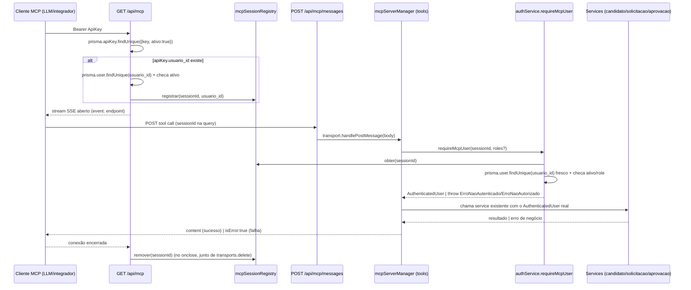

# MCP Integration Design

**Spec**: `.specs/features/mcp-integration/spec.md`
**Context**: `.specs/features/mcp-integration/context.md`
**Status**: Draft

---

## Architecture Overview

O handshake SSE (`GET /api/mcp`) passa a resolver a identidade do `User` por trás da `ApiKey` (se houver vínculo) e registrá-la contra o `sessionId` daquela conexão. Toda tool nova (e a existente, migrada) consulta essa identidade real via `requireMcpUser`, no lugar de aceitar `usuario_id`/`papel` como parâmetro do chamador. As tools continuam delegando 100% da lógica de negócio aos services já existentes — nenhuma acessa o Prisma diretamente.



---

## Code Reuse Analysis

### Existing Components to Leverage

| Component | Location | How to Use |
| --- | --- | --- |
| `AuthenticatedUser`, `ErroNaoAutenticado`, `ErroNaoAutorizado`, padrão de `requireUser` | `lib/services/authService.ts` | `requireMcpUser` reusa os mesmos tipos/classes de erro, mesmo contrato de retorno |
| `candidatoInputSchema` / `CandidatoInput` | `lib/validations/candidato.ts` | Shape reusado tal como está no input schema da tool `adicionar-curriculo` |
| `solicitacaoInputSchema` / `SolicitacaoInput` | `lib/validations/solicitacao.ts` | Shape reusado tal como está no input schema da tool `adicionar-solicitacao` |
| `decisaoInputSchema` / `DecisaoInput` | `lib/validations/aprovacao.ts` | Shape reusado (+ `solicitacao_id`) no input schema da tool `aprovar-solicitacao` |
| `candidatoService.cadastrar`, `.buscarPorId` | `lib/services/candidatoService.ts` | Chamado diretamente pelas tools, zero lógica de negócio nova |
| `solicitacaoService.criar`, `.buscarDetalhePorId` | `lib/services/solicitacaoService.ts` | Idem — `buscarDetalhePorId` chamado sempre com o `AuthenticatedUser` completo, nunca com a sobrecarga `string` (que não autentica nada) |
| `aprovacaoService.decidir` | `lib/services/aprovacaoService.ts` | Autorização fina (papel × etapa × gestor da equipe) já validada dentro do service — a tool só evita chegar até ali com identidade forjada |
| `dashboardService.listar` | `lib/services/dashboardService.ts` | Mantido como está — só muda como `listar_pendentes` obtém o `AuthenticatedUser` que passa para ele |
| Padrão `Map<string, Transport>` em memória | `app/api/mcp/route.ts` (`transports`) | `mcpSessionRegistry` segue o mesmo ciclo de vida (populado no `GET`, limpo no `onclose`) — mesma limitação conhecida de múltiplas instâncias, documentada, não resolvida aqui |

### Integration Points

| System | Integration Method |
| --- | --- |
| `prisma.apiKey` / `prisma.user` | Handshake `GET /api/mcp` passa a fazer um `findUnique` extra em `User` quando `apiKey.usuario_id` existe |
| SDK MCP (`server.tool`) | Cada tool nova é registrada com `server.tool(nome, descrição, zodShape, handler)`, mesmo padrão de `listar_pendentes` — `extra.sessionId`, já fornecido pelo SDK a cada handler, é a chave usada em `requireMcpUser` |
| `logService.registrar` | `requireMcpUser` reusa o mesmo padrão de `getSessionUser` — falha de identidade (`User` sumiu/inativo) grava `Log` tipo `ERRO`, nunca lança para fora sem log |

---

## Components

### `ApiKey.usuario_id` (schema)

- **Purpose**: Vincular uma `ApiKey` a um `User` real, tornando-a um token pessoal em vez de um segredo de sistema anônimo.
- **Location**: `prisma/schema.prisma`
- **Interface**: novo campo `usuario_id String? @db.Uuid` + relação `usuario User? @relation(fields: [usuario_id], references: [id])` no `model ApiKey`.
- **Dependências**: nenhuma — migration aditiva, nullable, não quebra chaves de sistema existentes (elas continuam funcionando para o handshake SSE, só não habilitam nenhuma tool que exija identidade).
- **Reuses**: mesmo padrão `@db.Uuid` já usado em `Equipe.gestor_id` para casar com `User.id`.

### `mcpSessionRegistry`

- **Purpose**: Guardar o vínculo `sessionId → usuario_id` durante a vida da conexão SSE, sem criar import circular entre `authService.ts` e `mcpServerManager.ts`/`app/api/mcp/route.ts`.
- **Location**: `lib/services/mcpSessionRegistry.ts` (novo arquivo)
- **Interfaces**:
  - `registrar(sessionId: string, usuarioId: string): void`
  - `remover(sessionId: string): void`
  - `obter(sessionId: string): string | undefined`
- **Dependências**: nenhuma (Map em memória, sem Prisma).
- **Reuses**: mesmo padrão do `Map<string, NextSSEServerTransport>` `transports` já existente em `app/api/mcp/route.ts` — populado/limpo nos mesmos pontos do ciclo de vida da conexão.

### `authService.requireMcpUser`

- **Purpose**: Resolver e validar a identidade real por trás de uma sessão MCP, no mesmo espírito de `requireUser` para rotas REST.
- **Location**: `lib/services/authService.ts` (função nova, ao lado de `requireUser`)
- **Interfaces**:
  - `requireMcpUser(sessionId: string, roles?: Role[]): Promise<AuthenticatedUser>` — lança `ErroNaoAutenticado` se a sessão não tem `usuario_id` registrado, se o `User` não existe mais, ou se está `ativo: false`; lança `ErroNaoAutorizado` se `roles` foi passado e o papel atual não bate; retorna `AuthenticatedUser` fresco (busca no Prisma a cada chamada, não cacheado) caso contrário.
- **Dependências**: `mcpSessionRegistry.obter`, `prisma.user.findUnique`, `logService.registrar` (mesmo padrão de log de `getSessionUser`).
- **Reuses**: `AuthenticatedUser`, `ErroNaoAutenticado`, `ErroNaoAutorizado` já existentes — nenhum tipo/classe de erro novo.

### `app/api/mcp/route.ts` (handshake, modificado)

- **Purpose**: Depois de validar a `ApiKey`, resolver o `User` vinculado (se houver) e registrar a identidade da sessão; limpar o registry ao fechar.
- **Location**: `app/api/mcp/route.ts`
- **Interfaces**: sem mudança de assinatura HTTP — mesmo `GET`, mesmo contrato de resposta SSE.
- **Dependências**: `prisma.user.findUnique` (só quando `apiKey.usuario_id` existir), `mcpSessionRegistry.registrar`/`remover`.
- **Reuses**: fluxo de validação de `ApiKey` já existente, só estendido; `transport.onclose` já existente, só adicionando `mcpSessionRegistry.remover(transport.sessionId)` ao lado de `transports.delete(...)`.

### `mcpServerManager.ts` (5 tools: 4 novas + `listar_pendentes` migrada)

- **Purpose**: Registrar as tools MCP de escrita/consulta, cada uma delegando a um service existente após resolver identidade via `requireMcpUser`.
- **Location**: `lib/services/mcpServerManager.ts`
- **Interfaces** (todas seguindo `server.tool(nome, descrição, zodShape, handler)`):
  - `listar_pendentes` — sem input de identidade (remove `usuario_id`/`papel`); `requireMcpUser(extra.sessionId, [GESTOR, RH_ADMIN])` → `dashboardService.listar`.
  - `adicionar_curriculo` — input = shape de `candidatoInputSchema`; `requireMcpUser(extra.sessionId, [GESTOR, RH_ADMIN])` → `candidatoService.cadastrar(dados, usuario.id)`.
  - `adicionar_solicitacao` — input = shape de `solicitacaoInputSchema`; `requireMcpUser(extra.sessionId)` (sem restrição de papel) → `solicitacaoService.criar(input, usuario.id)`.
  - `aprovar_solicitacao` — input = `{ solicitacao_id: z.string() }` + shape de `decisaoInputSchema`; `requireMcpUser(extra.sessionId, [GESTOR, RH_ADMIN])` → `aprovacaoService.decidir(solicitacao_id, usuario, { decisao, comentario })`.
  - `exibir_detalhes` — input = `{ tipo: z.enum(["solicitacao","curriculo"]), id: z.string() }`; ramifica papel/service conforme `tipo` (ver tabela de Error Handling).
- **Dependências**: `authService.requireMcpUser`, os 3 services de negócio, `Role` do Prisma client.
- **Reuses**: todos os services e schemas de validação já existentes — nenhuma lógica de negócio nova neste arquivo.
- **Testabilidade**: cada handler é exportado como função nomeada (ex: `export async function handleAdicionarCurriculo(args, extra)`) e `server.tool(...)` apenas a referencia — permite testar a lógica de guarda/erro em `mcpServerManager.test.ts` (mockando `authService`/services) sem precisar instanciar `McpServer`/SSE de verdade, mesmo padrão de isolamento já usado nos demais `*.test.ts` do projeto.

---

## Data Models

### `ApiKey` (alterado)

```prisma
model ApiKey {
  id         String   @id @default(cuid())
  key        String   @unique
  nome       String
  ativo      Boolean  @default(true)
  criado_em  DateTime @default(now())
  usuario_id String?  @db.Uuid

  usuario User? @relation(fields: [usuario_id], references: [id])

  @@map("api_keys")
}
```

**Relationships**: `ApiKey.usuario_id` → `User.id` (opcional — chaves de sistema sem vínculo continuam válidas para o handshake, mas não habilitam tools que exigam identidade).

---

## Error Handling Strategy

Convenção única para todas as tools: qualquer erro (identidade ou negócio) vira `{ isError: true, content: [{ type: "text", text: <mensagem> }] }` — nunca uma exceção não tratada propagando para o transporte SSE.

| Error Scenario | Handling | User Impact (content do MCP) |
| --- | --- | --- |
| Sessão sem `usuario_id` registrado / `User` sumiu ou inativo | `requireMcpUser` lança `ErroNaoAutenticado` | isError: "sessão MCP sem usuário vinculado válido" |
| Papel fora da lista exigida pela tool | `requireMcpUser` lança `ErroNaoAutorizado` | isError: mensagem de papel insuficiente |
| `email` duplicado em `adicionar_curriculo` | `candidatoService.cadastrar` lança `ErroEmailDuplicado` | isError: mensagem do erro |
| `tipo_fluxo_id` inexistente em `adicionar_solicitacao` | `solicitacaoService.criar` lança `ErroTipoFluxoNaoEncontrado` | isError: "tipo de fluxo não encontrado" |
| `dados` inválidos contra `campos_formulario` | `solicitacaoService.criar` lança `ErroDadosInvalidos` | isError: mensagem + `erro.erros` serializado (detalhe por campo) |
| `solicitacao_id` inexistente em `aprovar_solicitacao` / `exibir_detalhes` | `ErroNaoEncontrado` | isError: "não encontrado" |
| Papel/etapa/gestor incompatível em `aprovar_solicitacao` | `ErroNaoAutorizadoAprovacao` | isError: mensagem do erro |
| Solicitação já decidida/encerrada | `ErroDecisaoInvalida` | isError: "já decidida/encerrada" |
| `SOLICITANTE` sem visibilidade sobre a solicitação em `exibir_detalhes` | `ErroAcessoNegado` | isError: "acesso negado" |
| Falha da OpenAI durante criação de `Solicitacao`/`Candidato` | Já tratado dentro dos services (`iaService` nunca lança) — `Log` tipo `ERRO` gravado, fluxo segue | Sucesso normal, sem `resumo_ia` |
| Qualquer outra exceção não mapeada | catch genérico no handler da tool | isError genérico, sem vazar detalhe interno (stack trace, SQL etc.) |

---

## Tech Decisions (only non-obvious ones)

| Decision | Choice | Rationale |
| --- | --- | --- |
| Onde fica a identidade da sessão MCP | `mcpSessionRegistry` em memória, chaveado por `sessionId` (não por `ApiKey`) | `extra.sessionId` é fornecido pelo próprio SDK MCP a cada chamada de tool e não pode ser forjado pelo cliente (vem do transporte, não do payload JSON-RPC) — permite amarrar identidade real sem modificar `NextSSEServerTransport` |
| `exibir_detalhes`: parâmetro `tipo` explícito vs. cascata | Parâmetro explícito (`tipo: "solicitacao"\|"curriculo"`) | `Solicitacao.id` e `Candidato.id` são gerados da mesma forma (sem prefixo distinguível); os dois modelos de autorização são diferentes (visibilidade por papel/equipe vs. papel simples) e não devem se misturar numa tentativa em cascata |
| Migrar `listar_pendentes` nesta mesma rodada | Sim (decisão do usuário, ver `context.md`) | Evita ter 1 tool insegura ao lado de 4 seguras no mesmo servidor MCP |
| Resources `solicitacoes-pendentes`/`solicitacao-detalhe` | Não tocar nesta rodada (decisão do usuário) | Fora do pedido original; registrado como débito técnico em `context.md` |
| Frescor da identidade (cache vs. busca a cada chamada) | Sempre busca `User` fresco no Prisma dentro de `requireMcpUser`, nunca cacheia o papel | Paridade com `requireUser()` (HTTP) — desativação/mudança de papel faz efeito imediato, não só na próxima reconexão |
