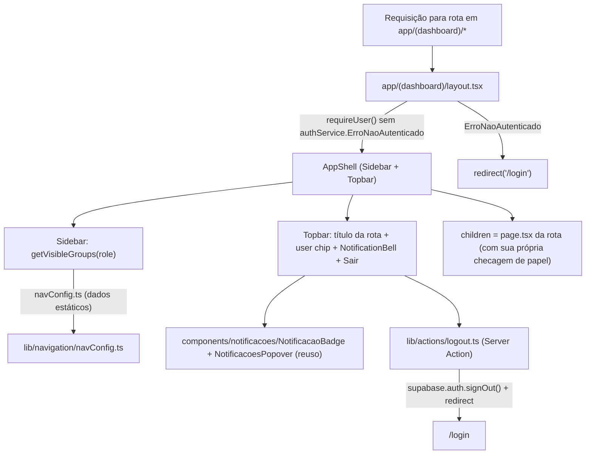

# Menu de Navegação (App Shell) Design

**Spec**: `.specs/features/menu-navegacao/spec.md`
**Status**: Draft

---

## Architecture Overview

Hoje cada rota em `app/(dashboard)/` (`aprovacoes`, `auditoria-logs`, `configuracao-fluxos`) não tem layout compartilhado — cada `page.tsx` chama `requireUser([...papéis])` e devolve HTML solto. Este design introduz um **Next.js layout** em `app/(dashboard)/layout.tsx` que:

1. Resolve a identidade da sessão uma vez (`requireUser()`, sem restrição de papel — qualquer papel autenticado passa).
2. Monta o shell visual (`AppShell` → `Sidebar` + `Topbar`) em volta de `children`.
3. Deixa cada `page.tsx` continuar dona da sua própria checagem de papel específica (ex.: `requireUser([Role.RH_ADMIN])`) — o shell não substitui nem duplica essa autorização, só envolve visualmente o resultado (inclusive a tela de "Acesso restrito").



---

## Code Reuse Analysis

### Existing Components to Leverage

| Component | Location | How to Use |
| --- | --- | --- |
| `requireUser()` | `lib/services/authService.ts` | Chamado no novo `layout.tsx` sem argumento de papéis (só autenticação); páginas individuais continuam chamando com papéis específicos, sem mudança. |
| `Role` enum | `lib/generated/prisma/client` | Base do tipo `NavItem.roles` e da função de filtro `getVisibleGroups`. |
| `NotificacaoBadge` / `NotificacoesPopover` | `components/notificacoes/*.tsx` | Renderizados dentro do novo `NotificationBell` (wrapper puramente de posicionamento) na Topbar — nenhuma mudança nesses arquivos. |
| `createServerClient` | `lib/supabase/server.ts` | Reusado por `lib/actions/logout.ts` para chamar `auth.signOut()`. |
| Padrão de tela existente (`app/(dashboard)/aprovacoes/page.tsx`) | — | Mantido como está: try/catch de `ErroNaoAutenticado`/`ErroNaoAutorizado`; o shell não interfere nesse fluxo. |
| Fontes já carregadas (`--font-fraunces`, `--font-inter`, `--font-ibm-plex-mono`) | `app/layout.tsx` | Reusadas via `var(--font-*)` nos CSS Modules do shell — nenhuma fonte nova a carregar. |
| Marca "OP Conecta" | `app/layout.tsx`, `app/login/page.tsx` | Mesmo texto de marca usado na Sidebar (mockup mostrava "FluxoRH"/"OP Conecta" — seguir o nome já corrigido no commit `77d970b`, não o nome antigo do mockup). |

### Integration Points

| Sistema | Método de Integração |
| --- | --- |
| `app/(dashboard)/*` (rotas existentes: `aprovacoes`, `auditoria-logs`, `configuracao-fluxos`) | Passam a herdar automaticamente o novo `layout.tsx` do grupo de rotas — nenhuma mudança nos `page.tsx` existentes. |
| `notificacoes` (componentes já prontos) | Consumidos como estão, sem alterar seus arquivos; só compostos visualmente dentro de `NotificationBell`. |
| `autenticacao-usuarios` (AUTH-13/14, logout) | Este design implementa o `signOut` real pela primeira vez, cumprindo o contrato já definido naquela spec (nenhuma redefinição de comportamento, só a implementação que faltava). |
| Design tokens (`docs/design-ux-ui/fluxorh-ui-layout-specs.md` §1.1) | Adicionados como CSS custom properties em `app/globals.css` (`:root`) — hoje esse arquivo não define nenhum token; este é o primeiro consumidor real, então os tokens nascem aqui e ficam disponíveis para as demais telas migrarem depois. |

---

## Components

### `app/(dashboard)/layout.tsx`

- **Purpose**: Resolve a sessão autenticada e monta o `AppShell` em volta de todas as rotas do grupo.
- **Location**: `app/(dashboard)/layout.tsx`
- **Interfaces**: `export default async function DashboardLayout({ children }: { children: React.ReactNode })`
- **Dependencies**: `requireUser()` (sem papéis), `redirect` (`next/navigation`)
- **Reuses**: mesmo padrão try/catch de `ErroNaoAutenticado` já usado em `aprovacoes/page.tsx`, mas sem checagem de papel.

### `AppShell`

- **Purpose**: Compõe Sidebar + Topbar + área de conteúdo, recebendo o usuário resolvido do layout.
- **Location**: `app/(dashboard)/_components/AppShell.tsx` (+ `AppShell.module.css`)
- **Interfaces**:
  - `AppShell({ usuario: AuthenticatedUser, children: React.ReactNode }): JSX.Element`
- **Dependencies**: `Sidebar`, `Topbar`
- **Reuses**: `AuthenticatedUser` (tipo já exportado por `authService.ts`)

### `Sidebar`

- **Purpose**: Renderiza marca, grupos de navegação filtrados por papel, destaque de item ativo e ação "Sair".
- **Location**: `app/(dashboard)/_components/Sidebar.tsx` (+ `Sidebar.module.css`) — **Client Component** (`usePathname` para estado ativo).
- **Interfaces**:
  - `Sidebar({ role: Role, nome: string, papelLabel: string }): JSX.Element`
- **Dependencies**: `usePathname` (`next/navigation`), `getVisibleGroups` (`lib/navigation/navConfig.ts`), `logout` (`lib/actions/logout.ts`, via `<form action={logout}>`)
- **Reuses**: `navConfig.ts`

### `Topbar`

- **Purpose**: Exibe eyebrow + título da tela atual, identidade do usuário (nome/papel) e o gatilho de notificações.
- **Location**: `app/(dashboard)/_components/Topbar.tsx` (+ `Topbar.module.css`) — **Client Component** (`usePathname` para resolver título).
- **Interfaces**:
  - `Topbar({ nome: string, papelLabel: string }): JSX.Element`
- **Dependencies**: `usePathname`, `resolveScreenTitle` (`lib/navigation/navConfig.ts`), `NotificationBell`
- **Reuses**: `navConfig.ts` (mesma fonte de verdade da Sidebar, evita duas listas de rotas divergentes)

### `NotificationBell`

- **Purpose**: Combina os componentes já existentes de notificação em um único gatilho visual na Topbar, sem alterar seu código.
- **Location**: `app/(dashboard)/_components/NotificationBell.tsx` (+ `NotificationBell.module.css`)
- **Interfaces**: `NotificationBell(): JSX.Element`
- **Dependencies**: `NotificacaoBadge`, `NotificacoesPopover` (ambos de `components/notificacoes/`)
- **Reuses**: os dois componentes inteiros, sem modificação — este componente é só um `<div>` com `position: relative` envolvendo ambos.

### `lib/navigation/navConfig.ts`

- **Purpose**: Única fonte de verdade dos itens de navegação (dado estático) e das funções puras que Sidebar/Topbar consomem — nenhuma lógica de UI aqui, só dados + funções puras (testáveis via vitest).
- **Location**: `lib/navigation/navConfig.ts` (+ `lib/navigation/navConfig.test.ts`)
- **Interfaces**:
  - `getVisibleGroups(role: Role): NavGroup[]` — filtra grupos/itens pelo papel; grupo sem nenhum item visível não aparece no array retornado (NAV-02..NAV-05).
  - `resolveScreenTitle(pathname: string): { eyebrow: string; titulo: string }` — encontra o item cujo `href` é o prefixo mais longo que casa com `pathname`; sem match, devolve um fallback genérico (NAV-10).
- **Dependencies**: `Role` (`lib/generated/prisma/client`)
- **Reuses**: nenhuma dependência externa nova.

### `lib/actions/logout.ts`

- **Purpose**: Server Action que encerra a sessão Supabase e redireciona para o Login — implementa o contrato já definido em AUTH-13/AUTH-14.
- **Location**: `lib/actions/logout.ts`
- **Interfaces**: `export async function logout(): Promise<void>` (marcado `'use server'`)
- **Dependencies**: `createServerClient` (`lib/supabase/server.ts`), `redirect` (`next/navigation`)
- **Reuses**: `lib/supabase/server.ts` (mesmo client já usado por `authService.ts`)

---

## Data Models

### `NavItem`

```typescript
interface NavItem {
  label: string;
  href: string;
  roles: Role[];
}
```

### `NavGroup`

```typescript
interface NavGroup {
  key: string;
  label: string;
  items: NavItem[];
}
```

**Conteúdo de `navConfig.ts` (dado estático, não um "model" persistido)**:

| Grupo | Item | `href` | Papéis |
| --- | --- | --- | --- |
| Meu trabalho | Minhas Solicitações | `/solicitacoes` | SOLICITANTE, GESTOR, RH_ADMIN |
| Meu trabalho | Nova Solicitação | `/solicitacoes/nova` | SOLICITANTE, GESTOR, RH_ADMIN |
| Meu trabalho | Aprovações Pendentes | `/aprovacoes` | GESTOR, RH_ADMIN |
| Visão geral | Dashboard | `/` | GESTOR, RH_ADMIN |
| Visão geral | Painel de Insights | `/insights` | GESTOR, RH_ADMIN |
| Recrutamento | Banco de Talentos | `/banco-de-talentos` | GESTOR, RH_ADMIN |
| Administração | Configuração de Fluxos | `/configuracao-fluxos` | RH_ADMIN |
| Administração | Auditoria & Logs | `/auditoria-logs` | RH_ADMIN |

Rotas confirmadas em `tasks.md` de cada feature: `solicitacoes` (T8/T10 → `/solicitacoes`, `/solicitacoes/nova`), `dashboard-visao-geral` (T11 → `/`), `painel-insights` (T6 → `/insights`). `aprovacoes`, `auditoria-logs`, `configuracao-fluxos` já implementadas nesses paths. `banco-de-talentos` ainda não tem `design.md`/`tasks.md` — rota `/banco-de-talentos` é uma convenção proposta aqui (mesmo padrão flat das demais), a confirmar quando aquela feature chegar ao design.

**Relationships**: `navConfig.ts` não depende de nenhum model Prisma — é dado de UI puro, versionado no código.

---

## Error Handling Strategy

| Cenário de Erro | Tratamento | Impacto no Usuário |
| --- | --- | --- |
| Sessão ausente/expirada ao carregar qualquer rota do grupo | `layout.tsx` captura `ErroNaoAutenticado` de `requireUser()` e chama `redirect('/login')` antes de montar o shell. | Usuário vai direto para Login, sem ver sidebar/topbar "vazia". |
| Papel do usuário não permite a tela específica (ex.: `GESTOR` em `/configuracao-fluxos`) | Já tratado pelo `page.tsx` da tela (inalterado); shell continua renderizado ao redor. | Vê sidebar/topbar normais + card "Acesso restrito" no lugar do conteúdo. |
| Falha ao chamar `signOut()` no Server Action de logout | `try/catch` no Server Action: loga no console do servidor e ainda assim `redirect('/login')` — nunca deixa o usuário "preso" logado numa tela. | Sessão pode ficar tecnicamente ativa no Supabase por mais um pouco, mas a aplicação trata como deslogado (cookie local removido via helper de `@supabase/ssr`). |
| `pathname` sem nenhum item de `navConfig` correspondente (ex.: `/solicitacoes/abc123`) | `resolveScreenTitle` cai no fallback: usa o grupo/rota pai mais próxima por prefixo (`/solicitacoes`) para eyebrow/título. | Título nunca fica em branco; pior caso é um título "aproximado" (ex.: mostra "Minhas Solicitações" numa tela de detalhe). |
| Item de menu apontaria para rota ainda não implementada | Não incluído em `navConfig.ts` até a rota existir (nenhum código condicional — é uma decisão de conteúdo do arquivo de dados). | Nunca há link para 404 a partir do menu. |

---

## Tech Decisions (only non-obvious ones)

| Decision | Choice | Rationale |
| --- | --- | --- |
| Onde resolver o usuário | `requireUser()` sem papéis, no `layout.tsx`, uma vez por navegação | Evita duplicar a query de `User` em toda página; mantém a checagem de papel específica onde já está (cada `page.tsx`), sem uma segunda fonte de verdade para autorização. |
| Fonte única de rotas de navegação | `lib/navigation/navConfig.ts` consumido tanto por `Sidebar` (itens) quanto por `Topbar` (título) | Duas listas seguiriam divergindo (ex.: título da topbar dessincronizado do rótulo do menu); uma função pura e testável reduz isso a um único lugar de manutenção. |
| Mecanismo de logout | Server Action (`'use server'`) acionado por `<form action={logout}>` na Sidebar, em vez de rota de API + `fetch` client-side | Menos JS no cliente, mesmo padrão que o App Router já favorece; nenhuma necessidade de estado de loading customizado — o próprio form nativo cobre o caso. |
| Estilo dos componentes | CSS Modules (`*.module.css`) por componente, mesma convenção de `aprovacoes.module.css`/`auditoria-logs` já em uso | Projeto não usa Tailwind; manter consistência em vez de introduzir uma segunda abordagem de estilo. |
| Onde nascem os design tokens (`--paper`, `--azul-900` etc.) | `app/globals.css` (`:root`), na íntegra da tabela §1.1 de `fluxorh-ui-layout-specs.md` | Hoje nenhum token existe no CSS global; como o shell é a primeira peça visual que precisa de todos eles simultaneamente (fundo, marca, carimbos futuros), é o ponto natural de introduzi-los — telas futuras/existentes podem migrar para os tokens depois. |
| Composição do "Banco de Talentos" no menu | Grupo próprio "Recrutamento" com um único item | Não se encaixa semanticamente em "Visão geral" (leitura/relatório) nem em "Administração" (RH_ADMIN-only; Banco de Talentos é GESTOR+RH_ADMIN) — um grupo dedicado evita forçar uma categoria errada. |
| Integração dos componentes de notificação | `NotificationBell` como wrapper de posicionamento puro, sem tocar `NotificacaoBadge`/`NotificacoesPopover` | Esses componentes pertencem à feature `notificacoes`; alterar seu estilo/estrutura seria escopo de outra feature. O acabamento visual (cores inline hoje fora da paleta do produto) fica como débito conhecido, não resolvido aqui. |

---

## Riscos / Observações (fora do controle direto desta feature)

1. **Conflito de "primeira tela" para `SOLICITANTE`**: `dashboard-visao-geral` reivindica a rota raiz `/` (só `GESTOR`/`RH_ADMIN`), enquanto `autenticacao-usuarios` já resolveu "landing única em `/`, sem roteamento condicional por papel". Um `SOLICITANTE` que acessar `/` diretamente (ex.: após login, se o redirect pós-login apontar para `/`) veria a tela de "Acesso restrito" do Dashboard, não uma tela útil. Este design não resolve isso (não é dono de `/`, nem de `page.tsx` do Dashboard) — fica registrado para quem executar `dashboard-visao-geral`/`autenticacao-usuarios` decidir se o redirect pós-login deve ser condicional por papel ou se `SOLICITANTE` precisa de outro destino padrão.
2. **Estilo dos componentes de notificação** (ver Tech Decisions acima) — débito visual conhecido, não bloqueia esta feature.

---

## Tips (preenchidas)

- Grupo colapsável: estado local (`useState`) por grupo na `Sidebar`, expandido por padrão (NAV-15) — sem persistência entre reloads nesta versão (fora de escopo por spec).
- Breakpoint responsivo (NAV-18): reusar o mesmo limiar já usado no login (`< 860px`, ver `fluxorh-ui-layout-specs.md` §4.1) para manter um único ponto de quebra documentado no produto, em vez de inventar um novo número.
