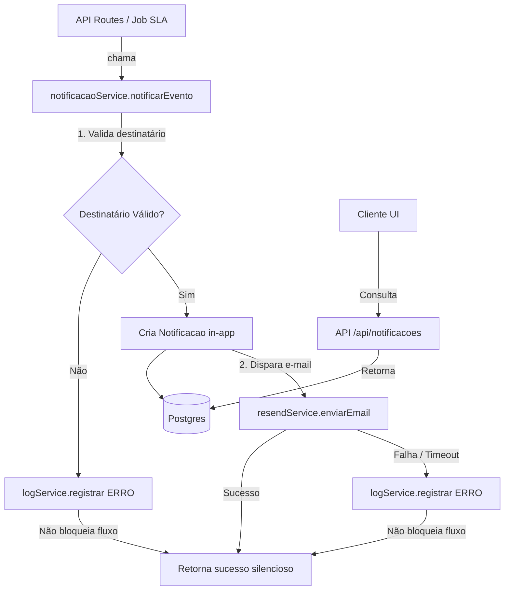

# Notificações Design

**Spec**: `.specs/features/notificacoes/spec.md`
**Context**: `.specs/features/notificacoes/context.md`
**Status**: Draft

---

## Contexto

Esta feature fornece o sistema central de comunicação (in-app e e-mail) do RHOP. Ela materializa a regra de que "nada fica pendente silenciosamente".

**Decisões travadas em `context.md`**:
- Criação da entidade `Notificacao` no Prisma.
- Cobrança de SLA com throttle (deduplicação) de no máximo 1x por dia por solicitação atrasada.
- Provedor de e-mail definido: **Resend** (conforme regras do sistema e `CLAUDE.md`).

---

## Architecture Overview

O serviço de notificação opera em background ou como fire-and-forget dentro do ciclo de vida da `Solicitacao`. A resiliência é um princípio arquitetural fundamental.



---

## Code Reuse Analysis

### O que esta feature entrega e que as outras consomem

| Componente | Localização | Como as outras features usam |
| --- | --- | --- |
| `notificacaoService.notificarEvento(...)` | `lib/services/notificacaoService.ts` | `solicitacoes`, `aprovacoes` e `sla-cobranca` chamam este método nos pontos de transição de estado para disparar avisos. |
| Modelo `Notificacao` | `prisma/schema.prisma` | Persistência local (in-app) exclusiva desta feature, mas referenciando `User` e `Solicitacao`. |

### Integration Points

| Sistema | Método de integração |
| --- | --- |
| Resend | Uso do SDK oficial (`resend`) para disparar e-mails. Chamadas encapsuladas e protegidas por bloco `try/catch` rígido. |
| Postgres (Prisma) | `lib/prisma.ts` para CRUD de `Notificacao`. |
| `auditoria-logs` | `logService.registrar({ tipo: 'ERRO', ... })` para falhas de destinatário ou de envio de e-mail. |
| `aprovacoes` / `solicitacoes` | São os acionadores lógicos (callers) desta feature. |

---

## Components

### `notificacaoService`

- **Purpose**: Orquestrar a criação in-app e o envio de e-mail, garantindo que falhas parciais (e-mail) não revertam a transação ou quebrem o chamador.
- **Location**: `lib/services/notificacaoService.ts`
- **Interfaces**:
  - `notificarEvento(input: NotificacaoInput): Promise<void>` (onde `NotificacaoInput` contém evento, destinatário_id, solicitacao_id, etc.)
  - `listarNotificacoes(usuario_id: string): Promise<Notificacao[]>`
  - `marcarComoLida(notificacao_id: string, usuario_id: string): Promise<void>`
  - `obterContagemNaoLidas(usuario_id: string): Promise<number>`
- **Dependencies**: `lib/prisma.ts`, `logService`, `resendService`.
- **Comportamento**:
  - Envolve a chamada de e-mail em um `try/catch` isolado.
  - Implementa a regra de throttle (1x/dia) para o evento "cobrança de SLA" consultando se já existe notificação deste tipo para esta solicitação hoje.

### `resendService` (Integração de E-mail)

- **Purpose**: Isolar a dependência do SDK do Resend e centralizar o disparo. Renderizar templates (texto/HTML simples focando no MVP).
- **Location**: `lib/services/resendService.ts`
- **Interfaces**:
  - `enviarEmail(input: EmailInput): Promise<boolean>` (retorna false em caso de falha, em vez de throw).
- **Dependencies**: `resend` (SDK via npm), variável de ambiente `RESEND_API_KEY`.

### Central de Notificações (UI)

- **Purpose**: Permitir ao usuário visualizar e interagir com suas notificações.
- **Location**: `components/notificacoes/NotificacoesPopover.tsx` (ou similar) e `components/notificacoes/NotificacaoBadge.tsx`.
- **Comportamento**:
  - Busca as notificações via `/api/notificacoes`.
  - Exibe um badge com contagem de não lidas.
  - Ao clicar numa notificação, marca como lida internamente (via API) e redireciona (deep-link) para a tela apropriada.
  - Exibe estado vazio formatado caso a lista seja vazia.

### API Routes

- **Location**: `app/api/notificacoes/route.ts` (GET para listar), `app/api/notificacoes/[id]/lida/route.ts` (PATCH/POST para marcar lida).
- **Security**: Usar `authService.getSessionUser()` para garantir que o usuário só busca/atualiza suas próprias notificações (visibilidade restrita).

---

## Data Models

### `Notificacao`

```prisma
enum TipoNotificacao {
  CRIACAO
  AVANCO_ETAPA
  APROVACAO_FINAL
  REJEICAO
  COBRANCA_SLA
}

model Notificacao {
  id              String          @id @default(uuid()) @db.Uuid
  usuario_id      String          @db.Uuid
  solicitacao_id  String          @db.Uuid
  tipo            TipoNotificacao
  mensagem        String
  lida            Boolean         @default(false)
  link            String
  criado_em       DateTime        @default(now())

  usuario         User            @relation("NotificacoesUsuario", fields: [usuario_id], references: [id])
  solicitacao     Solicitacao     @relation(fields: [solicitacao_id], references: [id])

  @@index([usuario_id, lida]) // Otimiza busca de não lidas e listagem por usuário
}
```

*Nota: Em `User`, será necessário adicionar o relacionamento inverso `notificacoes Notificacao[] @relation("NotificacoesUsuario")` e o mesmo para o modelo `Solicitacao` (`notificacoes Notificacao[]`).*

---

## Error Handling Strategy

| Cenário | Tratamento | Impacto no usuário / Fluxo |
| --- | --- | --- |
| Destinatário nulo/indefinido | `notificarEvento` aborta e grava `Log` (ERRO). | Nenhum bloqueio ao fluxo principal. |
| Falha no envio de e-mail (Resend indisponível/timeout) | `try/catch` ao redor da chamada. Grava `Log` (ERRO). | Fluxo da `Solicitacao` avança normalmente. In-app criada. |
| Falha ao criar notificação in-app (erro de DB) | Grava `Log` (ERRO). Retorno silencioso (swallowed). | Fluxo avança. Usuário não recebe in-app (fallback via e-mail ou dashboard). |
| Destinatário sem e-mail cadastrado | Detectado antes do envio. Grava `Log` (ERRO). | Notificação in-app é criada. Fluxo avança sem e-mail. |
| Rate limit Resend | Capturado pelo `catch`. Grava `Log` (ERRO). | Não afeta o fluxo de aprovação. |

---

## Tech Decisions (only non-obvious ones)

| Decisão | Escolha | Racional |
| --- | --- | --- |
| Disparo via Resend | `await resendService.enviarEmail` com try/catch (ou `waitUntil` no Next.js) | Vercel (onde está hospedado) pode cancelar promessas não resolvidas se o response for enviado antes. Devemos aguardar o envio ou usar `waitUntil()` de `next/functions` (Next.js 14/15) para evitar cancelamento de background tasks. |
| Throttle de SLA no banco | Consulta prévia (`count` em `Notificacao` de cobrança hoje) | Simples e efetivo. Evita infra de fila / mensageria ou state stores complexos. |
| Resumo de IA no E-mail (Questão Aberta #3 do spec) | Não embutido (fora do e-mail) | Mantém resiliência e velocidade no fluxo principal. O e-mail serve como notificação para o usuário abrir a plataforma e visualizar a `Solicitacao` com seu `resumo_ia`. |

---

## Riscos / Pontos a verificar na fase de Tasks

- **Next.js Fire-and-Forget / Background Tasks**: Como o deploy é na Vercel, o tempo de vida do servidor (serverless) termina ao enviar a resposta HTTP. Para enviar e-mail de forma resiliente e não bloquear o cliente, recomenda-se explorar a API `waitUntil` do Next.js (se aplicável à versão em uso) ou engolir o atraso aceitável do Resend de forma síncrona.
- Certificar de gerar corretamente os links para as notificações dependendo do papel do destinatário (e.g. `/gestao/aprovacoes/[id]` vs `/solicitacoes/[id]`).
