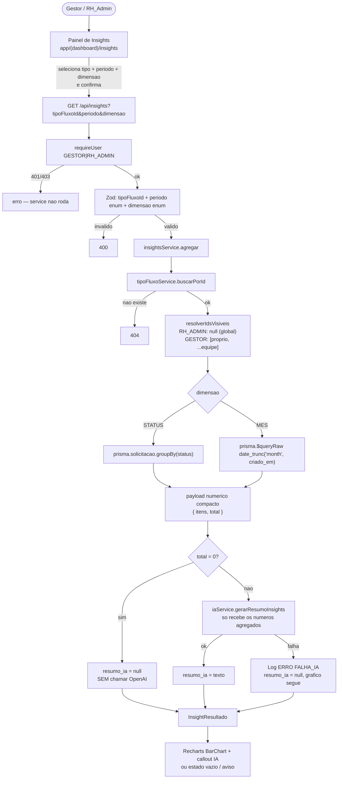

# Painel de Insights — Design

**Spec**: `.specs/features/painel-insights/spec.md`
**Context**: `.specs/features/painel-insights/context.md`
**UI reference**: `docs/design-ux-ui/fluxorh-mockup.html` (`#screen-insights`)
**Status**: Draft

---

## 0. Nota de reconciliação (questões em aberto fechadas aqui)

| Ponto | Decisão neste Design | Origem |
| --- | --- | --- |
| Papel de acesso (Questão #1) | RH_ADMIN global; GESTOR restrito a `solicitante_id IN (proprio + equipe)`. Já travado no `context.md`. | `context.md` |
| Dimensão de agregação sobre `dados` (Questão #2) | **Opção (a)**: duas dimensões genéricas, independentes de `TipoFluxo` — `STATUS` (contagem por `status`) e `MES` (contagem por mês de `criado_em`, cobre "tendência de reembolso ao longo do tempo"). Nenhuma introspecção de `dados`/`campos_formulario`. Evita acoplar o painel ao formato dinâmico do formulário (que varia por tipo) e evita a necessidade de marcar campos como "agregáveis" em `TipoFluxo` — fora do prazo do hackathon. Consequência direta: como as duas dimensões **sempre** existem para qualquer tipo, a condição de INSIGHT-11 ("mais de uma dimensão disponível") é sempre verdadeira — o seletor de dimensão é permanente na UI, não condicional. | `context.md` (Agent's Discretion) |
| Definição de "período" (Questão #3) | Faixas predefinidas: `ULTIMOS_30_DIAS`, `ULTIMOS_90_DIAS`, `ANO_ATUAL` — mesmas opções citadas no texto do spec e alinhadas ao seletor do mockup (`Últimos 30/90 dias`). Sem date-picker customizado: menos superfície de validação Zod, suficiente para o pitch. | `context.md` (Agent's Discretion) + mockup |
| Cache do resumo de IA (Questão #4) | **Sem cache nesta rodada.** Cada requisição recalcula agregação + narra de novo. Volume de dados do hackathon não justifica a complexidade de invalidação por tipo+período+dimensão. Fica como Deferred Idea (`context.md`). | `context.md` (Deferred) |
| Formato do gráfico (Questão #5) | Um único tipo de gráfico (barras, Recharts `BarChart`) para as duas dimensões (`STATUS` e `MES`). Uma segunda visualização (linha/tempo) é YAGNI nesta rodada — o mockup só valida barra. | `context.md` (Deferred) + mockup |
| Tabela "Tempo médio de aprovação por tipo" do mockup | **Fora de escopo desta feature.** Não está em nenhuma User Story do `spec.md` (nem em P1, P2 ou P3) — é enriquecimento visual do mockup sem requisito correspondente. Não implementar sem confirmar (regra do `CLAUDE.md` contra expandir escopo). | `CLAUDE.md` + ausência no spec |

Nenhuma decisão contradiz `spec.md`/`context.md` — só fecha zonas cinzentas e Agent's Discretion.

---

## Architecture Overview

Camadas conforme `CLAUDE.md`: Route (Zod + auth) → Service (agregação Postgres + narração IA) → Prisma. **Nenhuma alteração de schema** — feature é 100% leitura sobre `Solicitacao`/`TipoFluxo` já existentes.



---

## Code Reuse Analysis

| Component | Location | How to Use |
| --- | --- | --- |
| `authService.requireUser` | `lib/services/authService.ts` | Gate `[GESTOR, RH_ADMIN]` na rota (INSIGHT-10) |
| `tipoFluxoService.listar` | `lib/services/tipoFluxoService.ts` | Popula o seletor de tipo na página (Server Component, sem novo endpoint) |
| `tipoFluxoService.buscarPorId` | `lib/services/tipoFluxoService.ts` | Valida `tipoFluxoId` do filtro e obtém `nome` para o payload/prompt; `ErroNaoEncontrado` já existe e mapeia 404 |
| `logService.registrar` | `lib/services/logService.ts` | `Log ERRO` `acao: FALHA_IA` (INSIGHT-08) |
| `iaService` (arquivo existente) | `lib/services/iaService.ts` | Acrescenta `gerarResumoInsights` no mesmo arquivo de `gerarResumoSolicitacao` — mesmo padrão nunca-lança + `gpt-4o-mini` |
| Padrão rota Zod + auth + query params | `app/api/logs/route.ts` (`queryLogsSchema` + `parseLogsQuery`) | Mesmo formato para `insightsFiltroSchema` + `parseInsightsQuery` |
| Padrão página Server Component com gate | `auditoria-logs/page.tsx` | `requireUser` + bloco "Acesso restrito" sem `forbidden()`/`notFound()` experimentais |
| `lib/prisma.ts` | singleton | Único ponto de acesso (dentro do service, nunca na rota) |

### Integration Points

| System | Method |
| --- | --- |
| `solicitacoes` | Lê `Solicitacao` (`status`, `criado_em`, `tipo_fluxo_id`, `solicitante_id`) — não escreve nada |
| `configuracao-fluxos` | Lê `TipoFluxo` só para popular filtro e nome no prompt — não edita |
| `auditoria-logs` | Só escreve `Log` via `logService` |
| `dashboard-visao-geral` | Nenhuma — contadores operacionais são feature separada (Out of Scope) |

---

## Components

### `lib/validations/insight.ts`

```ts
export const PERIODOS_INSIGHTS = ["ULTIMOS_30_DIAS", "ULTIMOS_90_DIAS", "ANO_ATUAL"] as const;
export const DIMENSOES_INSIGHTS = ["STATUS", "MES"] as const;

export const insightsFiltroSchema = z.object({
  tipoFluxoId: z.string().min(1),
  periodo: z.enum(PERIODOS_INSIGHTS),
  dimensao: z.enum(DIMENSOES_INSIGHTS).optional().default("STATUS"),
});

export type InsightsFiltro = z.infer<typeof insightsFiltroSchema>;

export function parseInsightsQuery(url: string) {
  const { searchParams } = new URL(url);
  return insightsFiltroSchema.safeParse({
    tipoFluxoId: searchParams.get("tipoFluxoId") ?? undefined,
    periodo: searchParams.get("periodo") ?? undefined,
    dimensao: searchParams.get("dimensao") ?? undefined,
  });
}
```

Mesmo padrão de `queryLogsSchema`/`parseLogsQuery` (`lib/validations`, `app/api/logs/route.ts`) — `safeParse` isolado, testável sem simular `Request`.

### `lib/services/insightsService.ts`

- **Purpose**: agregação 100% Postgres (INSIGHT-02) + orquestração da narração IA (INSIGHT-06), com visibilidade por papel (INSIGHT-09) e sem chamar IA em período vazio (INSIGHT-05).
- **Errors**: reusa `ErroNaoEncontrado` de `tipoFluxoService` (não redefine) para `tipoFluxoId` inexistente.
- **Interfaces**:
  - `agregar(usuario: AuthenticatedUser, filtro: InsightsFiltro): Promise<InsightResultado>`
  - `periodoParaIntervalo(periodo: PeriodoInsights, agora?: Date): { inicio: Date; fim: Date }` — exportado para teste; `agora` injetável (mesmo padrão de `slaService.verificarSla(now?)`).
  - `resolverIdsVisiveis(usuario: AuthenticatedUser): Promise<string[] | null>` — `null` = sem filtro (RH_ADMIN, agregação global); array = `[usuario.id, ...idsDaEquipe]` (GESTOR). Exportado para teste.
- **Algoritmo de `agregar`**:
  1. `tipoFluxoService.buscarPorId(filtro.tipoFluxoId)` — propaga `ErroNaoEncontrado` se não existir (INSIGHT-04 edge case).
  2. `{ inicio, fim } = periodoParaIntervalo(filtro.periodo)`.
  3. `idsVisiveis = await resolverIdsVisiveis(usuario)`.
  4. Monta `where` base: `tipo_fluxo_id`, `criado_em: { gte: inicio, lte: fim }`, e se `idsVisiveis !== null`: `solicitante_id: { in: idsVisiveis }` (INSIGHT-09).
  5. Se `dimensao === 'STATUS'`: `prisma.solicitacao.groupBy({ by: ['status'], where, _count: { _all: true } })` → `itens = grupos.map(g => ({ chave: g.status, quantidade: g._count._all }))`.
  6. Se `dimensao === 'MES'`: `prisma.$queryRaw` com `date_trunc('month', criado_em)`, mesmo `where` traduzido para SQL parametrizado (`Prisma.sql`, cláusula `AND solicitante_id = ANY(...)` só quando `idsVisiveis !== null`) → `itens = linhas.map(r => ({ chave: formatoAnoMes(r.mes), quantidade: Number(r.quantidade) }))`.
  7. `total = itens.reduce((soma, i) => soma + i.quantidade, 0)`.
  8. Se `total === 0` → retorna `{ ..., itens: [], resumo_ia: null }` **sem** chamar `iaService` (INSIGHT-05).
  9. Se `total > 0` → `resumo_ia = await gerarResumoInsights({ tipoFluxoNome, periodo: filtro.periodo, dimensao: filtro.dimensao, itens, total })` — `null` em falha, sem lançar (INSIGHT-08); `iaService` já grava o `Log ERRO`.
  10. Retorna `InsightResultado`.
- **Dependencies**: `lib/prisma.ts`, `tipoFluxoService.buscarPorId`, `iaService.gerarResumoInsights`.
- **Nota de corrida/consistência**: sem necessidade de lock/transação — leitura pura, sem escrita concorrente a proteger.

### `lib/services/iaService.ts` (extensão)

- **Purpose**: acrescentar `gerarResumoInsights`, no mesmo arquivo de `gerarResumoSolicitacao`, com o mesmo contrato "nunca lança, `null` + `Log ERRO` em falha".
- **Interface**:
  - `gerarResumoInsights(input: { tipoFluxoNome: string; periodo: string; dimensao: string; itens: { chave: string; quantidade: number }[]; total: number }): Promise<string | null>`
- **Prompt** (system): instrui a IA a narrar **exclusivamente** os números recebidos (nunca inventar dados brutos), em português, e a **evitar afirmar tendências fortes quando a amostra for pequena** (ex.: `total <= 2` — reforça o edge case do spec: "payload agregado com volume muito pequeno").
- **Log de falha**: `entidade: "Insight"`, `entidade_id: `${tipoFluxoNome}:${periodo}:${dimensao}``, `acao: "FALHA_IA"` — mesmo padrão de `registrarFalhaIa`, adaptado (não há um id de registro único como `solicitacaoId`; a combinação filtro identifica o evento).

### `app/api/insights/route.ts`

- **Method**: `GET`
- **Auth**: `requireUser([Role.GESTOR, Role.RH_ADMIN])` — `ErroNaoAutenticado` → 401, `ErroNaoAutorizado` → 403 (INSIGHT-10).
- **Validação**: `parseInsightsQuery(request.url)` — falha → 400 com `issues` (mesmo formato de `/api/logs`).
- **Delegação**: `insightsService.agregar(usuario, resultado.data)` — `ErroNaoEncontrado` (tipo de fluxo inválido) → 404.
- **Resposta 200**: `InsightResultado` (JSON).
- Nenhuma lógica de agregação nem acesso a `prisma` na própria rota (INSIGHT-04).

### UI — `app/(dashboard)/insights/`

- **`page.tsx`** (Server Component): gate `[GESTOR, RH_ADMIN]` (mesmo padrão de `auditoria-logs/page.tsx` — `redirect('/login')` em `ErroNaoAutenticado`, bloco "Acesso restrito" em `ErroNaoAutorizado`); busca `tipoFluxoService.listar()` no servidor e passa como prop (`tipos: TipoFluxoResumo[]`) para `InsightsPanel` — evita um segundo endpoint só para popular o `<select>`.
- **`_components/InsightsPanel.tsx`** (Client Component, único): mantém estado do filtro (`tipoFluxoId`, `periodo`, `dimensao`), dispara `fetch('/api/insights?...')` ao confirmar/alterar filtro, renderiza:
  - **Filter bar**: selects de tipo (a partir de `tipos`), período, dimensão — mesmo espírito visual do mockup `.filter-bar`.
  - **Gráfico**: Recharts `BarChart` (`itens` → eixo X = `chave`, eixo Y = `quantidade`).
  - **Callout IA**: texto de `resumo_ia` com o mesmo estilo `.callout-ia` do mockup; se `resumo_ia === null` e `total > 0` → aviso "Resumo não pôde ser gerado no momento" (INSIGHT-08); se `total === 0` → estado vazio "Sem dados no período selecionado" e **sem** callout de IA (INSIGHT-05).
  - Não há necessidade de um segundo componente/estado compartilhado (padrão `AuditoriaLogsContext`) porque gráfico e resumo nascem do mesmo fetch dentro do mesmo componente — nenhuma comunicação entre irmãos é necessária aqui.
- **`insights.module.css`** (ou reaproveitar tokens globais já aplicados em `aprovacoes`): tokens do mockup já devem estar em `app/globals.css` (task de `aprovacoes`/`auditoria-logs`) — esta feature só consome, sem reintroduzir tokens.

---

## Data Models (TS)

```typescript
type PeriodoInsights = "ULTIMOS_30_DIAS" | "ULTIMOS_90_DIAS" | "ANO_ATUAL";
type DimensaoInsights = "STATUS" | "MES";

interface InsightItem {
  chave: string;       // status enum value, ou "YYYY-MM" para dimensao MES
  quantidade: number;
}

interface InsightResultado {
  tipo_fluxo_id: string;
  tipo_fluxo_nome: string;
  periodo: PeriodoInsights;
  dimensao: DimensaoInsights;
  total: number;
  itens: InsightItem[];
  resumo_ia: string | null;
}
```

**Relationships**: DTO de saída, não persistido (sem cache — Questão #4 fechada como "sem cache" nesta rodada).

---

## Error Handling

| Error | HTTP | When |
| --- | --- | --- |
| `ErroNaoAutenticado` | 401 | sem sessão |
| `ErroNaoAutorizado` (auth) | 403 | papel ≠ GESTOR/RH_ADMIN |
| Zod fail | 400 | `tipoFluxoId` ausente, `periodo`/`dimensao` fora do enum |
| `ErroNaoEncontrado` (`tipoFluxoService`) | 404 | `tipoFluxoId` não existe |
| Falha OpenAI | — (nunca propaga) | `resumo_ia: null` + `Log ERRO acao: FALHA_IA`; gráfico e resposta 200 seguem normalmente |

---

## Tech Decisions

| Decision | Rationale |
| --- | --- |
| Duas dimensões genéricas (`STATUS`, `MES`), sem introspecção de `dados`/`campos_formulario` | Evita acoplar o painel ao JSON dinâmico por `TipoFluxo` (Questão #2, opções b/c) — fora do orçamento do hackathon; ainda cobre os dois exemplos do pitch ("concentração por área" ≈ distribuição categórica via `STATUS`; "tendência de reembolso" ≈ série temporal via `MES`) |
| `MES` via `$queryRaw` (`date_trunc`) | Prisma `groupBy` não suporta expressões sobre coluna (truncamento de data); mantém a agregação 100% em SQL (INSIGHT-02) sem buscar linhas brutas e agrupar em JS |
| Sem cache do resumo IA | Volume baixo (hackathon); simplicidade > custo marginal de recomputar; deferred formalmente |
| Um único tipo de gráfico (barras) para as duas dimensões | YAGNI de um segundo componente de chart (linha) nesta rodada; mockup só valida barra |
| Página Server busca `tipoFluxoService.listar()` direto (sem endpoint dedicado) | Mesmo padrão de outras telas Server Component que populam selects a partir de service, sem round-trip extra |
| `iaService.gerarResumoInsights` no mesmo arquivo de `gerarResumoSolicitacao` | Um único módulo de integração com OpenAI, reaproveitando padrão de erro/log — evita duplicar a lógica de "nunca lança" |
| Sem novo model/migration Prisma | Feature é 100% leitura agregada sobre `Solicitacao`/`TipoFluxo` já existentes |

---

## Requirement Mapping

| ID | Component |
| --- | --- |
| INSIGHT-01 | `page.tsx` (tipos via `tipoFluxoService.listar`) + `InsightsPanel` (selects período/dimensão) |
| INSIGHT-02 | `insightsService.agregar` (`groupBy`/`$queryRaw`) |
| INSIGHT-03 | `InsightsPanel` (Recharts `BarChart`) |
| INSIGHT-04 | `app/api/insights/route.ts` (Zod + auth + delega, sem Prisma na rota) |
| INSIGHT-05 | `insightsService.agregar` passo 8 (`total === 0` → sem IA) |
| INSIGHT-06 | `iaService.gerarResumoInsights` |
| INSIGHT-07 | `InsightsPanel` (callout IA) |
| INSIGHT-08 | `iaService.gerarResumoInsights` (falha → `null` + `Log ERRO`) + `InsightsPanel` (aviso) |
| INSIGHT-09 | `insightsService.resolverIdsVisiveis` + `where` condicional |
| INSIGHT-10 | `requireUser([GESTOR, RH_ADMIN])` na rota |
| INSIGHT-11 | `InsightsPanel` (seletor de dimensão sempre visível, re-fetch em `agregar`) |

**Coverage:** 11/11 mapeados.
