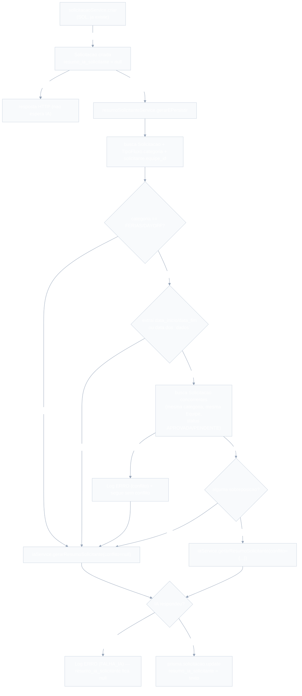
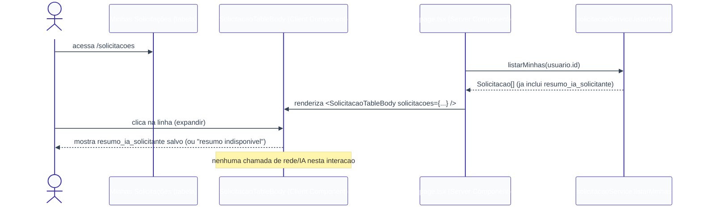

# Resumo IA de Solicitações — Design

**Spec**: `.specs/features/resumo-ia-solicitacoes/spec.md`
**Context**: `.specs/features/resumo-ia-solicitacoes/context.md`
**Status**: Draft

---

## Architecture Overview

Duas fronteiras de camada, conforme `CLAUDE.md`: (1) side-effect assíncrono disparado dentro de `solicitacaoService.criar` (mesmo padrão fire-and-forget já usado em `aprovacaoService.decidir` → `preencherResumoIa`); (2) leitura pura — `listarMinhas` já retorna o campo persistido, sem lógica nova na leitura.





---

## Code Reuse Analysis

### Existing Components to Leverage

| Component | Location | How to Use |
| --- | --- | --- |
| `solicitacaoService.criar` | `lib/services/solicitacaoService.ts` | Ganha uma linha nova: `void gerarEPersistir(solicitacao.id)` logo após persistir e gravar o `Log AUDITORIA` de criação — não bloqueia o retorno. |
| `solicitacaoService.listarMinhas` | `lib/services/solicitacaoService.ts` | Já retorna o `Solicitacao` completo (sem `select`); `resumo_ia_solicitante` aparece automaticamente após a migration, sem mudança de assinatura. |
| Padrão `iaService.gerarResumoSolicitacao` (nunca lança, grava `Log ERRO`, retorna `string \| null`) | `lib/services/iaService.ts` | Nova função `gerarResumoSolicitante` no mesmo arquivo, mesmo contrato, mesmo client `openai`. |
| Padrão fire-and-forget `void preencherResumoIa(...)` | `lib/services/aprovacaoService.ts` (`decidir`) | Mesmo padrão aplicado em `solicitacaoService.criar`. |
| `logService.registrar` | `lib/services/logService.ts` | Reused para `Log ERRO` (falha de IA e falha de busca de conflito). |
| `TipoFluxo.campos_formulario` / `tipoFluxoInputSchema` | `lib/validations/tipoFluxo.ts`, `lib/services/tipoFluxoService.ts` | Estendidos com `categoria` (novo campo), não recriados. |
| `TipoFluxoForm.tsx` | `app/(dashboard)/configuracao-fluxos/_components/TipoFluxoForm.tsx` | Ganha um `<select>` de categoria; mesmo padrão de estado local + submit já usado para `etapas`/`campos_formulario`. |
| Tabela de `app/(dashboard)/solicitacoes/page.tsx` | idem | Mantida; só o `<tbody>` vira um Client Component (`SolicitacaoTableBody`) para permitir expandir/colapsar. |
| `User.equipe_id` | `prisma/schema.prisma` | Usado para achar colegas da mesma equipe — nenhuma tabela nova, só uma query com `where: { solicitante: { equipe_id } }`. |

### Integration Points

| System | Integration Method |
| --- | --- |
| `solicitacoes` (SOL) | `criar` ganha 1 linha de side-effect; `listarMinhas`/tela ganham o campo e a UI de expansão. Nenhuma mudança de contrato público (rota `/api/solicitacoes` continua igual). |
| `configuracao-fluxos` (CONF) | `TipoFluxo` ganha `categoria`; `tipoFluxoService.criar`/`editar` e `TipoFluxoForm.tsx` passam a lidar com o novo campo. |
| `aprovacoes` (APR) | Nenhuma mudança — `Aprovacao.resumo_ia` continua sendo um dado independente (visão do aprovador), não confundir com `Solicitacao.resumo_ia_solicitante` (visão do solicitante). |

---

## Components

### `prisma/schema.prisma` (extensão)

- **Purpose**: adicionar `categoria` em `TipoFluxo` e `resumo_ia_solicitante` em `Solicitacao`.
- **Location**: `prisma/schema.prisma`

```prisma
enum CategoriaTipoFluxo {
  PADRAO
  FERIAS
  DAYOFF
}

model TipoFluxo {
  // ...campos existentes...
  categoria CategoriaTipoFluxo @default(PADRAO)
}

model Solicitacao {
  // ...campos existentes...
  resumo_ia_solicitante String?
}
```

> Sem novo index — a busca de conflito filtra por `tipoFluxo.categoria` (via relação já indexada por `tipo_fluxo_id`) e `solicitante.equipe_id` (já é FK de `User`, sem index dedicado hoje; volume de RH interno não justifica um novo index para esta feature).

### `lib/validations/tipoFluxo.ts` (extensão)

- **Purpose**: aceitar `categoria` no payload de criação/edição de `TipoFluxo`.
- **Location**: `lib/validations/tipoFluxo.ts`
- **Interface**:
  - `CATEGORIAS_TIPO_FLUXO = ["PADRAO", "FERIAS", "DAYOFF"] as const`
  - `tipoFluxoInputSchema` ganha `categoria: z.enum(CATEGORIAS_TIPO_FLUXO).default("PADRAO")`.
- **Reuses**: mesmo padrão de `TIPOS_CAMPO`/`PAPEIS_APROVADOR` já presentes no arquivo.
- **Nota**: **sem** `superRefine` exigindo `data_inicio`/`data_fim`/`data` em `campos_formulario` quando `categoria !== PADRAO` — ver Tech Decisions (RIA-14 pede fallback gracioso, não bloqueio na configuração).

### `lib/services/tipoFluxoService.ts` (extensão)

- **Purpose**: persistir `categoria` em `criar`/`editar`.
- **Location**: `lib/services/tipoFluxoService.ts`
- **Mudança**: `data: { nome, campos_formulario, etapas, categoria: dados.categoria }` em ambas as funções.
- **Reuses**: estrutura de try/catch de `P2002`/`P2025` já existente, inalterada.

### `app/(dashboard)/configuracao-fluxos/_components/TipoFluxoForm.tsx` (extensão)

- **Purpose**: permitir ao RH_Admin escolher a categoria.
- **Location**: mesmo arquivo
- **Mudança**: novo `<select>` (`PADRAO` default, `Férias`, `Day Off`) entre o campo `nome` e o editor de `etapas`; estado `categoria` somado ao objeto `TipoFluxoInput` submetido.
- **Reuses**: mesmo padrão de estado local (`useState`) e submit já usado para `nome`/`etapas`/`campos_formulario`.

### `lib/services/iaService.ts` (extensão)

- **Purpose**: gerar o resumo de IA voltado ao solicitante, com ou sem alerta de conflito.
- **Location**: `lib/services/iaService.ts`
- **Interface**:
  - `gerarResumoSolicitante(input: { solicitacaoId: string; tipoFluxoNome: string; dados: Record<string, unknown>; conflito: { periodoDescricao: string } | null }): Promise<string | null>`
- **Contrato**: idêntico a `gerarResumoSolicitacao` — nunca lança; falha (chave ausente/erro de API/timeout/conteúdo vazio) grava `Log ERRO` (`entidade: "Solicitacao"`, `acao: "FALHA_IA"`) e retorna `null`. Quando `conflito !== null`, o prompt inclui uma instrução explícita para mencionar, de forma genérica (sem nome), que há sobreposição de agenda com outro membro da equipe no período informado.
- **Reuses**: client `OpenAI`/modelo `gpt-4o-mini` já configurado no arquivo; mesma função auxiliar de log (`registrarFalhaIa`, generalizada ou uma nova `registrarFalhaIaSolicitacaoResumo` seguindo o padrão de uma função de log por domínio já usado no arquivo).

### `lib/services/resumoSolicitanteService.ts` (novo)

- **Purpose**: orquestrar a geração e persistência do resumo do solicitante — busca dados, detecta conflito de equipe, chama `iaService`, persiste. Concentra RIA-01, RIA-04, RIA-06 a RIA-10, RIA-16 a RIA-19.
- **Location**: `lib/services/resumoSolicitanteService.ts`
- **Interfaces**:
  - `gerarEPersistir(solicitacaoId: string): Promise<void>` — ponto de entrada chamado (fire-and-forget) por `solicitacaoService.criar`. Nunca lança (mesmo contrato de `iaService`); qualquer falha inesperada (ex.: erro ao buscar a própria `Solicitacao`) é capturada e vira `Log ERRO`, sem propagar.
  - `extrairPeriodo(categoria: CategoriaTipoFluxo, dados: Record<string, unknown>): { inicio: Date; fim: Date } | null` — FERIAS lê `data_inicio`/`data_fim`; DAYOFF lê `data` (vira `inicio === fim`); retorna `null` se ausente/inválido (RIA-19).
  - `haSobreposicao(a: { inicio: Date; fim: Date }, b: { inicio: Date; fim: Date }): boolean` — `a.inicio <= b.fim && b.inicio <= a.fim` (RIA-16, cobre igualdade e interseção parcial).
  - `buscarConflito(solicitacao): Promise<{ periodoDescricao: string } | null>` (privada) — `null` cedo se `categoria === PADRAO` (RIA-10) ou `solicitante.equipe_id === null` (RIA-09); busca concorrentes via `prisma.solicitacao.findMany({ where: { id: { not }, solicitante_id: { not }, status: { in: ['APROVADA','PENDENTE'] }, tipoFluxo: { categoria } , solicitante: { equipe_id } } })` (RIA-06, RIA-17 via filtro de `status`); compara com `haSobreposicao`; erro de banco → `Log ERRO` + `null` (RIA-18).
- **Dependencies**: `lib/prisma.ts`, `lib/services/iaService.ts` (`gerarResumoSolicitante`), `lib/services/logService.ts`.
- **Reuses**: mesmo estilo de `SolicitacaoComRelacoes`/`lerEtapas` de `aprovacaoService.ts` (funções pequenas e privadas, sem service extra).

### `lib/services/solicitacaoService.ts` (modificação pontual)

- **Purpose**: disparar o side-effect na criação (RIA-01).
- **Mudança**: após `registrar({ tipo: 'AUDITORIA', ... })` em `criar`, adicionar `void gerarEPersistir(solicitacao.id);` (import de `resumoSolicitanteService`). Nenhuma outra alteração — `listarMinhas`/`buscarDetalhePorId` já retornam o campo novo por herdarem o model completo.

### UI — `app/(dashboard)/solicitacoes/`

- **`page.tsx`** (modificação pontual): troca o `<tbody>{solicitacoes.map(...)}</tbody>` estático por `<SolicitacaoTableBody solicitacoes={solicitacoes} />`. Mantém `<thead>` e o restante igual.
- **`_components/SolicitacaoTableBody.tsx`** (novo, Client Component): recebe `solicitacoes: SolicitacaoResumo[]` (já com `resumo_ia_solicitante`) via prop; mantém `useState<string | null>` do id expandido; cada `Solicitacao` renderiza 2 `<tr>` — a linha normal (mesmo conteúdo de hoje, `onClick` no `<tr>` alterna expansão, exceto no link de protocolo) e uma linha condicional com `colSpan={6}` mostrando `resumo_ia_solicitante` ou o fallback `"Resumo da IA indisponível no momento."` quando `null` (RIA-02, RIA-03).
- **Reuses**: `styles` (`solicitacoes.module.css`) — novo bloco de classe para a linha expandida, inspirado no `.callout-ia` do mockup (`docs/design-ux-ui/fluxorh-ui-layout-specs.md`).

---

## Data Models

```typescript
enum CategoriaTipoFluxo {
  PADRAO = "PADRAO",
  FERIAS = "FERIAS",
  DAYOFF = "DAYOFF",
}

interface TipoFluxo {
  // ...campos existentes...
  categoria: CategoriaTipoFluxo; // default PADRAO
}

interface Solicitacao {
  // ...campos existentes...
  resumo_ia_solicitante: string | null; // gerado 1x na criação, nunca recomputado
}
```

**Relationships**: `TipoFluxo.categoria` não introduz nova relação — é um enum simples usado para filtrar `Solicitacao` concorrentes via `tipoFluxo: { categoria }` no `where`. `Solicitacao.resumo_ia_solicitante` não tem relação — é um campo escalar da própria `Solicitacao`, paralelo (mas independente) a `Aprovacao.resumo_ia`.

---

## Error Handling Strategy

| Error Scenario | Handling | User Impact |
| --- | --- | --- |
| Falha ao gerar resumo (chave OpenAI ausente, erro de API, timeout, conteúdo vazio) | `iaService.gerarResumoSolicitante` nunca lança; grava `Log ERRO` (`entidade: "Solicitacao"`, `acao: "FALHA_IA"`) e retorna `null` — `resumo_ia_solicitante` fica `null` | Linha expandida mostra "Resumo da IA indisponível no momento." |
| Falha ao buscar concorrentes de conflito (erro de banco/timeout) | `resumoSolicitanteService.buscarConflito` captura o erro, grava `Log ERRO`, retorna `null` — resumo é gerado sem menção a conflito | Resumo aparece normalmente, sem alerta (nenhum erro visível) |
| `TipoFluxo` FERIAS/DAYOFF sem os campos de data esperados nos `dados` | `extrairPeriodo` retorna `null`; checagem de conflito é pulada | Resumo aparece normalmente, sem alerta |
| Solicitante sem `equipe_id` (GESTOR/RH_ADMIN) | `buscarConflito` retorna `null` cedo | Resumo aparece normalmente, sem alerta |
| `TipoFluxo.categoria === PADRAO` | `buscarConflito` retorna `null` cedo, sem nenhuma query extra | Resumo puramente descritivo |
| Falha ao persistir `resumo_ia_solicitante` (erro de banco no `update`) | Capturada dentro de `gerarEPersistir`; grava `Log ERRO`; `Solicitacao` já criada permanece intacta | Linha expandida mostra fallback "indisponível" (mesmo efeito de falha de IA) |

---

## Tech Decisions (only non-obvious ones)

| Decision | Choice | Rationale |
| --- | --- | --- |
| Onde persistir o resumo | Novo campo `Solicitacao.resumo_ia_solicitante`, não reaproveita `Aprovacao.resumo_ia` | É 1 valor por `Solicitacao` (visão do solicitante); `Aprovacao.resumo_ia` é 1 por etapa/aprovador — reaproveitar acoplaria dois conceitos diferentes (questão em aberto #6 do `spec.md`, resolvida aqui) |
| Trigger de geração | Fire-and-forget (`void gerarEPersistir(...)`) dentro de `solicitacaoService.criar` | Mesmo padrão já validado em `aprovacaoService.decidir`; cumpre "IA nunca trava o fluxo" sem inventar mecanismo novo |
| Escopo de comparação de conflito | Por `TipoFluxo.categoria`, não por `tipo_fluxo_id` | Decisão do usuário na sessão de discuss ("se basear pelo fluxo que tiver isso") — permite múltiplos `TipoFluxo` de férias conviverem na mesma checagem |
| Convenção de campos de data | `data_inicio`/`data_fim` (FERIAS) e `data` (DAYOFF), **não validada como obrigatória no Zod de `TipoFluxo`** | RIA-14 pede fallback gracioso, não bloqueio — RH_Admin pode marcar a categoria antes de configurar os campos certos; o pior caso é só "sem checagem de conflito", nunca um erro |
| Nome do colega em conflito | Alerta genérico ("outro membro da sua equipe"), sem nome | Assumption registrada em `context.md` (privacidade) — não foi perguntado explicitamente ao usuário |
| Regeneração do resumo | Nunca — não existe função de editar `Solicitacao` nesta feature nem em `solicitacoes` | Decisão confirmada na sessão de discuss: "cachear na criação, sem edição" |
| UI de expansão | Extrai só o `<tbody>` para um Client Component (`SolicitacaoTableBody`), mantém `page.tsx` como Server Component | Minimiza a superfície client-side; nenhum novo fetch de rede é necessário (resumo já vem do `listarMinhas` original) |

---

## Requirement Traceability (mapeamento para Design)

| Requirement ID | Coberto por |
| --- | --- |
| RIA-01 | `solicitacaoService.criar` (`void gerarEPersistir`) + `resumoSolicitanteService.gerarEPersistir` |
| RIA-02 | `SolicitacaoTableBody` exibe `resumo_ia_solicitante` já salvo, sem novo fetch |
| RIA-03 | `SolicitacaoTableBody` — fallback "indisponível" quando `null` |
| RIA-04 | `iaService.gerarResumoSolicitante` — nunca lança, grava `Log ERRO` |
| RIA-05 | Reaproveita a regra de visibilidade já existente de `listarMinhas` (`where solicitante_id`) — nenhum novo endpoint de leitura é criado |
| RIA-06 | `resumoSolicitanteService.buscarConflito` — query por categoria + `equipe_id` + status |
| RIA-07 | `iaService.gerarResumoSolicitante` com `conflito !== null` |
| RIA-08 | `iaService.gerarResumoSolicitante` com `conflito === null` |
| RIA-09 | `buscarConflito` retorna `null` cedo se `equipe_id === null` |
| RIA-10 | `buscarConflito` retorna `null` cedo se `categoria === PADRAO` |
| RIA-11 | `TipoFluxo.categoria` (schema) + `tipoFluxoInputSchema` + `TipoFluxoForm.tsx` |
| RIA-12 | Convenção documentada (`extrairPeriodo`, FERIAS → `data_inicio`/`data_fim`) |
| RIA-13 | Convenção documentada (`extrairPeriodo`, DAYOFF → `data`) |
| RIA-14 | `extrairPeriodo` retorna `null` gracioso; sem validação bloqueante no Zod |
| RIA-15 | Persistência definitiva — nenhuma função de regenerar existe |
| RIA-16 | `haSobreposicao` (interseção de intervalo) |
| RIA-17 | Filtro `status: { in: ['APROVADA','PENDENTE'] }` — exclui `REJEITADA` |
| RIA-18 | `buscarConflito` — try/catch + `Log ERRO` |
| RIA-19 | `extrairPeriodo` — retorno `null` em campo ausente/malformado |

---

## Riscos / Pontos a verificar na fase de Tasks

- `SolicitacaoTableBody` passa `Date` (ex.: `criado_em`, `prazo_sla`) de Server para Client Component via props — suportado pelo React Server Components payload do Next.js, mas vale confirmar no primeiro build (`npm run build`) que não há warning de serialização.
- `iaService.gerarResumoSolicitante` precisa de uma função de log própria (ou reaproveitar `registrarFalhaIa` generalizando o parâmetro `entidade`) — decisão de nomenclatura fica para a task que a implementa.
- Migration do Prisma (`categoria` + `resumo_ia_solicitante`) precisa rodar (`npx prisma migrate dev`) antes de qualquer teste que dependa do client gerado — task dedicada cuida disso antes das demais.
