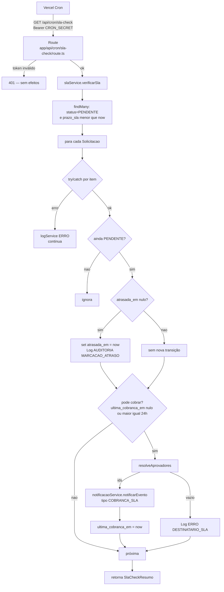
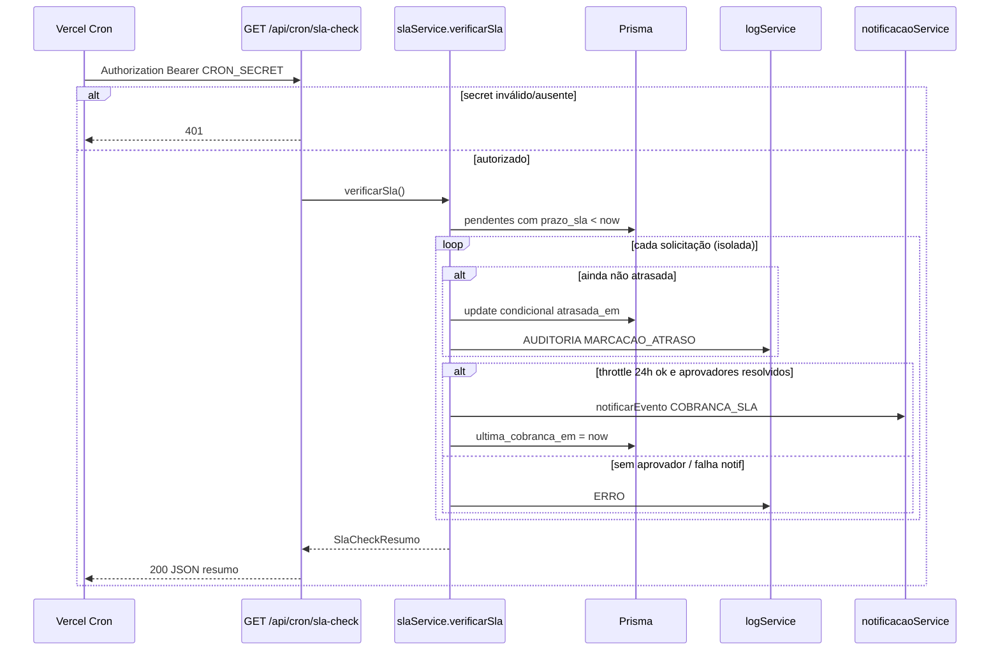

# SLA e Cobrança de Aprovações Atrasadas — Design

**Spec**: `.specs/features/sla-cobranca/spec.md`
**Context**: `.specs/features/sla-cobranca/context.md`
**Status**: Draft

---

## 0. Nota de reconciliação (questões em aberto + contratos vizinhos)

| Ponto | Decisão neste Design | Origem |
| --- | --- | --- |
| Modelagem de "atrasada" | Campo aditivo `atrasada_em DateTime?` em `Solicitacao`. `null` = não atrasada; preenchido = marcada como atrasada naquele instante. `status` permanece `PENDENTE`. | `context.md` (travado) |
| Throttle de cobrança 1x/dia | Campo `ultima_cobranca_em DateTime?` em `Solicitacao`, controlado por `slaService`. Só dispara novo evento se `null` ou se passaram ≥ 24h desde o valor. Defesa em profundidade: `notificacaoService` já faz throttle próprio por `Notificacao` do dia. | `context.md` (Agent's Discretion) |
| Semântica do `prazo_sla` (Q#3) | `prazo_sla` é o **deadline absoluto da etapa atual** (`DateTime`). O job compara `now > prazo_sla`. Contrato cross-feature: ao avançar etapa, `aprovacoes` deve (1) setar `prazo_sla = now + SLA_HORAS` e (2) limpar `atrasada_em` e `ultima_cobranca_em`. Hoje `aprovacaoService.decidir` **não** reinicia o prazo — ver Riscos. | Aberto no spec; fechado aqui |
| `prazo_sla` nulo (Q#4) | Schema atual exige `prazo_sla DateTime` (não-nullable). Job ignora defensivamente qualquer registro sem prazo. Sem default no job. | Spec + schema `solicitacoes` |
| Cron | **Vercel Cron** → `GET /api/cron/sla-check` com `Authorization: Bearer ${CRON_SECRET}`. Sem `node-cron` (deploy é Vercel; processo serverless não mantém scheduler in-process). Frequência 1x/dia (`0 3 * * *`) — plano Vercel Hobby não libera cron com frequência maior que diária. | Design doc §8 + stack |
| `usuario_id` nos Logs do job | `null` (ação de sistema). `Log.usuario_id` já é opcional. | `auditoria-logs` |
| Aprovador RH_ADMIN | Etapa `GESTOR` → `solicitante.gestor_id` (um destinatário). Etapa `RH_ADMIN` → **todos** os `User` com `role = RH_ADMIN` (cobrança por destinatário). Lista vazia / `gestor_id` nulo → não dispara, `Log ERRO`, segue. | Agent's Discretion |

Nenhuma decisão contradiz o `spec.md`/`context.md` — só fecha zonas cinzentas e Agent's Discretion.

---

## Architecture Overview

Camadas conforme `CLAUDE.md`: Route (auth de cron + delegação) → Service (detecção, marcação, cobrança, resiliência) → Prisma. Entrega efetiva fica em `notificacoes`.





---

## Code Reuse Analysis

### Existing Components to Leverage

| Component | Location | How to Use |
| --- | --- | --- |
| `model Solicitacao` + `prazo_sla` + `status` + `etapa_atual` | `prisma/schema.prisma` | Estender com `atrasada_em` / `ultima_cobranca_em`; query base do job |
| `logService.registrar` | `lib/services/logService.ts` | `AUDITORIA` na marcação; `ERRO` em falha de cobrança/destinatário/processamento |
| `notificacaoService.notificarEvento` | `lib/services/notificacaoService.ts` (feature `notificacoes`) | Disparo de `COBRANCA_SLA` com `usuario_id`, `solicitacao_id`, mensagem, link |
| `SLA_HORAS = 48` | `lib/services/solicitacaoService.ts` | Referência documental do contrato de reinício em `aprovacoes` — **não** recalcula prazo neste job |
| Padrão Route → Service | `app/api/logs/route.ts`, `app/api/aprovacoes/**` | Mesmo estilo; aqui auth é cron, não `requireUser` |
| `lib/prisma.ts` | singleton | Único acesso ao banco |

### Integration Points

| System | Integration Method |
| --- | --- |
| `solicitacoes` | Lê `prazo_sla`, `status`, `etapa_atual`, `solicitante.gestor_id`; escreve só campos de atraso/cobrança |
| `aprovacoes` | Não chama; assume que etapa pendente = `status=PENDENTE`. **Contrato**: reiniciar `prazo_sla` e limpar flags de atraso no avanço de etapa (hoje ausente — risco) |
| `notificacoes` | Chama `notificarEvento({ tipo: 'COBRANCA_SLA', ... })`; não implementa entrega |
| `auditoria-logs` | Só via `logService.registrar` |
| `dashboard-visao-geral` | Consome `atrasada_em IS NOT NULL` para contador "atrasados" (fora do escopo desta feature) |
| Vercel | `vercel.json` crons + env `CRON_SECRET` |

---

## Components

### `prisma/schema.prisma` (extensão de `Solicitacao`)

- **Purpose**: persistir marcação aditiva de atraso e âncora do throttle de cobrança.
- **Location**: `prisma/schema.prisma`
- **Changes**:

```prisma
model Solicitacao {
  // ... campos existentes ...
  prazo_sla          DateTime
  atrasada_em        DateTime?
  ultima_cobranca_em DateTime?
  // ...

  @@index([status, prazo_sla])
  @@index([atrasada_em])
}
```

- **Reuses**: model já criado por `solicitacoes`/`aprovacoes`.

### `lib/services/slaService.ts`

- **Purpose**: rotina de check de SLA — detectar vencidas, marcar idempotente, disparar cobrança com throttle e isolar falhas.
- **Location**: `lib/services/slaService.ts`
- **Interfaces**:
  - `verificarSla(now?: Date): Promise<SlaCheckResumo>` — varredura completa; `now` injetável para testes.
  - `resolveAprovadores(solicitacao): Promise<string[]>` — helper interno/exportado para teste: `GESTOR` → `[gestor_id]` se presente; `RH_ADMIN` → ids de todos RH_ADMIN; senão `[]`.
- **Algoritmo de `verificarSla`**:
  1. Buscar candidatas: `status = PENDENTE` AND `prazo_sla < now` (inclui já atrasadas — para re-cobrança).
  2. Para cada registro, em `try/catch` isolado:
     a. Revalidar no banco (ou update condicional) que ainda está `PENDENTE` — se não, skip (edge de corrida com decisão).
     b. Se `atrasada_em == null`: `update` condicional (`atrasada_em IS NULL` AND `status = PENDENTE`) setando `atrasada_em = now`; se afetou 1 linha → `Log AUDITORIA` (`entidade: Solicitacao`, `acao: MARCACAO_ATRASO`, `usuario_id: null`, `detalhes: { etapa_atual, prazo_sla }`). Se 0 linhas → não logar transição.
     c. Se pode cobrar (`ultima_cobranca_em == null` OR `now - ultima_cobranca_em >= 24h`):
        - `aprovadores = resolveAprovadores(...)`; se vazio → `Log ERRO` (`acao: DESTINATARIO_SLA`) e não atualizar `ultima_cobranca_em`.
        - Para cada aprovador: `notificarEvento({ usuario_id, solicitacao_id, tipo: 'COBRANCA_SLA', mensagem, link: '/aprovacoes' })` dentro de try/catch; falha → `Log ERRO` (`acao: FALHA_COBRANCA_SLA`), não aborta o job.
        - Se pelo menos uma chamada foi tentada com aprovadores resolvidos: setar `ultima_cobranca_em = now` (mesmo se notif falhou após tentativa — evita martelar o mesmo minuto; throttle de `notificacoes` cobre reenvio no mesmo dia).
     d. Contadores do resumo.
  3. Retornar `SlaCheckResumo`.
- **Dependencies**: `lib/prisma.ts`, `logService.registrar`, `notificacaoService.notificarEvento`.
- **Reuses**: contrato `NotificacaoInput` / `TipoNotificacao.COBRANCA_SLA` de `notificacoes`.
- **Stub**: se `notificacoes` ainda não estiver mergeada, usar módulo stub `notificarEvento` no-op documentado (mesmo padrão de `emitirAvancoEtapa`) e trocar na integração — ver Tasks.

### `app/api/cron/sla-check/route.ts`

- **Purpose**: endpoint acionável pelo cron; protege com segredo; delega ao service; devolve resumo JSON.
- **Location**: `app/api/cron/sla-check/route.ts`
- **Method**: `GET` (convenção Vercel Cron).
- **Auth**: `authorization === \`Bearer ${process.env.CRON_SECRET}\`` e `CRON_SECRET` definido; senão `401` sem chamar o service.
- **Response 200**: corpo = `SlaCheckResumo`.
- **Dependencies**: `slaService.verificarSla`.
- **Nota**: não usa `authService.requireUser` — é job de sistema, não sessão de usuário.

### `vercel.json` (crons)

- **Purpose**: agendar o check periodicamente em produção.
- **Location**: `vercel.json` (raiz)
- **Config sugerida**:

```json
{
  "crons": [
    {
      "path": "/api/cron/sla-check",
      "schedule": "0 3 * * *"
    }
  ]
}
```

- Horário: 1x/dia (3h) — plano Vercel Hobby não permite cron com frequência maior que diária. Compatível com throttle 1x/dia da cobrança; latência de detecção de atraso sobe de "até 1h" para "até 1 dia".
- Env: `CRON_SECRET` no Vercel e em `.env.local` (nunca commitado).

---

## Data Models

### `SlaCheckResumo`

```typescript
interface SlaCheckResumo {
  verificadas: number
  marcadas_atrasadas: number
  cobrancas_disparadas: number
  erros: number
}
```

**Relationships**: DTO de saída do job; não persistido (SLA-07 — observabilidade via response; opcionalmente espelhar em `Log AUDITORIA` de resumo na mesma execução — ver Tech Decisions).

### Extensão `Solicitacao` (campos desta feature)

```typescript
interface SolicitacaoSlaFields {
  atrasada_em: Date | null
  ultima_cobranca_em: Date | null
  // prazo_sla já existe (dono: solicitacoes)
}
```

**Relationships**: Dashboard filtra `atrasada_em != null`; aprovação continua sobre `status = PENDENTE` independentemente de `atrasada_em`.

### Contrato do evento de cobrança → `notificacoes`

```typescript
// Chamada por slaService (mínimo exigido pela spec SLA-04)
notificarEvento({
  usuario_id: aprovadorId,
  solicitacao_id: solicitacao.id,
  tipo: 'COBRANCA_SLA',
  mensagem: string, // ex: "Cobrança SLA: solicitação X na etapa GESTOR"
  link: '/aprovacoes',
})
```

---

## Error Handling Strategy

| Error Scenario | Handling | User Impact |
| --- | --- | --- |
| Request sem/`Bearer` inválido / `CRON_SECRET` ausente | 401; service não executa | Nenhum efeito colateral |
| Nenhuma candidata | Resumo zerado; 200 | OK |
| Solicitação decidida entre read e update | Update condicional afeta 0 linhas; skip | Sem marcação/cobrança indevida |
| `gestor_id` nulo ou zero RH_ADMIN | `Log ERRO` `DESTINATARIO_SLA`; segue | Sem cobrança daquela solicitação |
| `notificarEvento` lança | Catch por solicitação; `Log ERRO` `FALHA_COBRANCA_SLA`; demais seguem; marcação de atraso **não** é revertida | Job 200 com `erros > 0` |
| Falha genérica ao processar um item | Catch; `Log ERRO`; continua | Idem |
| Falha de `logService` | Já engolida internamente | Fluxo segue |

---

## Tech Decisions (only non-obvious ones)

| Decision | Choice | Rationale |
| --- | --- | --- |
| Flag `atrasada_em` (timestamp) vs boolean | `DateTime?` | Idempotência + auditoria de “quando” sem Log extra; dashboard/cards usam o mesmo campo |
| Throttle em `ultima_cobranca_em` + defesa em `notificacoes` | Ambos | Spec/context exigem 1x/dia no gatilho; `notificacoes` já throttleia entrega — defesa em profundidade sem fila |
| Vercel Cron (não node-cron) | `vercel.json` + route | Align com deploy Vercel; serverless não segura processo cron |
| `usuario_id: null` nos Logs do job | Sistema | Não existe User do cron; schema permite null |
| Cobrança a todos RH_ADMIN | Fan-out | Qualquer RH_ADMIN pode decidir a etapa; cobrança singular a um admin aleatório deixaria os outros sem aviso |
| Resumo só no JSON de resposta (+ Log opcional) | Contadores no 200; **também** um `Log AUDITORIA` `acao: SLA_CHECK_RESUMO` com o JSON do resumo e `entidade_id: "sla-check"` | Cobre SLA-07 de forma consultável na Tela de Logs sem UI nova |
| Reinício de `prazo_sla` no avanço | Contrato em `aprovacoes`, não implementado aqui | Dono da transição de etapa; evita esta feature escrever regra de aprovação |

---

## Requirement Mapping

| ID | Component |
| --- | --- |
| SLA-01 | `GET /api/cron/sla-check` + `vercel.json` + `verificarSla` |
| SLA-02 | Query `PENDENTE` + `prazo_sla < now` + revalidação de corrida |
| SLA-03 | `atrasada_em` + update condicional + `Log AUDITORIA MARCACAO_ATRASO` |
| SLA-04 | `resolveAprovadores` + `notificarEvento(COBRANCA_SLA)` + throttle `ultima_cobranca_em` |
| SLA-05 | try/catch por item; marcação não revertida; fluxo de aprovação intacto |
| SLA-06 | Bearer `CRON_SECRET` na route |
| SLA-07 | `SlaCheckResumo` no 200 + `Log AUDITORIA SLA_CHECK_RESUMO` |

---

## Riscos / Pontos a verificar na fase de Tasks

- **`aprovacoes` não reinicia `prazo_sla` nem limpa `atrasada_em` no avanço** — com o contrato “prazo por etapa”, a 2ª etapa pode nascer já vencida se a 1ª consumiu as 48h. **Ação**: registrar follow-up em `aprovacoes` (patch pequeno no `decidir`); fora do escopo de implementação desta feature, mas bloqueia correção semântica completa.
- **`notificacoes` pode ainda estar em worktree** — Tasks devem aceitar stub de `notificarEvento` com a mesma assinatura até o merge.
- **Duração do serverless** — muitas pendentes + fan-out RH_ADMIN pode aproximar timeout; MVP aceita processamento síncrono; se estourar, paginar em follow-up (fora de escopo).
- mermaid-studio / codenavi não instalados nesta sessão — diagramas inline; exploração via tools nativos.
