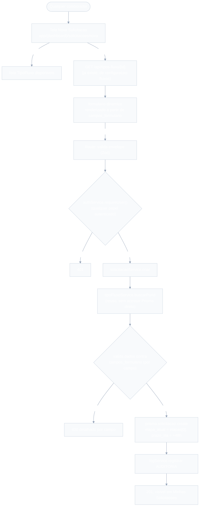
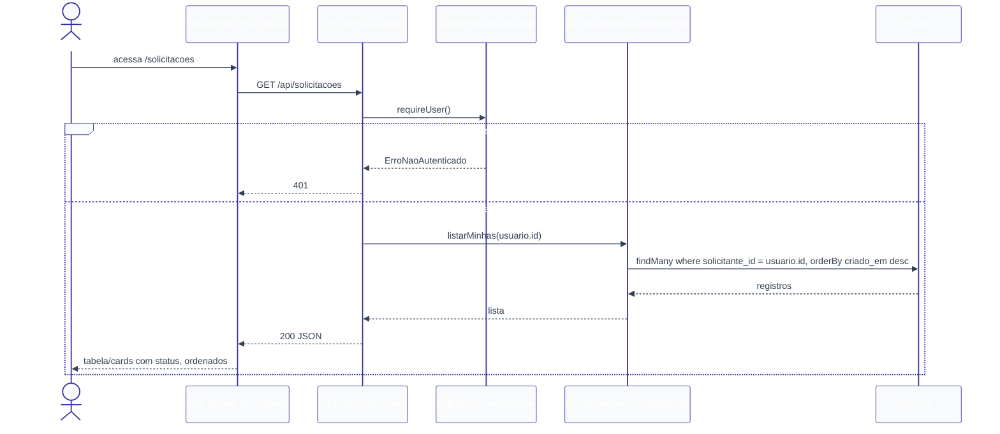

# Solicitações — Design

**Spec**: `.specs/features/solicitacoes/spec.md`
**Context**: `.specs/features/solicitacoes/context.md`
**Status**: Draft

---

## 0. Nota de reconciliação (decisões tomadas nesta sessão, fora do `context.md` original)

O `spec.md`/`context.md` desta feature já existiam antes desta sessão (parte do planejamento inicial do projeto) e deixaram 2 pontos genuinamente em aberto que bloqueiam o Design. Resolvidos agora:

1. **Origem do `prazo_sla`** (Questão em Aberto #1 do `spec.md`, também aberta em `sla-cobranca/context.md`) — **decisão confirmada pelo usuário**: valor fixo global (48h), constante no código, aplicado a toda `Solicitacao` independente do `TipoFluxo`. Não estende `configuracao-fluxos` (já fechada e testada). Se no futuro precisar ser configurável por tipo, é uma migration aditiva (novo campo em `TipoFluxo`), não um retrabalho desta feature.
2. **SOL-11 (side-effects de `resumo_ia`/notificação na criação)** — o `spec.md` descreve "disparar, de forma não bloqueante" a geração de `resumo_ia` (dono: `aprovacoes`) e a notificação (dono: `notificacoes`). Nenhuma das duas features tem `design.md` ainda — não existe contrato pra chamar. **Decisão desta sessão**: `solicitacaoService.criar` NÃO chama nada de `aprovacoes`/`notificacoes` — cria só a `Solicitacao`. Quando essas features forem desenhadas, definem seu próprio mecanismo de descoberta (recomendado: `aprovacoes` gera o `resumo_ia` sob demanda na primeira leitura da fila, evitando acoplamento à criação — ver a própria `Questão em Aberto #4` de `aprovacoes/spec.md`, que já reconhece isso como indefinido). SOL-11 fica satisfeito por aquelas features futuras, não por uma chamada explícita daqui.
3. **Representação de `etapa_atual`** (Questão em Aberto #3 do `spec.md`) — decisão: o próprio `Role` (enum já existente), denormalizado — não um índice numérico. Justificativa: `aprovacoes/spec.md` (APR-05) já assume comparação direta tipo `etapa_atual exige GESTOR`/`RH_ADMIN`, o que só funciona sem join se `etapa_atual` for o `Role` em si, não uma posição de array.

Nenhuma dessas decisões contradiz o `spec.md` — só resolve zonas cinzentas que ele deixou explicitamente abertas para o Design.

---

## Architecture Overview

Camadas conforme `CLAUDE.md`: Route (Zod + auth) → Service (regra de negócio, incluindo validação dinâmica contra `campos_formulario`) → Prisma.





---

## Code Reuse Analysis

### Existing Components to Leverage

| Component | Location | How to Use |
| --- | --- | --- |
| `authService.requireUser()` | `lib/services/authService.ts` | Sem restrição de `roles` — qualquer papel autenticado pode criar/listar/ver suas próprias solicitações. |
| `tipoFluxoService.listar()` / `buscarPorId(id)` | `lib/services/tipoFluxoService.ts` | Lista tipos disponíveis (tela Nova Solicitação) e busca `campos_formulario`/`etapas` pra validar e definir `etapa_atual` na criação — **nunca acessar `prisma.tipoFluxo` direto daqui**, sempre via este service. |
| `GET /api/tipos-fluxo` / `GET /api/tipos-fluxo/[id]` | `app/api/tipos-fluxo/**` | UI consome essas rotas já existentes pra popular o seletor de tipo e buscar `campos_formulario` ao selecionar. |
| `logService.registrar` | `lib/services/logService.ts` | Grava `Log` `AUDITORIA` na criação (SOL-02). |
| `model TipoFluxo`, `model Solicitacao` (mínimo), `enum StatusSolicitacao` | `prisma/schema.prisma` (`configuracao-fluxos`) | `Solicitacao` já existe — esta feature **estende** (não recria), conforme já previsto no `design.md` de `configuracao-fluxos`. |
| `Role` enum | `prisma/schema.prisma` (`autenticacao-usuarios`) | Reusado como tipo de `etapa_atual` (ver seção 0). |
| Padrão de rota (Zod + `requireUser` + service + `Response.json`) | `app/api/tipos-fluxo/**`, `app/api/logs/route.ts` | Mesmo estilo. |
| Padrão de página protegida | `app/(dashboard)/auditoria-logs/page.tsx`, `.../configuracao-fluxos/page.tsx` | Mesmo padrão de gate (aqui sem restrição de `role`, só autenticação). |

### Integration Points

| System | Integration Method |
| --- | --- |
| `configuracao-fluxos` | Lê `TipoFluxo` via `tipoFluxoService` (leitura, não escreve). |
| `aprovacoes` (ainda não desenhada) | Vai ler `Solicitacao` (`etapa_atual`, `solicitante.gestor_id`) pra montar a fila — esta feature não chama `aprovacoes`, só deixa o registro pronto pra ser lido. |
| `notificacoes` (ainda não desenhada) | Idem — vai descobrir novas `Solicitacao` por conta própria; esta feature não dispara nada. |
| `sla-cobranca` (ainda não desenhada) | Vai ler `prazo_sla`/`criado_em` pra calcular atraso; esta feature só grava o valor inicial. |

---

## Components

### `prisma/schema.prisma` (extensão do `model Solicitacao`)

- **Purpose**: completar o `model Solicitacao` mínimo (já criado por `configuracao-fluxos`) com os campos que esta feature precisa.
- **Location**: `prisma/schema.prisma`
- **Reuses**: `model TipoFluxo` (relação já existe), `enum Role` (`autenticacao-usuarios`), `model User` (ganha relação inversa `solicitacoes`).

```prisma
model Solicitacao {
  id            String            @id @default(cuid())
  tipo_fluxo_id String
  tipoFluxo     TipoFluxo         @relation(fields: [tipo_fluxo_id], references: [id])
  solicitante_id String           @db.Uuid
  solicitante   User              @relation(fields: [solicitante_id], references: [id])
  dados         Json
  status        StatusSolicitacao @default(PENDENTE)
  etapa_atual   Role
  prazo_sla     DateTime
  criado_em     DateTime          @default(now())

  @@index([tipo_fluxo_id])
  @@index([status])
  @@index([solicitante_id])
  @@index([etapa_atual])
  @@map("solicitacoes")
}
```

> `@@index([etapa_atual])` adicionado pensando na futura fila de `aprovacoes` (filtra por `etapa_atual = role`) — antecipação razoável, não over-engineering (é só um índice, sem lógica nova).

### `lib/services/solicitacaoService.ts`

- **Purpose**: criação validada de `Solicitacao` e listagem/detalhe restritos ao próprio solicitante (SOL-01 a SOL-12).
- **Location**: `lib/services/solicitacaoService.ts`
- **Interfaces**:
  - `SLA_HORAS = 48` (constante — ver Tech Decisions).
  - `criar(input: { tipo_fluxo_id: string; dados: Record<string, unknown> }, solicitanteId: string): Promise<Solicitacao>` — busca o `TipoFluxo` via `tipoFluxoService.buscarPorId` (lança `ErroTipoFluxoNaoEncontrado` se não existir — mapeia o `ErroNaoEncontrado` de `tipoFluxoService`); valida `dados` contra `campos_formulario` campo a campo (ver `lib/validations/solicitacaoDados.ts`); define `etapa_atual = etapas[0]`, `prazo_sla = now + 48h`; persiste; grava `Log AUDITORIA`.
  - `listarMinhas(solicitanteId: string): Promise<SolicitacaoResumo[]>` — `where: { solicitante_id: solicitanteId }`, `orderBy: { criado_em: 'desc' }`, inclui nome do `TipoFluxo`.
  - `buscarDetalhePorId(id: string, solicitanteId: string): Promise<SolicitacaoDetalhe>` — `findUnique`; `ErroNaoEncontrado` se não existir; `ErroAcessoNegado` se `solicitante_id !== solicitanteId` (SOL-11/SOL-12 — bloqueio no backend, não é 404 pra não vazar existência x acesso — **decisão**: usar 403, não 404, pra manter consistência com o padrão de autorização já usado no projeto (`ErroNaoAutorizado`-like); ver Error Handling Strategy).
- **Dependencies**: `lib/prisma.ts`, `tipoFluxoService.buscarPorId`, `logService.registrar`, `lib/validations/solicitacaoDados.ts`.
- **Reuses**: `tipoFluxoService`, `logService.registrar`.

### `lib/validations/solicitacaoDados.ts`

- **Purpose**: validar `dados` (submetido pelo formulário dinâmico) contra a definição `campos_formulario` de um `TipoFluxo` — a mesma regra semântica já usada em `configuracao-fluxos` pra DEFINIR os campos, aqui aplicada pra VALIDAR os valores preenchidos.
- **Location**: `lib/validations/solicitacaoDados.ts`
- **Interface**: `validarDados(dados: Record<string, unknown>, campos: CampoFormularioDefinicao[]): { valido: true } | { valido: false; erros: Array<{ chave: string; mensagem: string }> }` — para cada campo: `obrigatorio` e ausente/vazio → erro; tipo `numero` e valor não numérico (ou fora de `min`/`max`) → erro; tipo `data` e valor não parseável como data → erro; tipo `selecao` e valor fora de `opcoes` → erro; tipo `texto` e fora de `min`/`max` (tamanho) → erro. Chaves em `dados` que não existem em `campos_formulario` são ignoradas silenciosamente (ver Tech Decisions — Questão em Aberto #2 do spec).
- **Reuses**: `CampoFormularioDefinicao` (tipo já exportado por `lib/validations/tipoFluxo.ts`, `configuracao-fluxos`) — não redefine o contrato do campo, só consome.

### `lib/validations/solicitacao.ts`

- **Purpose**: schema Zod do ENVELOPE da requisição (não da validação profunda por campo, que depende do `TipoFluxo` buscado no banco e por isso vive no service).
- **Location**: `lib/validations/solicitacao.ts`
- **Interface**: `solicitacaoInputSchema = z.object({ tipo_fluxo_id: z.string().min(1), dados: z.record(z.string(), z.unknown()) })`.

### API Routes

- **`app/api/solicitacoes/route.ts`**
  - `GET` → `requireUser()` (sem `roles` — qualquer papel) → `solicitacaoService.listarMinhas(usuario.id)` (SOL-07 a SOL-09).
  - `POST` → `requireUser()` → valida envelope com `solicitacaoInputSchema` → `solicitacaoService.criar(dados, usuario.id)` (SOL-01 a SOL-06).
- **`app/api/solicitacoes/[id]/route.ts`**
  - `GET` → `requireUser()` → `solicitacaoService.buscarDetalhePorId(id, usuario.id)` (SOL-10 a SOL-12).
- **Reuses**: `authService.requireUser`, `solicitacaoInputSchema`, `solicitacaoService`.

### UI — `app/(dashboard)/solicitacoes/`

- **`page.tsx`** — Server Component: `requireUser()`; chama `solicitacaoService.listarMinhas` DIRETO (sem round-trip, mesmo padrão de `configuracao-fluxos/page.tsx`); lista com tipo, status, data; estado vazio; botão "Nova Solicitação".
- **`nova/page.tsx`** — Server Component: `requireUser()`; chama `tipoFluxoService.listar()` DIRETO pra popular as opções; renderiza `<NovaSolicitacaoForm tiposDisponiveis={...} />`.
- **`nova/_components/NovaSolicitacaoForm.tsx`** — Client Component: seletor de `TipoFluxo`; ao selecionar, `fetch('/api/tipos-fluxo/{id}')` (rota já existente, `configuracao-fluxos`) pra pegar `campos_formulario`; renderiza um `<CampoDinamico>` por campo; submete `POST /api/solicitacoes`.
- **`nova/_components/CampoDinamico.tsx`** — Client Component: renderiza o input correto por `tipo` semântico (`texto`→text input, `numero`→number input, `data`→date input, `selecao`→select com `opcoes`), aplicando `obrigatorio`/`min`/`max` como atributos HTML nativos (validação client é só UX, a validação real é no backend via `solicitacaoDados.ts`).
- **`[id]/page.tsx`** (P2) — Server Component: `requireUser()`; `solicitacaoService.buscarDetalhePorId(id, usuario.id)` DIRETO; `ErroAcessoNegado`/`ErroNaoEncontrado` → mensagem/`notFound()`; exibe `dados` rotulados conforme `campos_formulario` do `TipoFluxo`.
- **Reuses**: `GET /api/tipos-fluxo`, `GET /api/tipos-fluxo/[id]` (já existentes), `POST /api/solicitacoes`.

---

## Data Models

### `Solicitacao` (ver Prisma acima)

```typescript
interface SolicitacaoResumo {
  id: string
  tipoFluxo: { nome: string }
  status: 'PENDENTE' | 'APROVADA' | 'REJEITADA'
  criado_em: Date
}

interface SolicitacaoDetalhe extends SolicitacaoResumo {
  tipo_fluxo_id: string
  solicitante_id: string
  dados: Record<string, unknown>
  etapa_atual: 'GESTOR' | 'RH_ADMIN'
  prazo_sla: Date
}
```

**Relationships**: `Solicitacao.tipo_fluxo_id` → `TipoFluxo.id` (obrigatório, real FK). `Solicitacao.solicitante_id` → `User.id` (obrigatório, real FK — diferente do `Log.usuario_id`, que é opcional/polimórfico; aqui toda `Solicitacao` TEM um solicitante, sempre).

---

## Error Handling Strategy

| Error Scenario | Handling | User Impact |
| --- | --- | --- |
| Usuário não autenticado | `requireUser()` lança `ErroNaoAutenticado` → 401 | Redirecionado ao login |
| `tipo_fluxo_id` inexistente | `tipoFluxoService.buscarPorId` lança `ErroNaoEncontrado`, mapeado para `ErroTipoFluxoNaoEncontrado` no service desta feature → 404 | "Tipo de fluxo não encontrado" |
| Campo obrigatório ausente/vazio, ou valor incompatível com o tipo semântico | `validarDados` retorna lista de erros por campo → 400 com detalhe | Mensagem de validação por campo, nada persistido |
| Chave em `dados` sem correspondência em `campos_formulario` | Ignorada silenciosamente (ver Tech Decisions) | Nenhum impacto — a chave extra é descartada |
| Usuário tenta ver detalhe de `Solicitacao` de outro | `buscarDetalhePorId` lança `ErroAcessoNegado` → 403 | "Você não tem acesso a esta solicitação" |
| `id` de detalhe inexistente | `ErroNaoEncontrado` → 404 | "Solicitação não encontrada" |
| Falha ao gravar `Log AUDITORIA` | `logService.registrar` contém a falha internamente (nunca lança) | Criação da `Solicitacao` conclui normalmente |

---

## Tech Decisions (only non-obvious ones)

| Decision | Choice | Rationale |
| --- | --- | --- |
| `prazo_sla` | Constante fixa de 48h no código (`SLA_HORAS`), não configurável por `TipoFluxo` | Confirmado pelo usuário nesta sessão — ver seção 0 |
| Side-effects de criação (`resumo_ia`, notificação) | Não implementados aqui — `criar` só persiste a `Solicitacao` | `aprovacoes`/`notificacoes` ainda não desenhadas, sem contrato pra chamar; evita acoplamento a uma API que não existe — ver seção 0 |
| `etapa_atual` | `Role` denormalizado (não índice numérico) | Compatível com a query de fila que `aprovacoes/spec.md` (APR-05) já assume — ver seção 0 |
| Validação profunda de `dados` | Vive no SERVICE (`solicitacaoDados.ts`), não no Zod da rota | Depende do `TipoFluxo` buscado no banco — Zod da rota só valida o envelope (`tipo_fluxo_id` + `dados` como objeto), CLAUDE.md reserva lógica de negócio pro service |
| Chave extra em `dados` (fora de `campos_formulario`) | Ignorada silenciosamente | Resolve a Questão em Aberto #2 do `spec.md` — comportamento já proposto lá como default |
| Acesso a `Solicitacao` de outro usuário | 403 (`ErroAcessoNegado`), não 404 | Consistente com o padrão de erro de autorização já usado no projeto (`ErroNaoAutorizado`); a spec não exige esconder a existência do registro, só bloquear o acesso |
| Detalhe da própria solicitação (Questão em Aberto #3 do spec) | Implementado como P2 nesta feature (`[id]/page.tsx`) | Já estava listado como história P2 no `spec.md` — não é invenção de escopo, só confirma que fica aqui e não em `aprovacoes` |
| Estratégia anti-duplicação de submit (Questão em Aberto #6 do spec) | Não implementada — só desabilita o botão de submit durante o `fetch` (client) | Suficiente pro MVP; idempotência real de servidor (chave de idempotência) é over-engineering não pedido para um hackathon; registrado como limitação conhecida |

---

## Requirement Traceability (mapeamento para Design)

| Requirement ID | Coberto por |
| --- | --- |
| SOL-01 | `solicitacaoService.listarMinhas` (`where solicitante_id`) |
| SOL-02 | Listagem exibe `tipoFluxo.nome`, `status`, `etapa_atual`, `criado_em` |
| SOL-03 | UI: botão "Nova Solicitação" em `page.tsx` |
| SOL-04 | `authService.requireUser()` na rota/página |
| SOL-05 | `nova/page.tsx` + `tipoFluxoService.listar()`; `NovaSolicitacaoForm` renderiza `campos_formulario` |
| SOL-06 | `validarDados` (obrigatoriedade + tipo semântico) antes de `criar` persistir |
| SOL-07 | `solicitacaoService.criar` — `status=PENDENTE`, `etapa_atual=etapas[0]`, `dados`, `criado_em` |
| SOL-08 | `criar` — `prazo_sla = now + SLA_HORAS` |
| SOL-09 | UI: sucesso redireciona para `page.tsx` (listagem) |
| SOL-10 | `logService.registrar` chamado em `criar` |
| SOL-11 | Não implementado aqui — decisão de design (seção 0); satisfeito futuramente por `aprovacoes`/`notificacoes` |
| SOL-12 | Edge: `TipoFluxo` sem etapas — garantido por CONF-04, não reimplementado |
| SOL-13 | Falha de `logService` não impede a criação (comportamento herdado de `auditoria-logs`, já implementado) |
| SOL-14 | UI: indicador visual por `status` em `page.tsx` (P2) |
| SOL-15 | Estado vazio explícito em `page.tsx` |

---

## Riscos / Pontos a verificar na fase de Tasks

- SOL-11 fica formalmente "não coberto" por esta feature — quando `aprovacoes`/`notificacoes` forem desenhadas, precisam decidir seu próprio mecanismo de descoberta de `Solicitacao` nova/pendente (recomendação registrada na seção 0: geração sob demanda, não reativa à criação).
- `@@index([etapa_atual])` antecipa a query de fila de `aprovacoes` — se o Design daquela feature decidir por uma representação diferente de etapa (o que não deveria acontecer, dado o alinhamento feito aqui), esse índice vira código morto, não um bug.
- Estratégia anti-duplicação de submit ficou deliberadamente mínima (desabilitar botão) — se o usuário quiser algo mais robusto (idempotência server-side), é um retrabalho pequeno e isolado no service, não uma mudança de schema.
