# FluxoRH — Especificações Técnicas de UI/UX e Diagramas Mermaid para Leitura por IA

> **Arquivo de Origem:** [docs/fluxorh-mockup.html](file:///c:/Users/fabio/OneDrive/Documentos/Workspaces/ObraPrima/rhop/docs/fluxorh-mockup.html)  
> **Objetivo:** Fornecer um guia formal, altamente estruturado e otimizado para parsing por modelos de IA e engenheiros de frontend, definindo tokens visuais, hierarquia de componentes, matrizes de permissão por papel, fluxos de navegação e diagramas Mermaid de todas as telas do sistema **FluxoRH**.

---

## 1. Design System & Tokens Semânticos

O sistema visual do FluxoRH é construído sobre uma metáfora editorial/institucional ("documento oficial com chancela digital e carimbos de estado"), combinando três famílias tipográficas e um sistema rigoroso de tokens de cor e texturas.

### 1.1 Paleta de Cores (Variáveis CSS)

| Token CSS | Hex | Categoria | Uso Semântico |
|---|---|---|---|
| `--paper` | `#F3F6FC` | Background Base | Fundo da aplicação e tela de login |
| `--paper-raised` | `#FFFFFF` | Superfície Elevada | Cards, tabelas, modais, superfícies de leitura |
| `--ink` | `#16233D` | Texto Principal | Cor padrão de texto de alto contraste |
| `--ink-soft` | `#5B6B87` | Texto Secundário | Rótulos, metadados, descrições secundárias |
| `--azul-900` | `#142A52` | Marca & Sidebar | Fundo da Sidebar, cabeçalhos principais, modal head |
| `--azul-800` | `#1B356A` | Primário Escuro | Botões ativos, topo de gráficos, FAB de ajuda |
| `--azul-700` | `#1F3F7A` | Acento Corporativo | Itens de menu selecionados, botões secundários |
| `--azul-500` | `#3567B0` | Interatividade | Links, foco de inputs, destaques de borda |
| `--azul-200` | `#C7D6F0` | Suporte Suave | Bordas de elementos selecionados, badges neutras |
| `--azul-100` | `#E4ECFA` | Fundo de Seleção | Hover em tabelas, fundos de chips, background de abas |
| `--amarelo-700` | `#B87F15` | Acento de Alerta | Texto do tag de IA, borda de selo institucional |
| `--amarelo-600` | `#DDA02A` | CTA Destaque | Botão primário "Entrar" / "Enviar", acento ativo |
| `--amarelo-400` | `#F0BE55` | Destaque Visual | Hover em botões primários, texto em destaque no login |
| `--amarelo-100` | `#FBEFD3` | IA Surface | Fundo do box de Resumo por IA (`.callout-ia`) |
| `--linha` | `#DCE3F0` | Divisor | Linhas de tabela, bordas de card, divisores horizontais |
| `--verde` | `#2F8F62` | Status Positivo | Carimbo "Aprovado", taxas de SLA no prazo |
| `--verde-bg` | `#E4F3EC` | Fundo Positivo | Background do badge "Aprovado" |
| `--vermelho` | `#C24B3B` | Status Negativo | Carimbo "Rejeitado", botões de rejeição, logs de erro |
| `--vermelho-bg` | `#FBE9E6` | Fundo Negativo | Background do badge "Rejeitado" |
| `--laranja` | `#CC5B23` | Status Alerta | Carimbo "Atrasado", avisos de SLA estourado |
| `--laranja-bg` | `#FBEADE` | Fundo Alerta | Background do badge "Atrasado" |

### 1.2 Sistema Tipográfico

1. **Display / Headlines:** `Fraunces` (Serif, pesos 500/600/700)
   - Uso: Títulos principais (`<h1>`, `<h2>`, `<h3>`), selo institucional, valores em stat tiles.
2. **Interface / Corpo:** `Inter` (Sans-serif, pesos 400/500/600/700)
   - Uso: Corpo de texto, formulários, botões, tabelas, itens de navegação.
3. **Dados / Código / Metadados:** `IBM Plex Mono` (Monospace, pesos 500/600)
   - Uso: Protocolos (`REQ-2026-XXXX`), carimbos de status (`.stamp-badge`), eyebrows, tags de IA, timestamps.

### 1.3 Assinaturas Visuais

- **Carimbos de Estado (`.stamp-badge`):** Badges retangulares com borda tracejada (`1.5px dashed`), fonte `IBM Plex Mono`, leve rotação em CSS (`transform: rotate(-1.4deg)`).
- **Textura de Papel Pautado (`.ruled`):** Gradient linear repetitivo simulando caderno/papel timbrado corporativo (`repeating-linear-gradient`).
- **Resumo por IA (`.callout-ia`):** Container com fundo amarelo suave (`--amarelo-100`), borda esquerda viva (`--amarelo-600`), tag superior `✦ RESUMO POR IA`.
- **Selo Institucional (`.seal`):** Círculo com iniciais `FR`, borda dourada dupla com traçado pontilhado (`outline: 1.5px dashed`).

---

## 2. Diagrama de Navegação & Roteamento por Papel

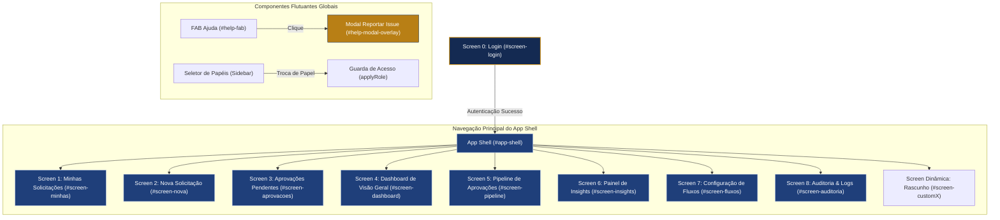

---

## 3. Matriz de Permissões por Papel (RBAC)

| ID da Tela | Nome da Tela | SOLICITANTE | GESTOR | RH_ADMIN |
|---|---|:---:|:---:|:---:|
| `screen-login` | Tela de Login | ✓ | ✓ | ✓ |
| `screen-minhas` | Minhas Solicitações | ✓ | ✓ | ✓ |
| `screen-nova` | Nova Solicitação | ✓ | ✓ | ✓ |
| `screen-aprovacoes` | Aprovações Pendentes | ✗ | ✓ | ✓ |
| `screen-dashboard` | Dashboard de Visão Geral | ✗ | ✓ | ✓ |
| `screen-pipeline` | Pipeline de Aprovações | ✗ | ✗ | ✓ |
| `screen-insights` | Painel de Insights | ✗ | ✓ | ✓ |
| `screen-fluxos` | Configuração de Fluxos | ✗ | ✗ | ✓ |
| `screen-auditoria` | Auditoria & Logs | ✗ | ✗ | ✓ |
| `customX` | Páginas Personalizadas (Dinam.) | ✓ | ✓ | ✓ |

---

## 4. Especificação Detalhada das Telas

### 4.1 Screen 0: Login (`#screen-login`)

- **Objetivo:** Autenticação corporativa e apresentação da proposta de valor do sistema.
- **Estrutura Visual:** Layout Grid em 2 colunas (Painel Visual Ilustrativo `1.1fr` + Formulário de Acesso `1fr`).
- **Comportamento Responsivo:** Em telas `< 860px`, o painel visual é ocultado e o card passa a ser 1 coluna.

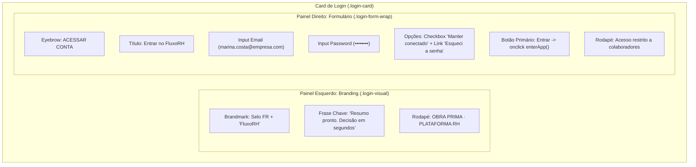

---

### 4.2 Shell da Aplicação (`.app-shell`)

- **Objetivo:** Estrutura container permanente contendo Menu Lateral (Sidebar), Barra Superior (Topbar), Área de Conteúdo Flexível e FAB Flutuante.

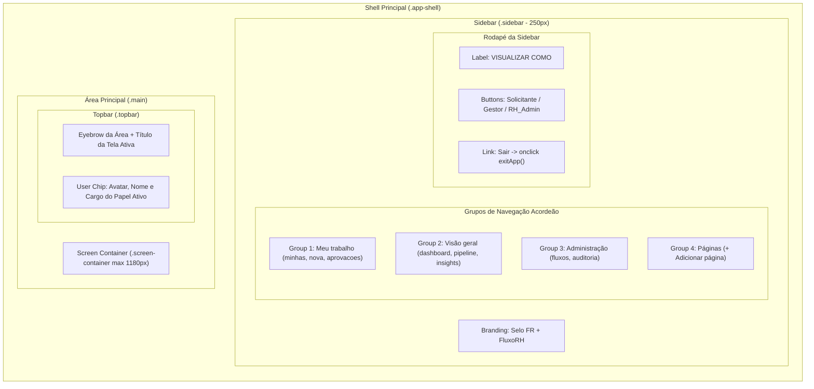

---

### 4.3 Screen 1: Minhas Solicitações (`#screen-minhas`)

- **Objetivo:** Listar solicitações abertas pelo usuário logado com seus respetivos status, SLA e etapas atuais.
- **Componentes:** Cabeçalho com CTA "+ Nova Solicitação", Tabela de dados com colunas: Protocolo, Tipo, Etapa atual, Status (Carimbo), SLA e Data de abertura.

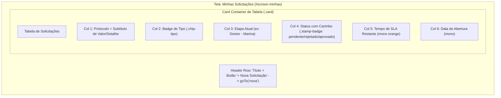

---

### 4.4 Screen 2: Nova Solicitação (`#screen-nova`)

- **Objetivo:** Permitir ao usuário escolher um tipo de fluxo e preencher o formulário correspondente.
- **Componentes:** Seleção visual de fluxo (Cards Vaga/Férias/Reembolso), Formulário dinâmico com textura pautada (`.ruled`), barra de acompanhamento das etapas do fluxo e botões de ação ("Salvar rascunho", "Enviar solicitação").

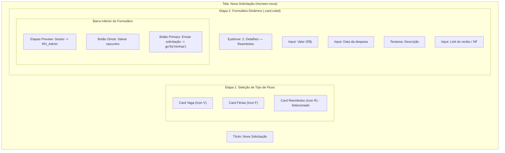

---

### 4.5 Screen 3: Aprovações Pendentes (`#screen-aprovacoes`)

- **Objetivo (Hero Feature):** Exibir os cards de solicitação pendentes de aprovação, destacando o **Resumo Gerado por IA** para tomada de decisão ágil.
- **Componentes:** Abas de alternância ("Sua equipe" vs "Todas RH"), Cards de Aprovação com Badge de Tipo, Protocolo, Badge de SLA/Atraso, **Callout de IA (`.callout-ia`)**, divisor e botões de ação ("Rejeitar" / "Aprovar").

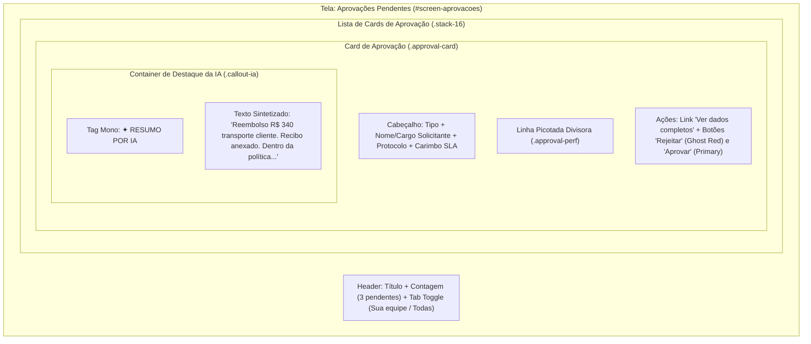

---

### 4.6 Screen 4: Dashboard de Visão Geral (`#screen-dashboard`)

- **Objetivo:** Fornecer indicadores métricos de volume e status das solicitações com tabela sintética.
- **Componentes:** Filtros de tipo/período, Grid de 4 Stat Tiles (Pendentes, Atrasadas [Accent Orange], Aprovadas, Rejeitadas), Tabela de resumo das últimas solicitações.

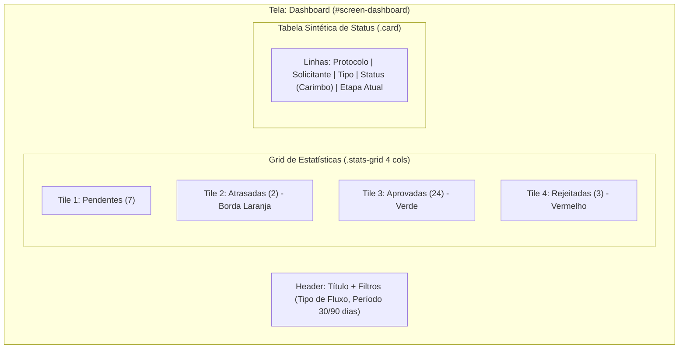

---

### 4.7 Screen 5: Pipeline de Aprovações (`#screen-pipeline`)

- **Objetivo:** Visão estilo Kanban do fluxo de aprovações por colunas de etapa (Visão exclusiva do RH_Admin).
- **Componentes:** Colunas Kanban (Aguardando Gestor, Aguardando RH_Admin, Aprovado, Rejeitado), contadores redondos por coluna, cards kanban com indicador visual de SLA estourado (`.late`), lista expansível com botão "+ N outras concluídas/rejeitadas".

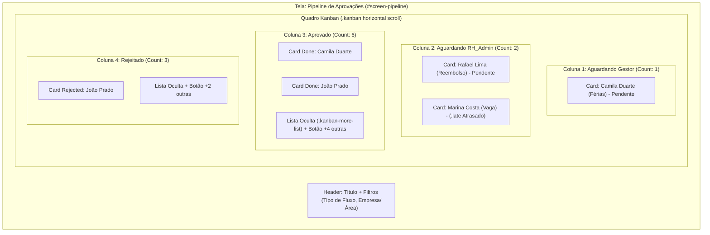

---

### 4.8 Screen 6: Painel de Insights (`#screen-insights`)

- **Objetivo (Feature de IA Agregada):** Apresentar dados quantitativos consolidados e a interpretação sintética da IA sobre tendências e gargalos de RH.
- **Componentes:** Gráfico de barras simples em CSS (Vagas por área), Callout de síntese de IA sobre gargalos, tabela de SLA e tempo médio por tipo de fluxo.

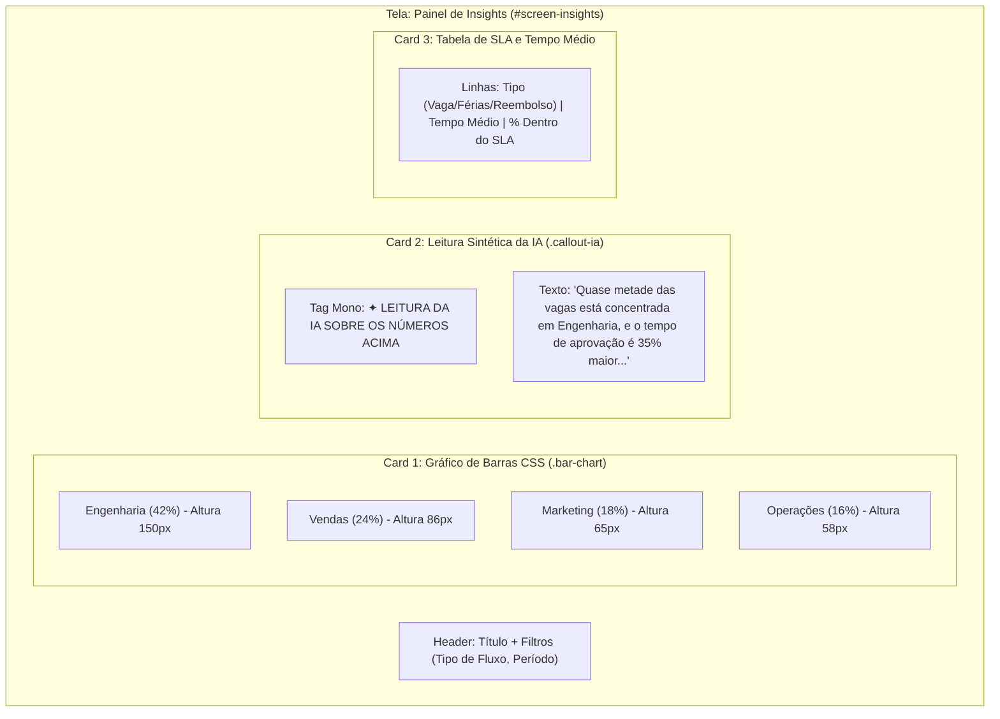

---

### 4.9 Screen 7: Configuração de Fluxos (`#screen-fluxos`)

- **Objetivo:** Permitir ao RH_Admin visualizar e gerenciar os tipos de fluxo, suas etapas e os campos do formulário associado.
- **Componentes:** Cards de tipos de fluxo (Vaga, Férias, Reembolso), pílulas indicadoras da ordem das etapas (`.step-pill`), container de campos de formulário ativos com rótulo e tipo desabilitado.

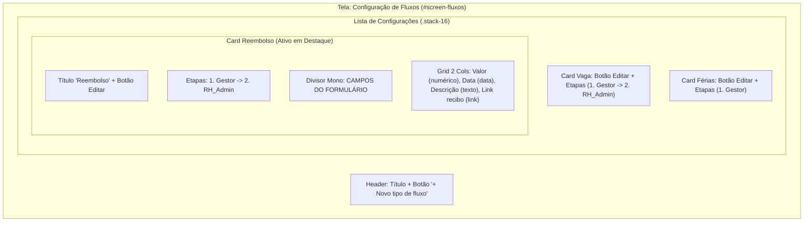

---

### 4.10 Screen 8: Auditoria & Logs (`#screen-auditoria`)

- **Objetivo:** Exibir logs técnicos e de auditoria de negócios para rastreabilidade completa de ações e exceções do sistema.
- **Componentes:** Filtro por tipo de log (Auditoria vs Erro) e busca textual, Tabela de Logs com Timestamp, Tipo (`.log-tipo.auditoria` azul vs `.log-tipo.erro` vermelho), Entidade/Protocolo, Descrição da ação e Usuário/Ator do sistema.

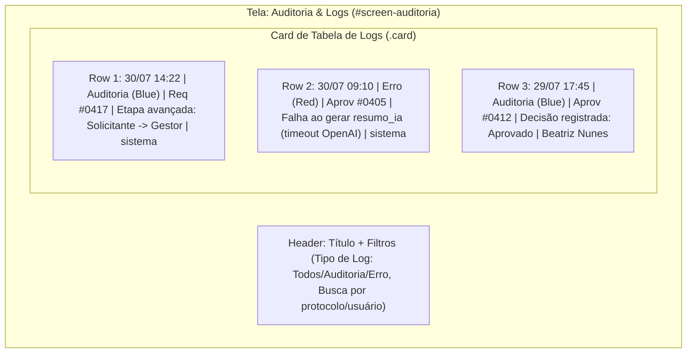

---

### 4.11 Componente Flutuante: Botão de Ajuda & Modal de Issue (`#help-modal-overlay`)

- **Objetivo:** Permitir que o usuário reporte bugs ou melhorias diretamente da interface, enviando o contexto da tela atual para a abertura de issues no GitHub.

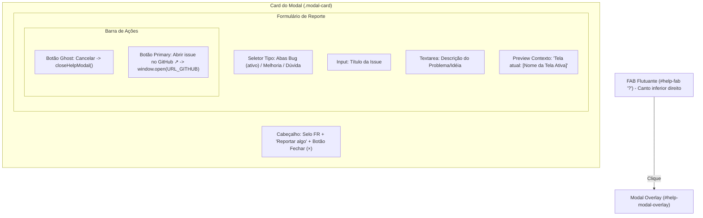

---

## 5. Fluxo de Dados e Máquina de Estados de Solicitação

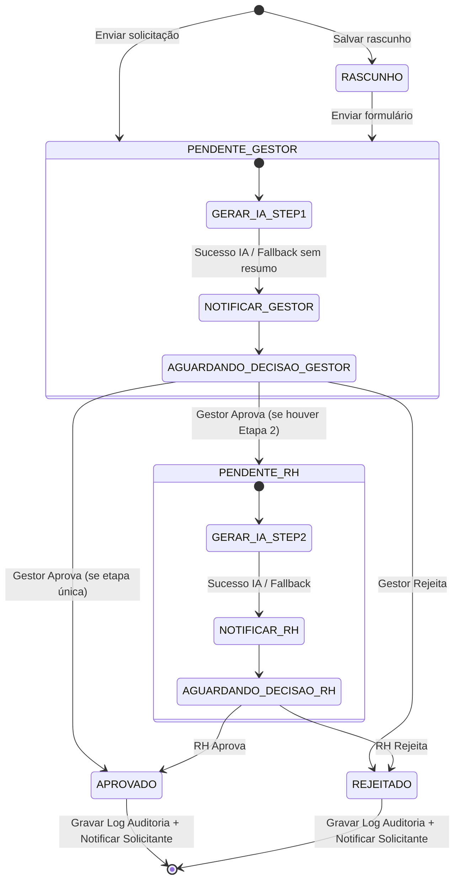

---

## 6. Diretrizes para Agentes de IA e Devs (Prompting & Codificação)

Ao converter este mockup/especificação em componentes reais (React/Next.js/Tailwind/shadcn):

1. **Respeitar os Rótulos dos Tokens:** Sempre referenciar CSS custom properties (`var(--paper)`, `var(--azul-900)`, `var(--amarelo-600)`) ou mapear no Tailwind `tailwind.config.js` sob a marca FluxoRH.
2. **Componente de Resumo por IA (`.callout-ia`):**
   - Nunca bloquear a renderização da tela se o resumo de IA estiver carregando ou falhar. Usar estado de fallback exibindo os dados brutos da solicitação se `resumo_ia == null`.
3. **Mecanismo de Carimbo (`.stamp-badge`):**
   - Manter a tipografia monospace (`IBM Plex Mono`), caixa alta e a rotação sutil (`transform: rotate(-1.4deg)`) para preservar a assinatura estética de "documento chancelado".
4. **Guarda de Acesso por Papel (RBAC):**
   - Garantir que a renderização condicional do menu e das telas valide explicitamente as permissões do papel ativo (`SOLICITANTE`, `GESTOR`, `RH_ADMIN`).
